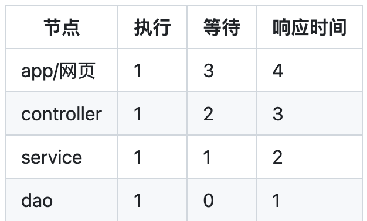
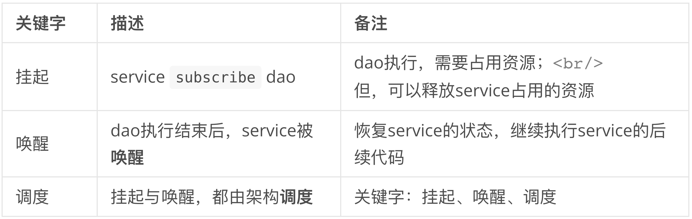
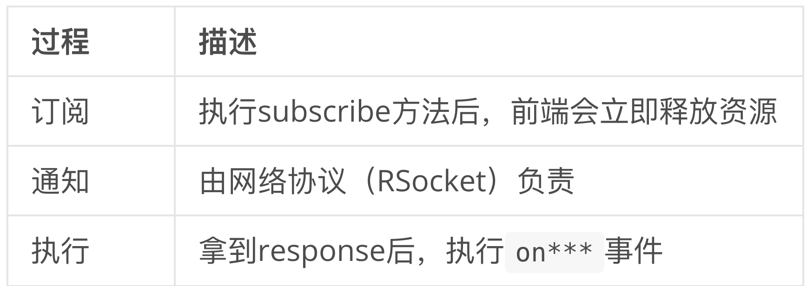

# reactive system demo

响应式编程，前后端聊的不是一回事...

# 1 什么是“响应式”？

1. 根据屏幕尺寸，计算每次需要加载多少条数据，滚动显示列表数据？
2. 修改model，自动更新View？
3. <mark>将微服务调用链路看做“Stream”？Mono、Flux？</mark>

以上都是！

[《反应式宣言》——The Reactive Manifesto-阿里云开发者社区](https://developer.aliyun.com/article/497920)

我要通过这个项目，解决第3个问题：

- 前端，rsocket-js

- 前后端交互，rsocket协议

- 后端使用RSocket协议开放接口

- 数据库支持r2dbc协议

打通链路的同时，让代码容易阅读。让异步代码的结构看起来像同步的代码，虽然底层原理完全不同。

# 2 为什么要使用“响应式”编程？

## 2.1 阻塞了什么？

以“查询订单”为例。设，每个节点执行正常业务逻辑耗时1秒，且忽略网络交互的时间。

service等待dao的执行结果，所以service等待1秒，dao不需要等待；

同理controller需要等待service的执行结果，所以controller等待2秒。依次类推：



## 2.2 Q & A

1. 使用响应式架构后，app还需要等待3秒吗？

答：是的（执行1秒，等待3秒）

2. 有什么区别？

答：等待的3秒，没有消耗资源（CPU/内存）。

3. 为什么没有消耗资源？

答：异步任务 + 发布订阅模型。以service调用dao为例：



4. QPS提高了多少？

答：优化前，app占用4秒的资源；优化后，app只占用1秒的资源。于是，同样的资源，可以提高4倍的访问量。性能提升了4倍。整个链路提升了`4*3*2*1=24`倍。

## 2.3 响应式系统的代码怎么写？

### 2.3.1 前端 app/网页

```javascript
requestResponse(url, params).subscribe({
    onError: (error: Error) => {
        //比如，密码错误、手机号不存在等
    },
    onComplete: (response: Payload<Buffer, null>) => {
        //拿到响应 data
        const data = JSON.parse((response.data!).toString())
        //注：RSocket协议为了提升性能，使用的buffer，不是JSON string
    }
})
```



### 2.3.2 后端 controller/service/dao

> 后端封装得很好，看不到`subscribe\onXXX`

```kotlin
 class Controller(val service:Service){
    //开放接口，使用RSocket协议的注解，略
    suspend fun api(){
      service.dosomething()
    }
}
----
class Service(val dao:Dao){
    suspend fun dosomething(){
       dao.XXX()
    }
}
-----
//Dao ...
```
