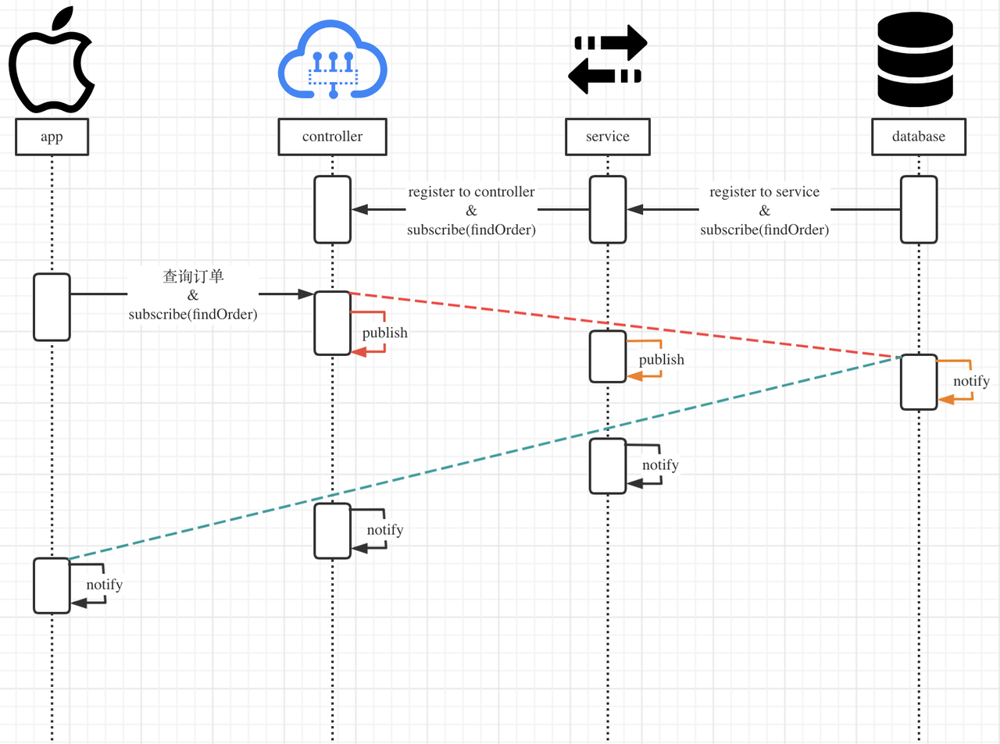
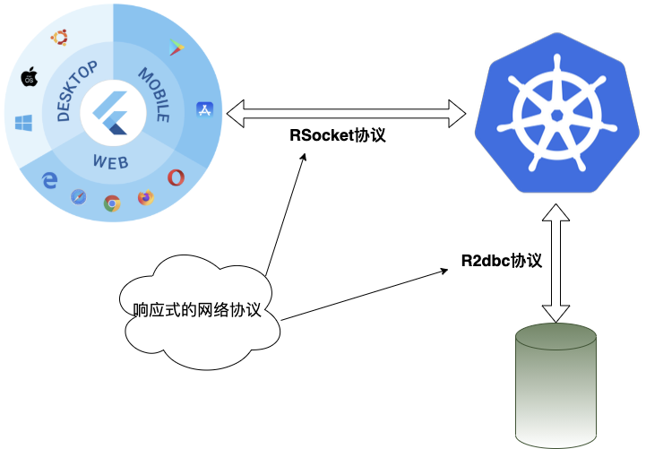

# reactive system demo

响应式编程，前后端聊的不是一回事...

# 1 什么是“响应式”？

1. 根据屏幕尺寸，计算每次需要加载多少条数据，滚动显示列表数据？
2. 修改model，自动更新View？
3. 将微服务调用链路看做“Stream”？Mono、Flux？

以上都是！

[《反应式宣言》——The Reactive Manifesto-阿里云开发者社区](https://developer.aliyun.com/article/497920)

# 2 为什么要使用“响应式”编程？

下图是“**查询订单**”的操作，使用“**响应式编程**”后的链路图。看不懂没关系，我随便画的。



## 2.1 阻塞了什么？

简单说，阻塞就是占着茅坑不拉屎。

请将上图当作传统的http请求，假设，每个节点执行耗时1秒，且忽略网络交互的时间：

| 节点         | 执行耗时（秒） | 等待（秒）          | 响应时间（秒） | 备注                |
| ---------- | ------- | -------------- | ------- | ----------------- |
| app/网页     | 1       | <mark>3</mark> | 4       | **死等的3秒，就是“阻塞”**。 |
| controller | 1       | <mark>2</mark> | 3       |                   |
| service    | 1       | <mark>1</mark> | 2       |                   |
| dao        | 1       | 0              | 1       |                   |

## 2.2 Q & A

1. 使用响应式架构后，app还需要等待3秒吗？

答：是的（执行1秒，等待3秒）

2. 有什么区别？

答：等待的3秒，没有消耗资源（CPU/内存）。

3. 为什么没有消耗资源？

答：异步任务 + 发布订阅模型。app调用的服务链路过长，不好解释。以service调用dao为例：

| 关键字 | 描述                                             | 备注                            |
| --- | ---------------------------------------------- | ----------------------------- |
| 挂起  | service `subscribe` dao：service被**挂起**；dao异步执行 | 记录当前service的状态，释放service占用的资源 |
| 唤醒  | dao执行结束后，service被**唤醒**                        | 恢复service的状态，继续执行service的后续代码 |
| 调度  | 挂起与唤醒，都由架构**调度**                               |                               |

关键字：挂起、唤醒、调度

4. QPS提高了多少？

答：优化前，app占用4秒的资源；优化后，app只占用1秒的资源。于是，同样的资源，可以提高4倍的访问量。性能提升了4倍。整个链路提升了$4*3*2*1=24$倍。

5. 代价大吗？学习成本、开发成本、成熟的开发框架等

答：创新嘛，不考虑成本。我已经用到项目上快2年了，挺平稳的

## 2.3 响应式系统的代码怎么写？

### 2.3.1 前端 app/网页

```javascript
requestResponse(url, params).subscribe({
    onError: (error: Error) => {
        //比如，密码错误、手机号不存在等
    },
    onComplete: (response: Payload<Buffer, null>) => {
        //拿到响应 data
        const data = JSON.parse((response.data!).toString())
        //注：RSocket协议为了提升性能，使用的buffer，不是JSON string
    }
})
```

| 过程  | 描述                                 |
| --- | ---------------------------------- |
| 订阅  | 执行subscribe方法后，前端会立即释放资源           |
| 通知  | 代码中看不到notify的过程，由网络协议负责（RSocket协议） |
| 执行  | 拿到response后，执行`on***`事件            |

### 2.3.2 后端 controller/service/dao

> 后端封装得很好，看不到`subscribe\onXXX`。只是语法糖的障眼法，底层原理与前端相同。

```kotlin
 class Controller(val service:Service){
    //开放接口，使用RSocket协议的注解，略
    suspend fun api(){
      service.dosomething()
    }
}
----
class Service(val dao:Dao){
    suspend fun dosomething(){
       dao.XXX()
    }
}
-----
//Dao ...
```

| 过程  | 描述                                                                       |
| --- | ------------------------------------------------------------------------ |
| 订阅  |                                                                          |
| 通知  | 由springboot、RSocket协议、`kotlin coroutines`架构、netty、r2dbc协议等负责。同理，看不到这部分代码 |
| 执行  | `kotlin coroutines`代码                                                    |

# 3 开发人员具体做什么？



- 前端使用vue3

- **前后端交互使用RSocket协议**

- 后端微服务
  
  - 使用springboot框架
  
  - 不使用Restful API
  
  - 使用kotlin coroutines写controller/service/dao的方法
  
  - 使用reactive方式访问Redis（缓存）
  
  - 使用r2dbc访问数据库

- **后端微服务之间使用RSocket协议**

# 4 任务计划

## 4.1 hello world

快速搭建一个后端微服务项目，测试性能具体提升多少。

实现**登录**功能，成功后发**token**：

- 访问数据库，通过username拿password

- 验证username和password
  
  - 验证通过，生成token。且，将username、token、refresh token存储到redis
  
  - 验证失败，返回错误消息

- 测试要求：1秒内，发完10万个请求

## 4.2 业务场景

老师、学生、课程、成绩

| 名称  | 名称      |
| --- | ------- |
| 老师  | teacher |
| 学生  | student |
| 课程  | course  |
| 成绩  | score   |

- 设计UI，好看些

- 设计交互，稍微复杂些

- 创建领域模型，设计model之间的关系

- 创建数据库、表结构、测试数据等

- 练习SQL语句，完成经典的SQL练习题

## 4.3 开发前端

 使用vue3，学习CRUD的实战技巧

- vue3 demo

- 重复点击“新增”按钮，数据库生成重复数据怎么办

- RSocket协议开放的接口，前端怎么访问

- 异常处理

## 4.4 开发后端

springboot + rsocket + kotlin coroutines + reactive redis + r2dbc + netty等reactive 技术，怎么玩转微服务
