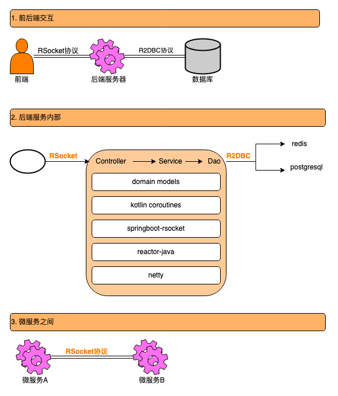

# 微服务架构

## 

| 功能          | 描述                                        | 版本号   | 项目名                                                                                                 |
| ----------- | ----------------------------------------- | ----- | --------------------------------------------------------------------------------------------------- |
| hello world | 测验RSocket协议 + springboot的性能               | 0.0.1 | account: 开放登录接口 auth: 管理token common: 自用的开发工具 r-feign: 模仿spring open feign，仅支持rsocket协议 |
| SQL         | 学习常用的SQL语句； kotlin coroutines + r2dbc | 0.0.2 |                                                                                                     |
|             |                                           |       |                                                                                                     |
|             |                                           |       |                                                                                                     |
|             |                                           |       |                                                                                                     |

| **名称**            | **描述**                                                                | **备注**                                                                                                                                                                                                                                   |
| ----------------- | --------------------------------------------------------------------- | ---------------------------------------------------------------------------------------------------------------------------------------------------------------------------------------------------------------------------------------- |
| RSocket           | 响应式协议                                                                 | 应用场景：  - 前端访问后端 - 后端微服务之间                                                                                                                                                                                                       |
| R2DBC             | 访问数据库的协议                                                              | 应用场景：  - redis - postgresql/timescaleDB                                                                                                                                                                                         |
| netty             | netty可以自定义编码/解码字节流。支持rsocket协议                                        |                                                                                                                                                                                                                                          |
| reactor-java      | springboot底层使用reactor-java实现的rsocket协议                                | 框架已经封装好了。开发时，几乎看不到reactor-java的API                                                                                                                                                                                                       |
| kotlin coroutines | 开发时，频繁使用的API。可以看做开发语言。  kotlin coroutines是一个开发库，在语言级别提供了异步编程的实现 | 我会进一步封装，让异步的代码跟同步的，看起来几乎没有区别。两个目的：  - 提高入门的速度 - 提高开发效率  当然，理论的推导与学习过程，还是很枯燥的。  coroutines是在thread的基础上，进一步细分的概念，context不是基于ThreadLocal的。于是，从springboot的context获取bean、token、校验接口参数等场景，都需要修改springboot的源码（有源码嘛，可以改，不难） |
