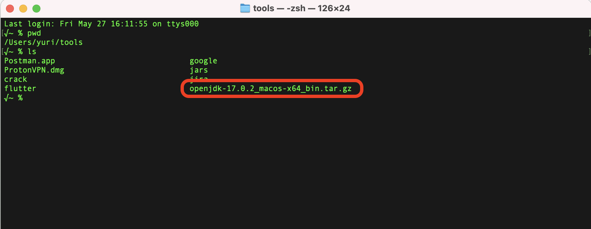

# 安装配置开发工具

软件的版本号非常重要，如果环境不一致，会遇到莫名其妙的BUG。同事也很难帮忙

| 名称            | 版本号                                      | 备注                                                                            |
| ------------- | ---------------------------------------- | ----------------------------------------------------------------------------- |
| jdk           | 17.0.2<br/>https://jdk.java.net/archive/ | https://kotlinlang.org/docs/faq.html#which-versions-of-jvm-does-kotlin-target |
| intellij idea | 2022.1.1                                 |                                                                               |
| kotlin        | 1.7.10                                   |                                                                               |
| kotest        | 1.2.59-IC-2022.1                         | 测试框架                                                                          |
| git           | 2.37.1                                   |                                                                               |

# 1 管理多个版本的JDK

https://kotlinlang.org/docs/whatsnew16.html#kotlin-jvm

`kotlin 1.6.21`支持`JVM 17`。

> 具体的版本号，是kotlin/jdk/intellij idea，相互妥协的结果。
> 
> JDK太基础了，你需要管理多个版本的JDK，随时准备切换

## 1.1 安装配置JDK（intel-based mac）

```
# 1 查看macos系统版本
case $(uname -m) in
    x86_64)  echo x86;;
    aarch64) echo arm;;
esac

# 2 下载对应版本的jdk
https://jdk.java.net/archive/

# 3 查看已安装的jdk
√~ % /usr/libexec/java_home -V
Matching Java Virtual Machines (2):
    11.0.8 (x86_64) "AdoptOpenJDK" - "AdoptOpenJDK 11" /Library/Java/JavaVirtualMachines/adoptopenjdk-11.jdk/Contents/Home
    1.8.0_282 (x86_64) "AdoptOpenJDK" - "AdoptOpenJDK 8" /Library/Java/JavaVirtualMachines/adoptopenjdk-8.jdk/Contents/Home
/Library/Java/JavaVirtualMachines/adoptopenjdk-11.jdk/Contents/Home
```



```
# 4 安装openjdk17
sudo tar xvzf openjdk-17.0.2_macos-x64_bin.tar.gz -C /Library/Java/JavaVirtualMachines

# 5 查看已安装的jdk

√~ % /usr/libexec/java_home -V
Matching Java Virtual Machines (3):
    17.0.2 (x86_64) "Oracle Corporation" - "OpenJDK 17.0.2" /Library/Java/JavaVirtualMachines/jdk-17.0.2.jdk/Contents/Home
    11.0.8 (x86_64) "AdoptOpenJDK" - "AdoptOpenJDK 11" /Library/Java/JavaVirtualMachines/adoptopenjdk-11.jdk/Contents/Home
    1.8.0_282 (x86_64) "AdoptOpenJDK" - "AdoptOpenJDK 8" /Library/Java/JavaVirtualMachines/adoptopenjdk-8.jdk/Contents/Home
/Library/Java/JavaVirtualMachines/jdk-17.0.2.jdk/Contents/Home
√~ % 

# 6 安装jenv
brew install jenv

# 7 查看jenv管理的jdk versions
√~ % jenv versions
  system
  1.8
  1.8.0.282
  11
  11.0
* 11.0.8 (set by /Users/yuri/.jenv/version)
  openjdk64-1.8.0.282
  openjdk64-11.0.8
√~ % 

# 8 给jenv添加openjdk17的配置
√~ % jenv add /Library/Java/JavaVirtualMachines/jdk-17.0.2.jdk/Contents/Home
openjdk64-17.0.2 added
17.0.2 added
17.0 added
17 added
√~ % 

# 9 查看jenv管理的jdk versions
√~ % jenv versions
  system
  1.8
  1.8.0.282
  11
  11.0
* 11.0.8 (set by /Users/yuri/.jenv/version)
  17
  17.0
  17.0.2
  openjdk64-1.8.0.282
  openjdk64-11.0.8
  openjdk64-17.0.2
√~ % 

# 10 使用openjdk 17
√~ % jenv global 17.0.2
√~ % jenv versions
  system
  1.8
  1.8.0.282
  11
  11.0
  11.0.8
  17
  17.0
* 17.0.2 (set by /Users/yuri/.jenv/version)
  openjdk64-1.8.0.282
  openjdk64-11.0.8
  openjdk64-17.0.2
√~ % java --version
openjdk 17.0.2 2022-01-18
OpenJDK Runtime Environment (build 17.0.2+8-86)
OpenJDK 64-Bit Server VM (build 17.0.2+8-86, mixed mode, sharing)
√~ % javac --version
javac 17.0.2
√~ % 
```

## 1.2 相关工具概述

配置JDK的过程中，用到了一些新工具。概况如下：

| 名称             | 描述                                                | 备注                            |
| -------------- | ------------------------------------------------- | ----------------------------- |
| x86/arm        | 苹果M1芯片使用的arm架构，常见的关键字：aarch64,arm64,arm           | intel用的x86。芯片不同，指令集不同，两个版本不兼容 |
| openjdk        | openjdk是免费，可商用的版本                                 | 开发和部署用一套JDK，提前探坑              |
| jenv           | 专门管理多个版本的JDK                                      |                               |
| java --version | 最终还是要用传统手艺，验证环境是否设置正确。且，打开新的terminal，或，重启电脑后，再次确认 |                               |

# 2 intellij idea

## 2.1 安装且破解

```
# 1 彻底卸载intellij idea
# 2 安装最新版
# 3 下载&解压破解包 (网上搜索 ja-netfilter-all intellij idea 2022.1.1)
# 4 Windows 系统，点击运行 scripts/install-current-user.vbs
Mac/Linux 系统，运行 scripts/install.sh

# 5 重启系统（否则下一步会报错，提示：key is invalid）
# 6 打开 IDEA, 填入指定激活码完成激活(查看 激活码.txt)
```

## 2.2 配置Intellij idea

```
# 1 plugins。去除用不到的plugins，比如android,html,subversion,maven,tomcat等
# 2 Preferences/Editor/File Encodings
```


```
# 3 Preferences/Build,Excection,Deployment/Compiler/Kotlin Compiler
```


## 2.3 安装kotest plugins


## 2.4 gradle


# 3 升级git版本

```
√~ % git --version
git version 2.36.1
√~ % brew update
√~ % brew upgrade git
√~ % git --version
git version 2.37.1
√~ % which git
/usr/local/bin/git
```

> git安装好后，如果版本号没问题，intellij idea会自动侦测到git的路径，不需要手工修改
