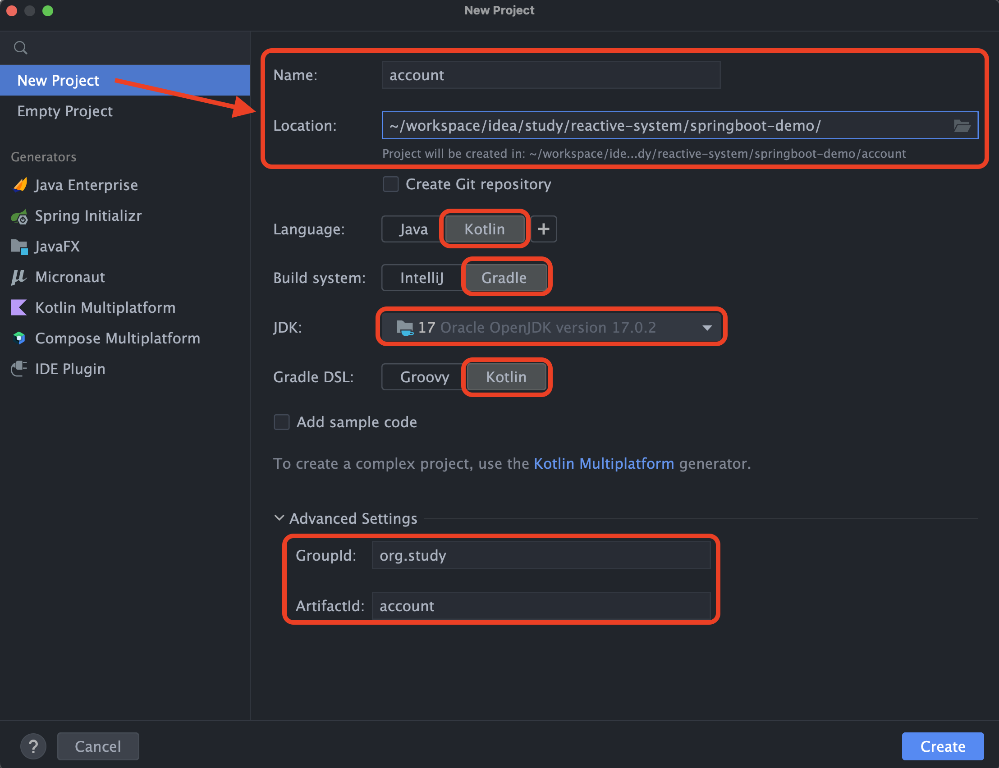
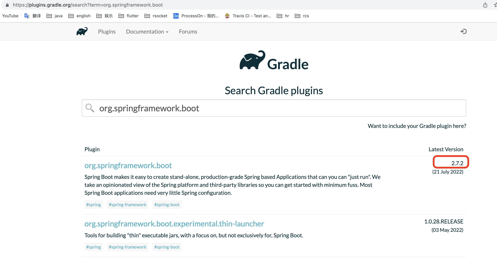

# helloworld之account

# 1 目标

完成以下两个练习

## 1.1 RSocket协议

- 创建项目account

- 使用rsocket协议开放接口`annoymous.greet`
  
  - 参数：username
  
  - 返回："welcome $username"

- 单元测试controller
  
  - 启动服务，访问接口
  
  - 随机生成10个username，判断返回值是否正确

## 1.2 kotlin coroutines

- 修改接口`greet`,`delay(1秒)`

- 测试
  
  - 同时发起10个请求，观察是否1秒内全部返回
  
  - 同时发起10W个请求，观察接口返回速度(**预计需要10s**)

# 2 操作流程

## 2.1 创建project

点击"create"按钮后，intellij idea会自动生成一些文件，且，自动下载依赖、构建项目等，可以手动关闭任务，因为，接下来，我们需要修改项目的配置文件`build.gradle.kts`。



## 2.2 build.gradle.kts

如果intellij idea自动生成的文件与`build.gradle.kts`有冲突，那么，以配置文件为准。

### 2.2.1 plugins

| id                              | 版本号            |
| ------------------------------- | -------------- |
| org.springframework.boot        | 2.7.2          |
| io.spring.dependency-management | 1.0.13.RELEASE |
| jvm                             |                |
| plugin.spring                   |                |

```
# 搜索 https://plugins.gradle.org/
```



### 2.2.2 完整配置

```
@file:Suppress("SpellCheckingInspection")

import org.jetbrains.kotlin.gradle.tasks.KotlinCompile

plugins {
    idea
    id("org.springframework.boot") version "2.7.2"
    id("io.spring.dependency-management") version "1.0.13.RELEASE"
    kotlin("jvm") version "1.7.10"
    kotlin("plugin.spring") version "1.7.10"
}
idea {
    module {
        isDownloadJavadoc = false
        isDownloadSources = true
    }
}
group = "org.study"
version = "0.0.1"
java.sourceCompatibility = JavaVersion.VERSION_17

repositories {
    mavenCentral()
}

dependencies {
    val kotestVersion = "5.4.2"
    val kotestSpringVersion = "1.1.2"
//    val springmockkVersion = "3.1.1"

    implementation("org.springframework.boot:spring-boot-starter-rsocket")
    implementation("io.projectreactor.kotlin:reactor-kotlin-extensions")
    implementation("org.jetbrains.kotlin:kotlin-reflect")
    implementation("org.jetbrains.kotlin:kotlin-stdlib-jdk8")
    implementation("org.jetbrains.kotlinx:kotlinx-coroutines-reactor")

    testImplementation("org.springframework.boot:spring-boot-starter-test") {
        exclude(group = "org.junit.vintage", module = "junit-vintage-engine")
        exclude(module = "mockito-core")
    }
    testImplementation("io.projectreactor:reactor-test")
//    testImplementation("com.ninja-squad:springmockk:$springmockkVersion")
    testImplementation("io.kotest:kotest-runner-junit5-jvm:$kotestVersion")
    testImplementation("io.kotest:kotest-assertions-core-jvm:$kotestVersion")
    testImplementation("io.kotest:kotest-property:$kotestVersion")
    testImplementation("io.kotest.extensions:kotest-extensions-spring:$kotestSpringVersion")
}

tasks{
    withType<KotlinCompile> {
        kotlinOptions {
            freeCompilerArgs = listOf("-Xjsr305=strict")
            jvmTarget = "17"
        }
    }
    withType<Test> {
        useJUnitPlatform()
    }
    withType<Wrapper> {
        distributionType = Wrapper.DistributionType.BIN
        gradleVersion = "7.4.1"
    }
}
```

## 2.3 application.yml

`src/main/resources/application.yml`

```kotlin
spring:
  rsocket:
    server:
      transport: websocket
      port: 6000
      mapping-path: /account
```

## 2.4 启动类

`src/main/kotlin/org.study.account/App.kt`

```kotlin
package org.study.account

import org.springframework.boot.autoconfigure.SpringBootApplication
import org.springframework.boot.runApplication
import reactor.core.publisher.Hooks
import java.util.*

@SpringBootApplication
class App

fun main(args: Array<String>) {
    TimeZone.setDefault(TimeZone.getTimeZone("UTC"))
    runApplication<App>(*args)
    Hooks.onErrorDropped { }
}
```

## 2.5 controller

`src/main/kotlin/org.study.account.controller/HelloController.kt`

```kotlin
package org.study.account.controller

import kotlinx.coroutines.delay
import org.springframework.messaging.handler.annotation.MessageMapping
import org.springframework.stereotype.Controller

@Controller
class HelloController {
    @MessageMapping("anonymous.greet")
    suspend fun greet(username: String): String {
        delay(1000)
        return "welcome $username"
    }
}
```

# 3 测试

根目录 `src/test`

## 3.1 config

### 3.1.1 Kotest  + SpringExtension

`src/test/kotlin/io.kotlintest.provided/ProjectConfig.kt`

kotest的固定配置，不能修改。其中：

- package name: io.kotlintest.provided

- class name: ProjectConfig

```kotlin
package io.kotlintest.provided

import io.kotest.core.config.AbstractProjectConfig
import io.kotest.extensions.spring.SpringExtension

class ProjectConfig : AbstractProjectConfig() {
    override fun extensions() = listOf(SpringExtension)
}
```

### 3.1.2 Requester

`src/test/kotlin/org.study.account.config/RSocketConfig.kt`

```kotlin
package org.study.account.config

import org.springframework.beans.factory.annotation.Value
import org.springframework.context.annotation.Bean
import org.springframework.context.annotation.Configuration
import org.springframework.messaging.rsocket.RSocketRequester
import java.net.URI

@Configuration
class RSocketConfig {
    @Bean
    fun requester(
        @Suppress("SpringJavaInjectionPointsAutowiringInspection") builder: RSocketRequester.Builder,
        @Value("\${spring.rsocket.server.port}") port: Int,
        @Value("\${spring.rsocket.server.mapping-path}") mappingPath:String,
    ): RSocketRequester = builder.websocket(URI.create("ws://localhost:${port}/${mappingPath}"))
}
```

## 3.2 Spec

`src/test/kotlin/org.study.account.controller/HelloControllerSpec.kt`

```kotlin
package org.study.account.controller

import io.kotest.core.spec.style.StringSpec
import io.kotest.matchers.longs.shouldBeBetween
import io.kotest.matchers.shouldBe
import io.kotest.property.Arb
import io.kotest.property.arbitrary.string
import io.kotest.property.forAll
import kotlinx.coroutines.Job
import kotlinx.coroutines.coroutineScope
import kotlinx.coroutines.joinAll
import kotlinx.coroutines.launch
import kotlinx.coroutines.reactive.awaitFirst
import org.slf4j.LoggerFactory
import org.springframework.boot.test.context.SpringBootTest
import org.springframework.messaging.rsocket.RSocketRequester
import kotlin.system.measureTimeMillis


@SpringBootTest
class HelloControllerSpec(val requester: RSocketRequester) : StringSpec({
    "Anonymous access to the `anonymous.greet` API" {
        log.info("hello world -- start")
        greet(requester, "May")
        log.info("hello world -- end")
    }
    "计算`anonymous.greet` API的执行时间" {
        val time = measureTimeMillis {
            greet(requester, "May")
        }
        time.shouldBeBetween(1000, 1500)
    }
    "重复执行10次" {
        times(requester, 10).shouldBeBetween(1000, 1500)
    }

    /**
     * 1. 在使用kotlin coroutines + rsocket之前，每秒最多处理1000个请求；
     * 优化后，预计性能提升100倍，即100_000。
     * 2. 但，测试代码强制等待1秒，与实际接口执行时长100ms相比，慢了10倍
     *
     * 所以，综合1，2，当前系统每秒处理10_000个请求。100万个请求，大约需要10秒。
     */
    "重复执行100_000次" {
        times(requester, 100_000).shouldBeBetween(5000, 10_000)
    }
}) {
    companion object {
        private val log = LoggerFactory.getLogger(this::class.java)
        private suspend fun times(requester: RSocketRequester, times: Int): Long = coroutineScope {
            measureTimeMillis {
                val list = mutableListOf<Job>()
                forAll(times, Arb.string(3, 5)) { username ->
                    list.add(
                        launch {
                            greet(requester, username)
                        }
                    )
                    username.isNotBlank()
                }
                list.joinAll()
            }
        }

        private suspend fun greet(requester: RSocketRequester, username: String) = requester
            .route("anonymous.greet")
            .data(username)
            .retrieveMono(String::class.java)
            .awaitFirst().shouldBe("welcome $username")
    }
}
```
