# 1 目的

- 使用nexus3部署私有代码仓库

- 使用gradle dependency建立服务之间的依赖

让每一个project有明确的边界，没有构建顺序，加快部署速度

# 2 部署

```
# 1 下载镜像
docker image pull sonatype/nexus3:3.41.0

# 2 创建volume
docker volume create --name nexus-data

# 3 运行container
docker container run -d -p 6030:8081 --name nexus \
-v nexus-data:/nexus-data sonatype/nexus3:3.41.0

# 4 访问 http://${ip}:6030
注：如果使用的云服务器，需要添加“入口规则”，允许访问6030端口
```

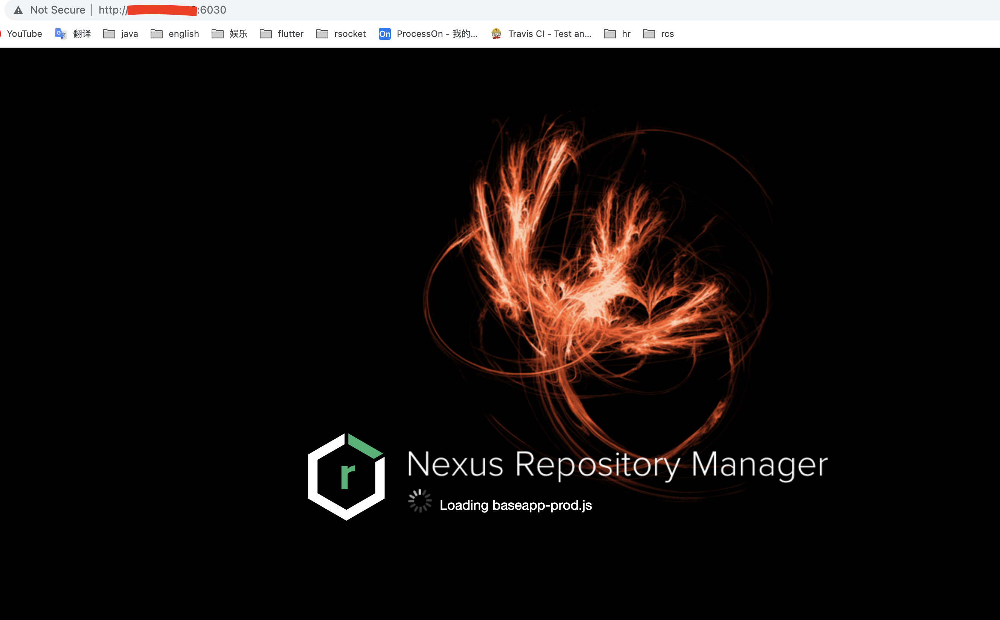

```
# 5 查看给用户admin自动生成的密码
cat /var/lib/docker/volumes/nexus-data/_data/admin.password
```

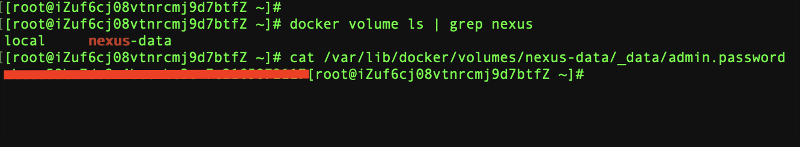

```
# 6 输入admin/password，继续访问nexus
```

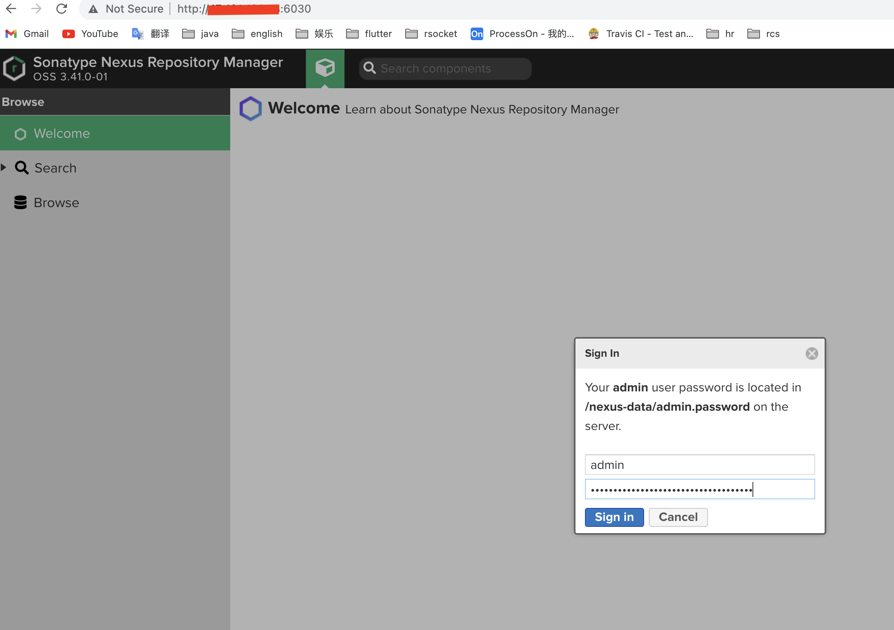

```
# 7 首次登录成功后，需要修改默认密码
```

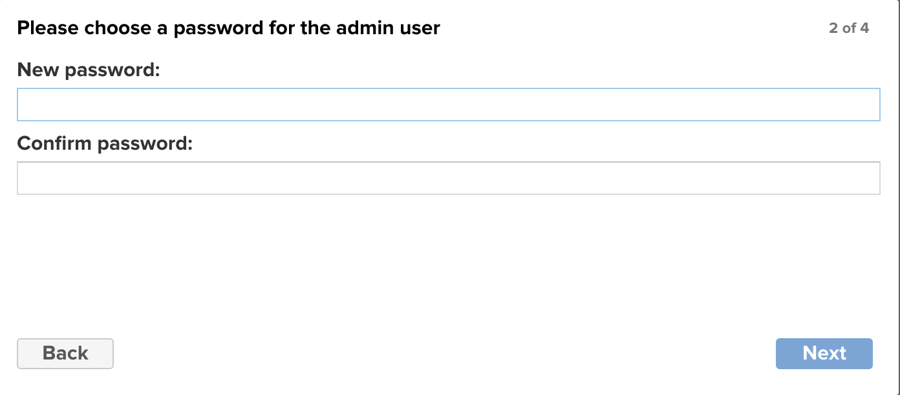

```
# 8 通常，为了安全，不允许匿名用户访问
```

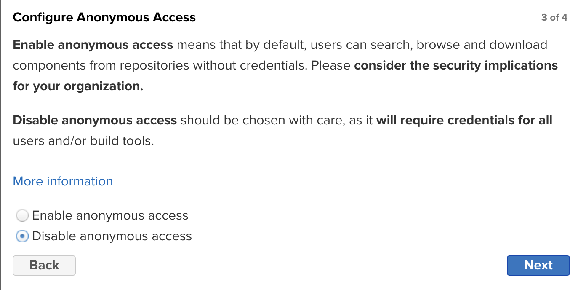

---

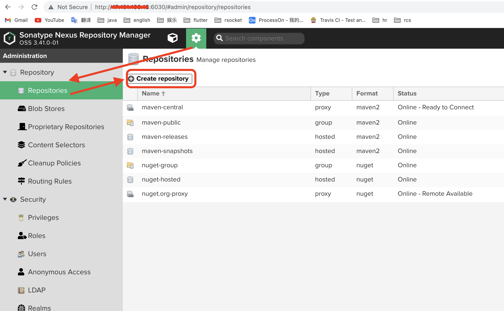

----

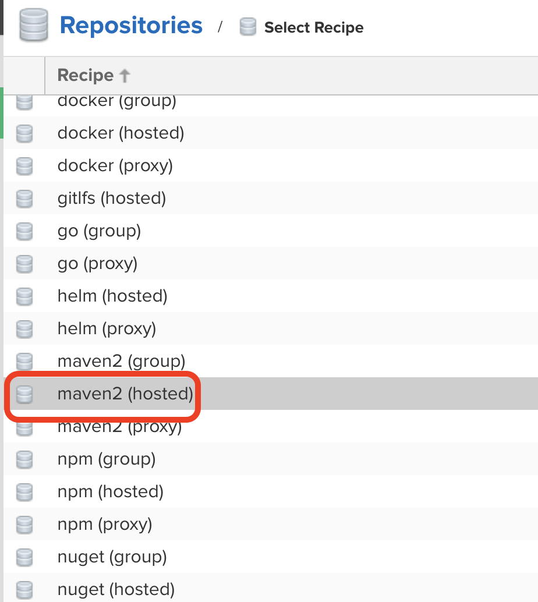

----

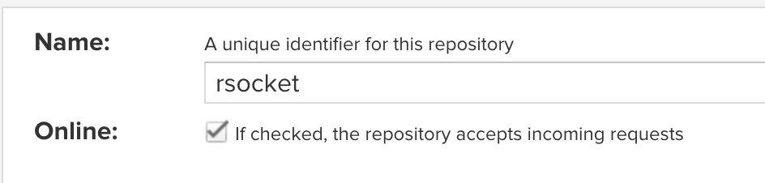

# 3 发布代码到私有仓库

publish r-feign的源码到私有仓库中

> r-feign是模拟spring openFeign，专门为rsocket协议定制的项目。代码不多，开发过程较复杂，略。

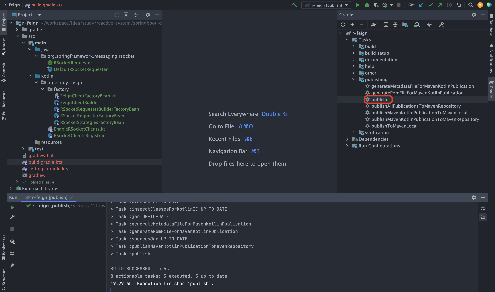

----

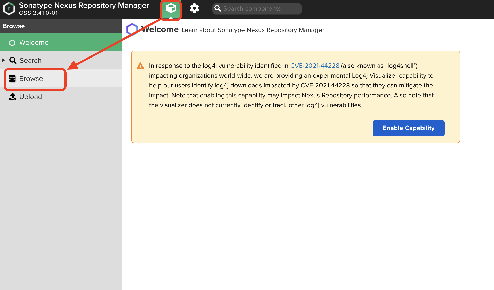

----

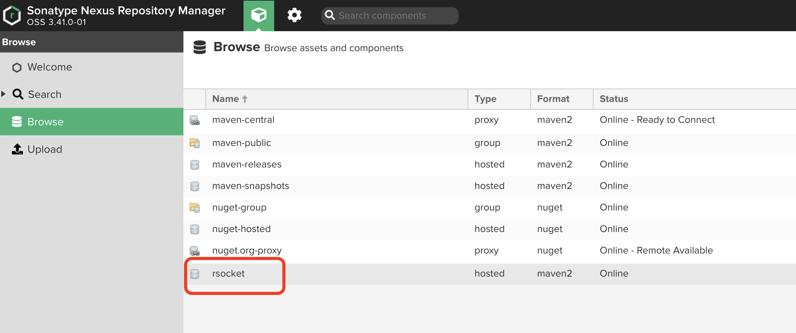

----

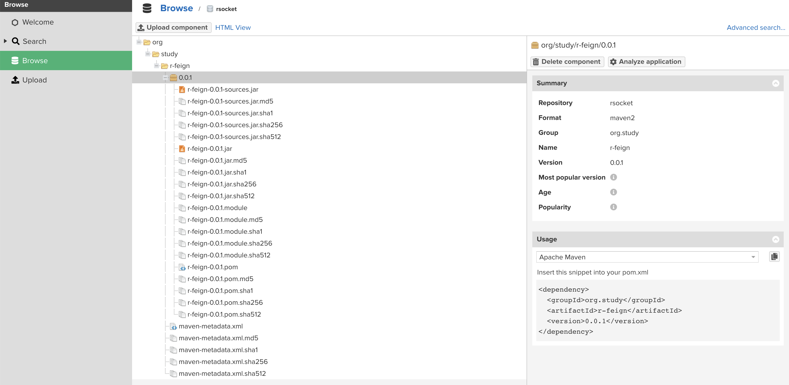

# 4 使用

1. 添加私服地址

2. 加载依赖文件
