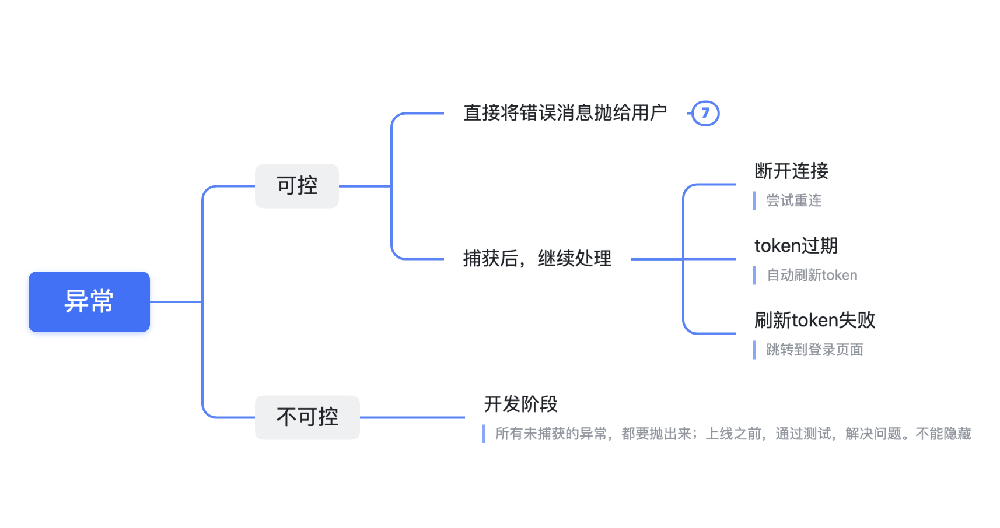
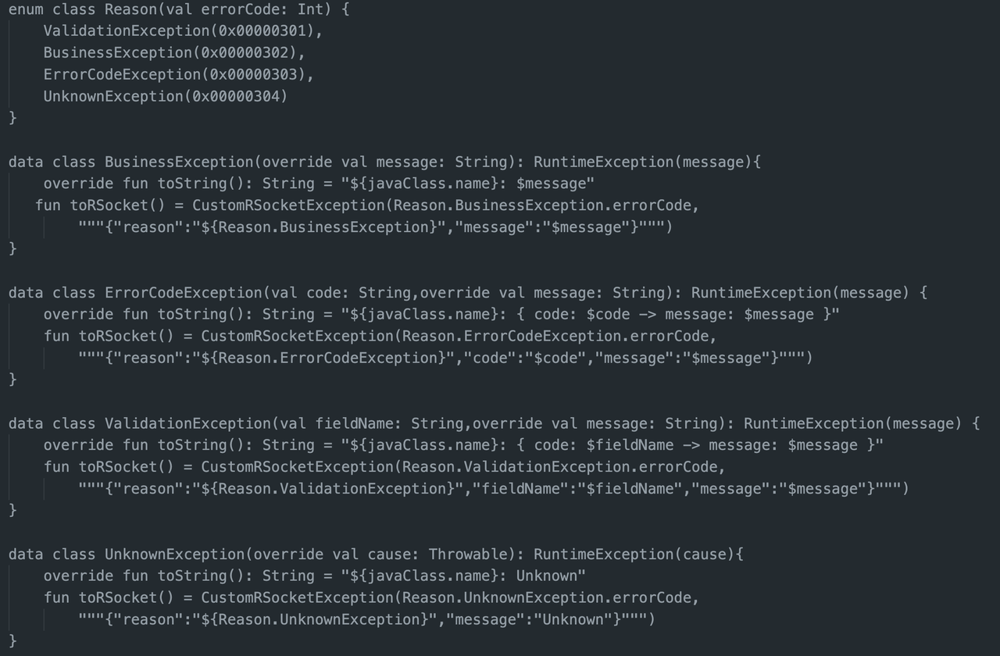
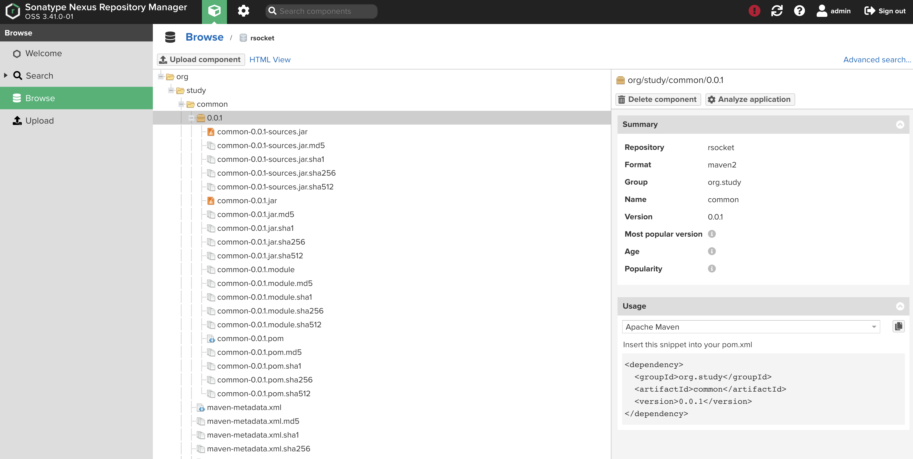

# common

# 1 统一异常处理

1. 枚举类Reason

约定异常类型的名称与编码。这样，前端拿到消息后，就可以识别了

2. 自定义异常
- BusinessException，直接将异常消息展示给用户看

- ErrorCodeException，根据约定的code，前端做特殊处理。比如，token过期，前端自动使用refresh Token，获得新的token

- ValidationException。做个约定：前后端都得做参数校验。如果前端看到这个错误，说明前端的代码漏了参数校验

- UnknownException，后端的代码有BUG

# 2 其他

| class                   | 描述             | 备注                 |
| ----------------------- | -------------- | ------------------ |
| RandomPasswordGenerator | 生成随机的password  | 测试注册新用户的接口时，自动生成密码 |
| RegexUtil               | 归纳整理常用的正则表达式   | 参数校验               |
| SpringContextHolder     | 从上下文获取已注册的bean |                    |

# 3 publish

