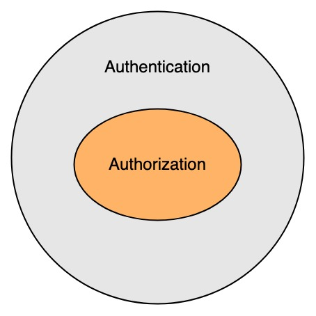
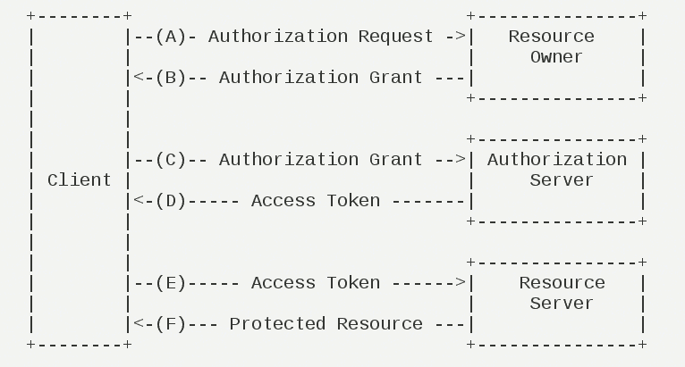
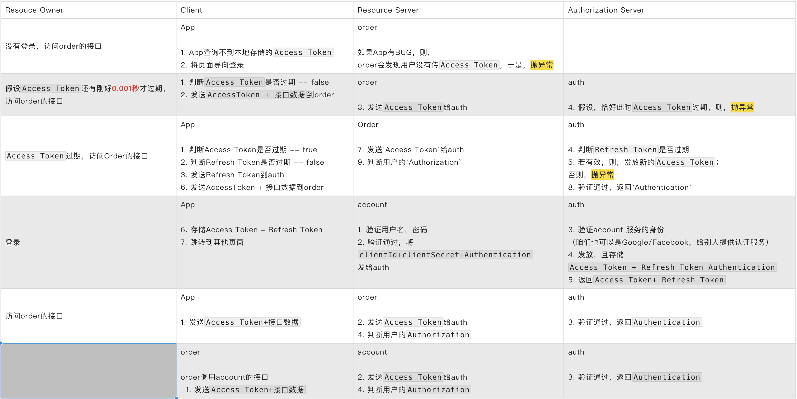

# 什么是security

权限就解决两个问题：你是谁、能做什么

1. 你是谁，就是登录。那么，如何识别你是谁？
   
   - 用户名 + 密码
   
   - 手机号（邮箱） + 验证码 + 密码
   
   - google，facebook等第三方授权

2. 登录之后能做什么，分两块：配置、验证

# 1 配置

标准的RBAC模型，即用户、角色、资源（菜单、按钮、接口、图片等）之间的关系。**新建**用户之前已经设计好了。

# 2 验证

## 2.1 BearToken vs JWT

先看几个名词

| 名词             | 描述   | 备注      |
| -------------- | ---- | ------- |
| authentication | 你是谁  | 用户的身份信息 |
| authorization  | 能做什么 | 权限      |
| token          | 临时凭证 | 登录之后，发放 |

用户的身份信息很敏感的，必须加密处理。两种方式：

1. JWT。直接对authentication内容加密，后台服务器使用对应的解密算法，即可查看`authentication`

2. BearToken。只是一个随机的字符串，且，随时可以撤销。像验证码。后台服务器得存储token与authentication之间的对应关系，而且为了响应速度快，会把数据放缓存里

我选择**Bear Token**

|                | Bear Token                                             | JWT                                                                                  |
| -------------- | ------------------------------------------------------ | ------------------------------------------------------------------------------------ |
| token          | ✓                                                      |                                                                                      |
| authentication | ✓                                                      | ✓                                                                                    |
| 加密             |                                                        | ✓                                                                                    |
| 服务端缓存          | ✓                                                      |                                                                                      |
| 优点             | 更安全，前端拿到的token必须由后端解释。后端随时可以让token作废                   | 不需要单独的auth服务； 不需要缓存； 任何服务都可以按照约定的加密算法读取用户信息                                  |
| 缺点             | 每个request都要拿token换authentication，需要单独开启auth服务，**IO密集** | 只能添加额外的代码，强制下线危险用户。因为危险用户的token只要不过期，也是合法的。 每个request都要解密authentication，**计算密集** |

## 2.2 token换authentication

所有接口允许谁访问是要提前设置的，spring security根据配置会自动拦截这些服务，然后，从上下文拿到token；

token只是随机字符串，没有任何含义，得访问auth服务，才能拿到authentication。

注意：auth服务开放的接口，虽然安全级别高，但拿token换authentication，却不能拦截！

为了解决安全问题：

1. auth服务部署在内网环境中，不允许外网访问

2. 不是所有的后台服务都可以访问auth。即，要验证client、secret

## 2.3 authorization

用token得到authentication后，就可以读取authorization的数据了。spring security在设计的时候，$authorization ∈ authentication$ 

但是，authorization的数据太多了，比如接口。随着业务的增加，允许用户访问的接口数量不可控。既然不可控，也就没必要做了。还是要交给具体的服务处理。

# 3 详解验证流程

| 概念/专有名词              | 描述         | 备注                           |
| -------------------- | ---------- | ---------------------------- |
| Resource Owner       | 资源持有者，即：用户 |                              |
| Authorization Server | 授权服务器，auth | 为了安全与性能，auth的数据放缓存里          |
| Resource Server      | 资源提供者      | account，order。资源提供者也可以是资源调用者 |
| Client               | 资源调用者      | App（前端），account，order        |
| Authentication       | 用户身份信息     | 用户名，密码，手机号，验证码，邮箱，一次性密钥等     |
| Access Token         |            | 默认生效时间：1周                    |
| Refresh Token        |            | 默认生效时间：1月                    |

