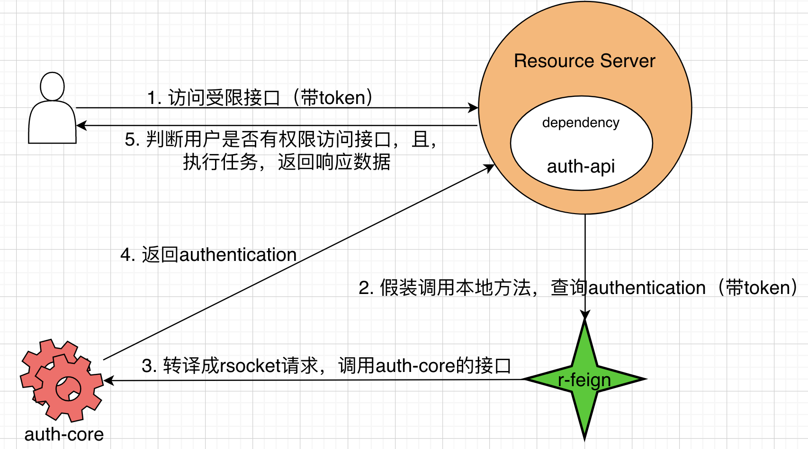

# auth

# 1 项目结构

分两个项目：auth-api, auth-core

其中，auth-api只是接口定义，没有实现。由auth-core负责实现。



----


# 2 构建项目

这两个项目是独立构建的

# 3 接口与实现

## 3.1 接口

即`auth-api`开放的接口。会用到`r-feign`的注解

```
@file:Suppress("unused")

package org.study.auth

import org.study.rfeign.Anonymous
import org.study.rfeign.RSocketClient
import org.springframework.messaging.handler.annotation.MessageMapping
import org.study.auth.model.*
import org.study.auth.model.token.SecurityToken
import org.study.auth.model.token.UserAndToken

/**
 * 不是所有的后台应用都可以访问auth！
 */
@RSocketClient
interface AuthApi {
    /**
     * 此时用户还没登录，没有token，必须匿名访问
     */
    @Anonymous
    @MessageMapping("anonymous.auth.generate.token")
    suspend fun generateToken(request: GenerateToken): UserAndToken

    /**
     * 删除accessToken
     */
    @MessageMapping("auth.delete.token")
    suspend fun deleteToken(request: DeleteToken)

    /**
     * 这个接口相当于转接头。<br/>
     * 相关服务：consumer,provider,auth-api,auth-core。<br/>
     * 调用链如下：<br/>
     * 1. consumer调用provider的接口，且，必须传token。<br/>
     *   普通的参数放入data中，token放入metadata中。<br/>
     *   consumer可以是前端应用，也可以是与provider一样的后台服务。<br/>
     * 2. provider从上下文获取token<br/>
     * 3. provider调用 <code> auth-api.getAuthentication() </code>，拿token换用户信息。<br/>
     *   auth-api只是接口，不能实例化。看起来像是服务，其实，只是一种约定。r-feign读取到这些约定后，才不会做错事。<br/>
     *   token有两种：操作员的token，与被操作者的token。千万不要搞混乱了，操作员的token只能放入metadata中传递。<br/>
     * 4. provider使用r-feign，将调用auth-api的过程，转成rsocket协议，发送报文到auth-core<br/>
     * 5. auth-core开放服务，处理响应
     */
    @Anonymous
    @MessageMapping("anonymous.auth.get.authentication")
    suspend fun getAuthentication(request: GetAuthentication): SecurityToken

    /**
     * 更新用户身份信息。用户不用重新登录
     */
    @MessageMapping("auth.update.authentication")
    suspend fun updateAuthentication(request: UpdateAuthentication)

    /**
     * 删除用户的数据，让用户重新登录
     */
    @MessageMapping("auth.delete.authentication")
    suspend fun deleteAuthentication(request: DeleteAuthentication)

    /**
     * token已过期，需要重新生成token。不需要用户重新登录
     */
    @Anonymous
    @MessageMapping("anonymous.auth.refresh.token")
    suspend fun refreshToken(request: RefreshToken): UserAndToken
}
```

## 3.2 实现

```
import kotlinx.coroutines.async
import kotlinx.coroutines.coroutineScope
import kotlinx.coroutines.launch
import org.slf4j.LoggerFactory
import org.springframework.messaging.handler.annotation.MessageMapping
import org.springframework.security.core.annotation.AuthenticationPrincipal
import org.springframework.stereotype.Controller
import org.study.auth.model.*
import org.study.auth.model.token.SecurityToken
import org.study.auth.model.token.UserAndToken
import org.study.auth.service.*
import org.study.common.config.ErrorCodeException
import java.util.*

@Controller
class AuthController(
    val clientService: AuthClientService,
    val authUserService: AuthUserService,
    val relationService: RelationService,
    val accessTokenService: AccessTokenService,
    val refreshTokenService: RefreshTokenService,
) {
    private val log = LoggerFactory.getLogger(this::class.java)

    @MessageMapping("anonymous.auth.generate.token")
    suspend fun generateToken(request: GenerateToken): UserAndToken {
    }

    /**
     * 删除accessToken
     */
    @MessageMapping("auth.delete.token")
    suspend fun deleteToken(@AuthenticationPrincipal(expression = "schoolmaster") schoolmaster: Schoolmaster, request: DeleteToken) {
    }

    /**
     * 这个接口相当于转接头。<br/>
     * 相关服务：consumer,provider,auth-api,auth-core。<br/>
     * 调用链如下：<br/>
     * 1. consumer调用provider的接口，且，必须传token。<br/>
     *   普通的参数放入data中，token放入metadata中。<br/>
     *   consumer可以是前端应用，也可以是与provider一样的后台服务。<br/>
     * 2. provider从上下文获取token<br/>
     * 3. provider调用 <code> auth-api.getAuthentication() </code>，拿token换用户信息。<br/>
     *   auth-api只是接口，不能实例化。看起来像是服务，其实，只是一种约定。r-feign读取到这些约定后，才不会做错事。<br/>
     *   token有两种：操作员的token，与被操作者的token。千万不要搞混乱了，操作员的token只能放入metadata中传递。<br/>
     * 4. provider使用r-feign，将调用auth-api的过程，转成rsocket协议，发送报文到auth-core<br/>
     * 5. auth-core开放服务，处理响应
     */
    @MessageMapping("anonymous.auth.get.authentication")
    suspend fun getAuthentication(request: GetAuthentication): SecurityToken {
    }

    /**
     * 更新用户身份信息。用户不用重新登录
     */
    @MessageMapping("auth.update.authentication")
    suspend fun updateAuthentication(@AuthenticationPrincipal(expression = "schoolmaster") schoolmaster: Schoolmaster, request: UpdateAuthentication) {
    }

    /**
     * 删除用户的数据，让用户重新登录
     */
    @MessageMapping("auth.delete.authentication")
    suspend fun deleteAuthentication(@AuthenticationPrincipal(expression = "schoolmaster") schoolmaster: Schoolmaster, request: DeleteAuthentication) {
    }

    @MessageMapping("anonymous.auth.refresh.token")
    suspend fun refreshToken(request: RefreshToken): UserAndToken{
    }
```
