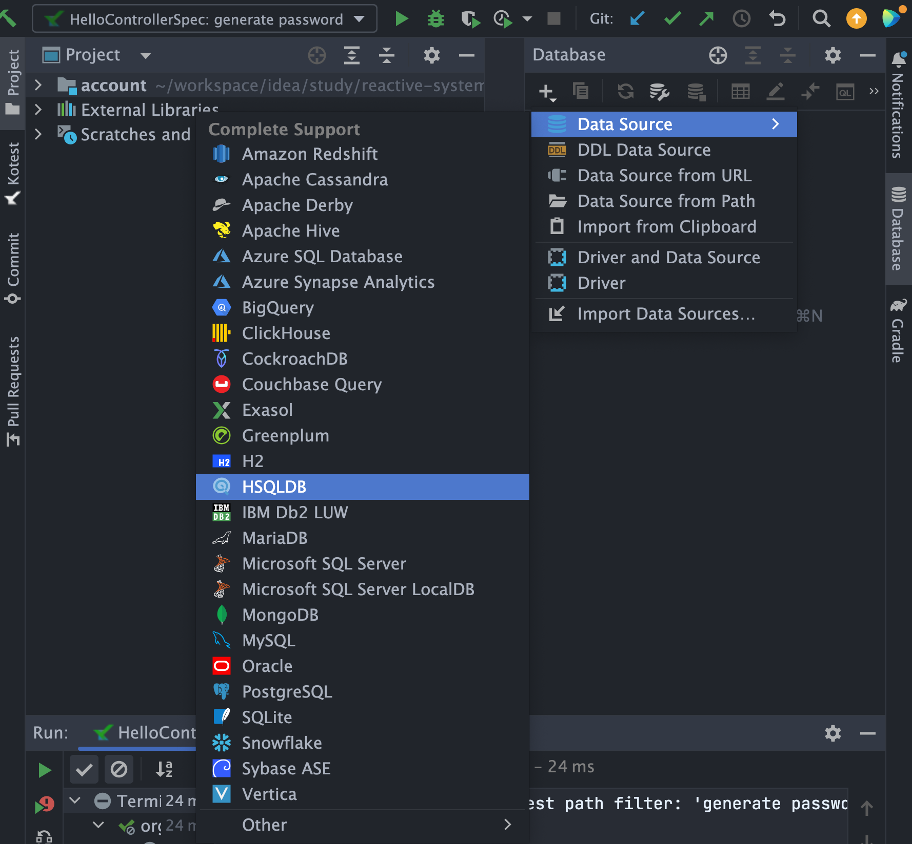

# 数据库

# 1 配置postgresql

```
# 1 下载镜像
docker image pull postgres:11.11-alpine

# 2 运行
docker container run --name postgres -e POSTGRES_PASSWORD=123456 -d -p 5432:5432 postgres:11.11-alpine
# 3. 进入容器
docker container exec -it postgres bash
# 4. 进入默认用户postgres
bash-5.1# psql -U postgres

# 5. 列出所有database
postgres=# \l

# 6. 创建数据库 school
postgres=# create database school owner admin;
CREATE DATABASE
postgres=# grant all privileges on database school to admin;
GRANT

# 7. 切换database & user
postgres=# \q
bash-5.1# psql -d school -U admin;

# 8. 创建独立的schema
school=> create user account with password 'sge!*~';
CREATE ROLE
school=> create user score with password 'FPLWe]';
CREATE ROLE
school=> create schema account;
CREATE SCHEMA
school=> create schema score;
CREATE SCHEMA
school=> 
school=> grant all privileges on schema account to account;
GRANT
school=> grant all privileges on schema score to score;
GRANT
school=> grant usage on schema account to score;
GRANT
school=> grant usage on schema score to account;
GRANT
```

# 2 配置intellij idea的database视图



# 3 初始化10万条测试数据

```sql
-- 1 选择schema account
set search_path = "account"

-- 2 创建
create table t_schoolmaster
(
    id           varchar(36) not null primary key,
    username     varchar(50) not null,
    country_code varchar(4)  not null,
    phone_no     varchar(11) not null,
    password     varchar(65) not null,
    version      bigint    default 0,
    create_time  timestamp default CURRENT_TIMESTAMP,
    update_time  timestamp
);
comment on table t_schoolmaster is '校长';

-- 3 检查表是否为空/10万条数据
select count(*) from t_schoolmaster;

-- 4 快速插入10万条测试数据
insert into t_schoolmaster(id,username,country_code, phone_no,password)
select uuid_in(md5(random()::text || random()::text)::cstring) as id,
       'user-'||generate_series(1,100000)::text as username,
       '86' as country_code,
       '13753532765' as phone_no,
       '$2a$04$IQye8lEkPEmS8lu4hwCzOeQb.Yw4Wzm9d7LNTGWHv5R3ELp6AtVSW' as password;


-- 5 检查数据
select * from t_schoolmaster limit 10;
```


