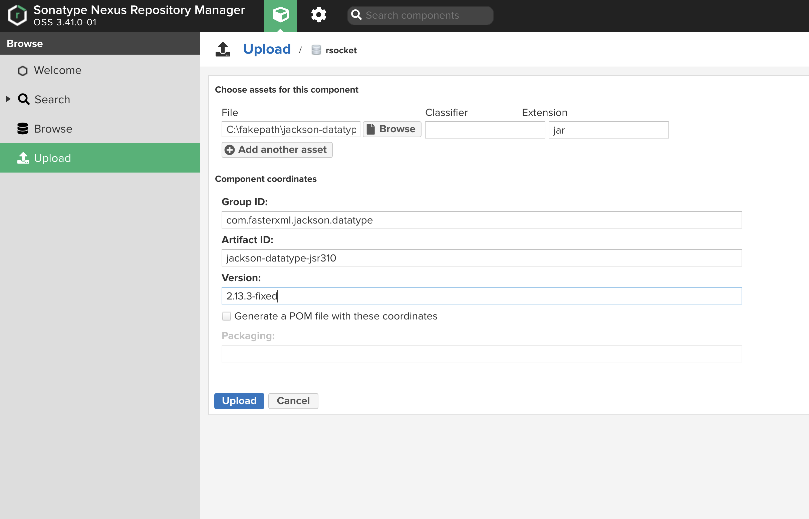
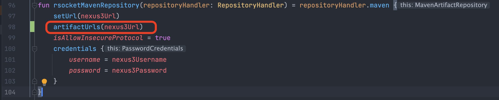

# 1 LocalDateTime

- 时区混乱

- 日期格式

## 1.1 时区

代码、部署的环境、数据库、缓存服务器等都使用UTC时区

- 部署服务的机器，设置时区为UTC

```bash
[root@iZuf6cj08vtnrcmj9d7btfZ ~]# timedatectl
               Local time: Mon 2022-08-29 07:39:26 CST
           Universal time: Sun 2022-08-28 23:39:26 UTC
                 RTC time: Mon 2022-08-29 07:39:25
                Time zone: Asia/Shanghai (CST, +0800)
[root@iZuf6cj08vtnrcmj9d7btfZ ~]# timedatectl set-timezone UTC
[root@iZuf6cj08vtnrcmj9d7btfZ ~]# timedatectl
               Local time: Sun 2022-08-28 23:39:59 UTC
           Universal time: Sun 2022-08-28 23:39:59 UTC
                 RTC time: Sun 2022-08-28 23:39:59
                Time zone: UTC (UTC, +0000)
```

- 设置数据库的时区为UTC

```
[root@iZuf6cj08vtnrcmj9d7btfZ ~]# docker container exec -it postgres bash
bash-5.1# date
Sun Aug 28 23:42:00 UTC 2022
```

- 设置spring 容器的时区为UTC

```
fun main(args: Array<String>) {
    TimeZone.setDefault(TimeZone.getTimeZone("UTC"))
    runApplication<App>(*args)
    Hooks.onErrorDropped { }
}
```

- 设置docker container 的时区为UTC

## 1.2 日期格式

```
# 1 解压 jackson-datatype-jsr310-2.13.3.jar
√~ % jar xf jackson-datatype-jsr310-2.13.3.jar

# 2 替换 `com.fasterxml.jackson.datatype.jsr310.JavaTimeModule.class`

# 3 重新压缩jar
√~ % jar cf jackson-datatype-jsr310-2.13.3-fixed.jar com META-INF

# 4 上传到私有仓库
com.fasterxml.jackson.datatype:jackson-datatype-jsr310:2.13.3-fixed
```



```
# 5 修改build.gradle.kts，添加artifactUrls
```



## 1.3 测试

观察参数、返回值中LocalDatetime字段的值
