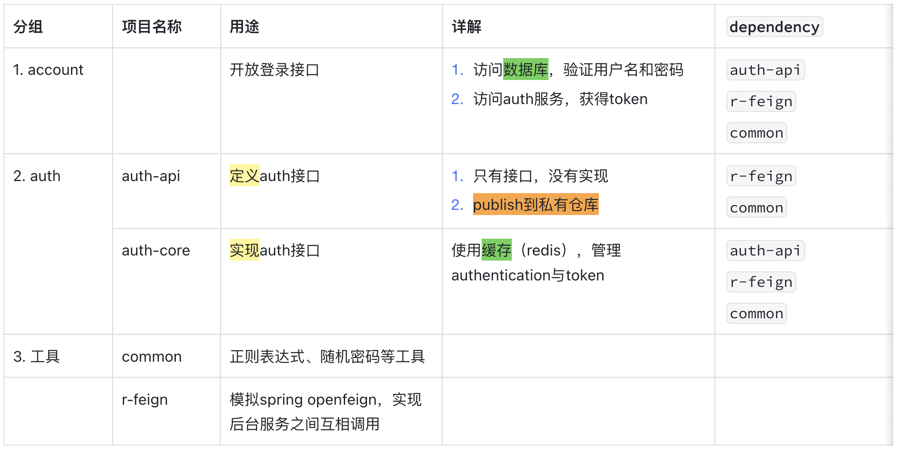
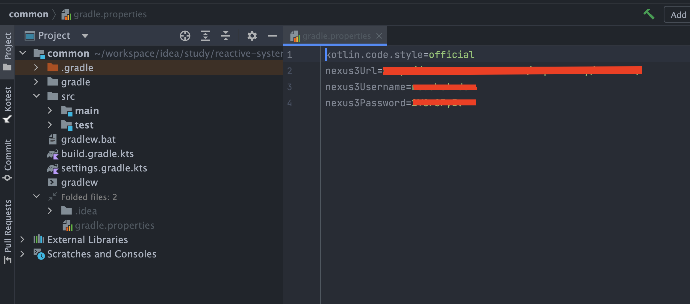
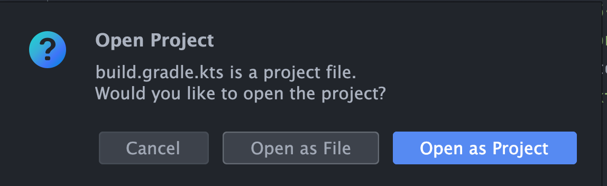
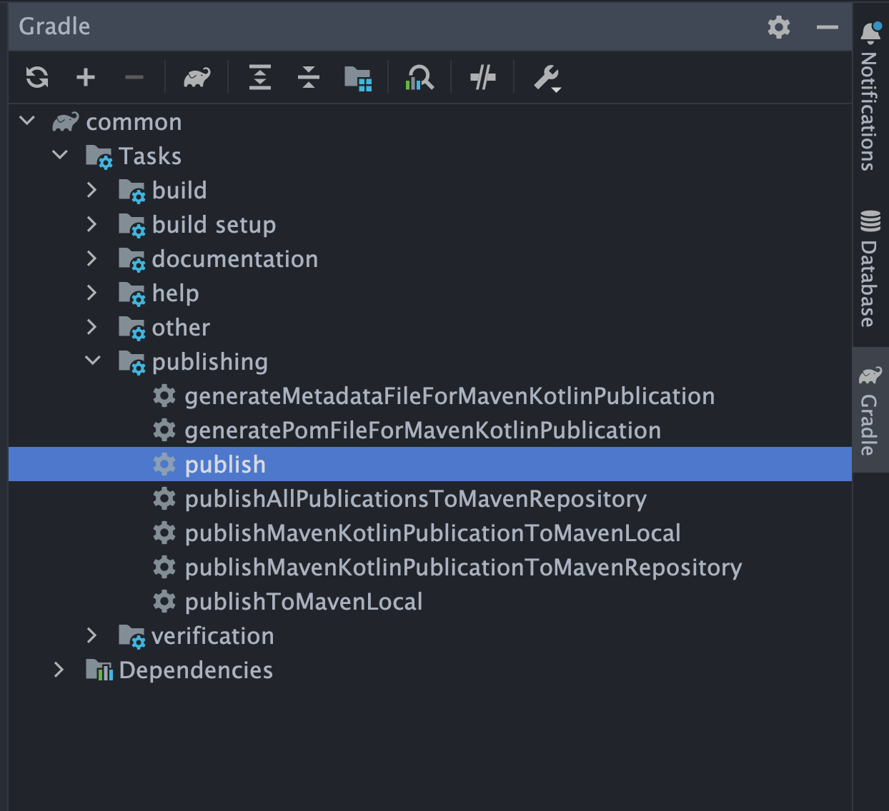
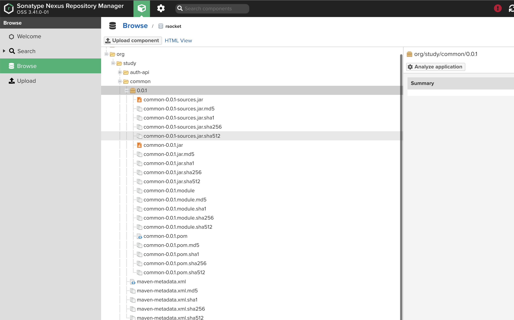
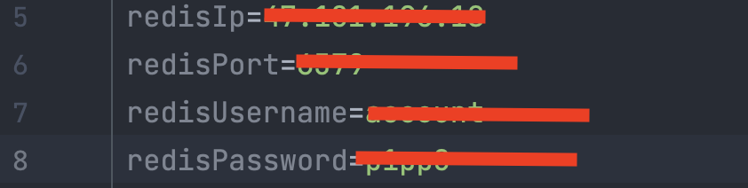
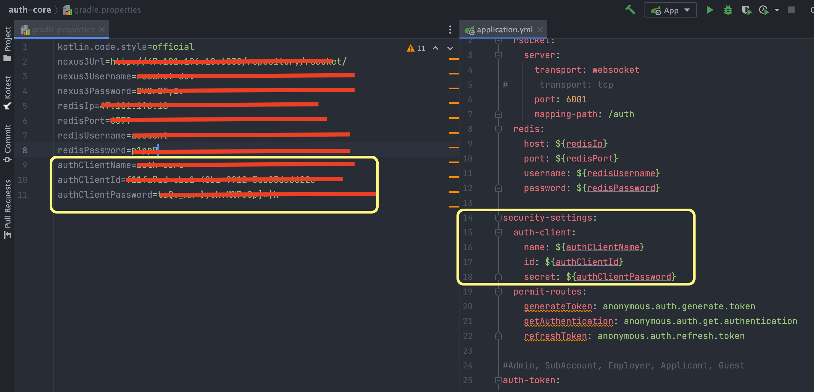
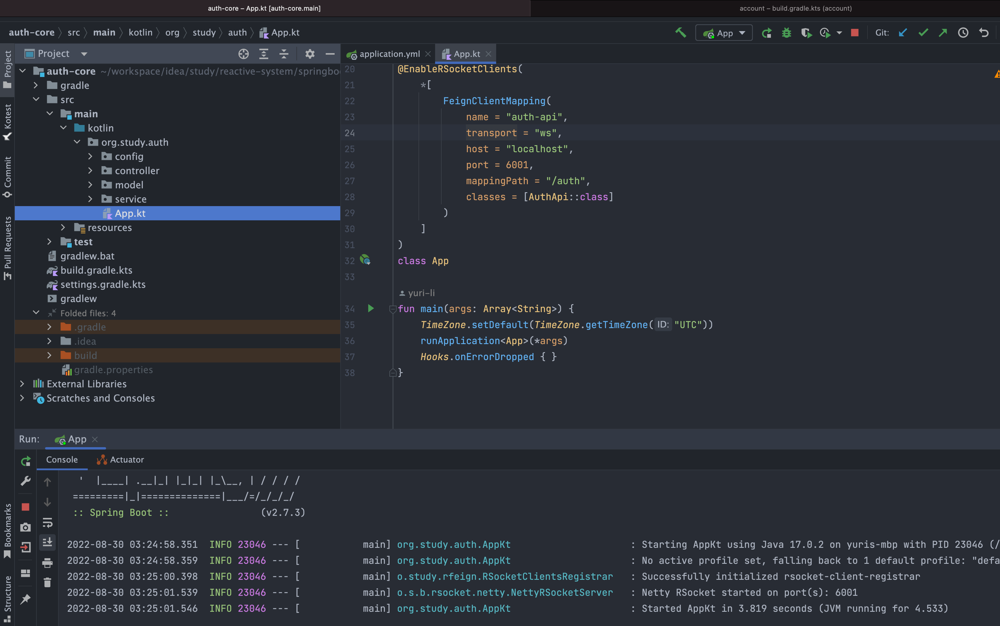
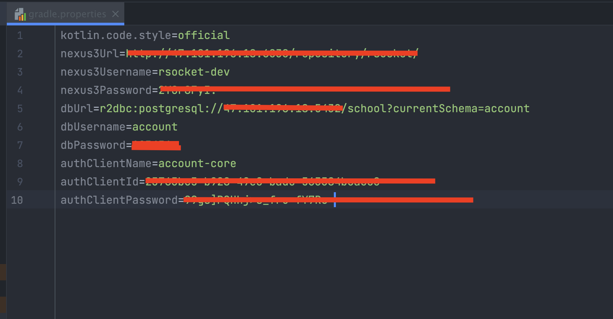

# 部署Helloworld

# 1 构建项目

## 1.1 项目分类

## 1.2 项目结构简介

- 每个服务都是独立构建的，比如auth-api,auth-core。而auth只是一个目录

- 项目构建的入口是“build.gradle.kts”，所以，加载的应该是build.gradle.kts文件，而不是目录

- nexus的IP地址/用户名/密码、application.yml中的变量，都存放在`gradle.properties`中，且，没有上传代码仓库`github`

## 1.3 构建过程

### 1.3.1 构建common

1. 准备开发环境
- 检查jdk版本，必须是17

- 修改git的配置，且保证主干名称是“main”（虽然不是必须的，但还是要做，避免干扰）

- `git clone https://github.com/yuri-li/reactive-system.git`
2. 部署nexus3

请添加管理员与开发者账户。代码中要使用的是开发者账户

3. 构建common
- 修改`gradle.properties`，如下



- 使用intellij idea打开common目录下的`build.gradle.kts`,点击按钮“open as project”



- 上传common到nexus3





### 1.3.2 r-feign

构建过程与common类似，且，需要上传到nexu3中。

> gradle.properties`中nexus3的配置是相同的
> 
> publish命令是复合命令，会自动构建project

### 1.3.3 auth-api

略

### 1.3.4 其他

剩下两个project较复杂

- auth-core，要用到redis

- account，要用到postgresql

# 2 auth-core

## 2.1 配置redis

- 使用docker部署redis

- 进入容器，设置username和password。`auth username password`

## 2.2 gradle.properties



## 2.3 注册auth client

访问auth服务，需要验证client。现在，先要注册两个client：auth-core, account-core

使用`src/test/org.study.auth/AuthClientServiceSpec/"register client"`，注册两个client： auth-core, account-core。

> 代码没写太完善，所以，请手工记录client id,secret

## 2.4 修改gradle.properties



## 2.5 启动src/main/org.study.auth/App.kt




# 3 account

## 3.1 配置postgresql

- 使用docker部署postgresql

- 进入容器，创建database `school`

- 选择database `school`
  
  - 创建角色admin、account、score（请记录每个角色的password）
  
  - 使用account角色创建schema `account`
  
  - 使用score角色创建schema `score`
  
  - 给account角色授权schema `score`的查询权限
  
  - 给score角色授权schema `account`的查询权限

- 使用角色account，进入database `school`

- 选择schema `account`

- 使用下面的SQL，建表，且，插入10万条测试数据

```
create table t_schoolmaster
(
    id           varchar(36) not null primary key,
    username     varchar(50) not null,
    country_code varchar(4)  not null,
    phone_no     varchar(11) not null,
    password     varchar(65) not null,
    version      bigint    default 0,
    create_time  timestamp default CURRENT_TIMESTAMP,
    update_time  timestamp
);
comment on table t_schoolmaster is '校长';


insert into t_schoolmaster(id,username,country_code, phone_no,password)
select uuid_in(md5(random()::text || random()::text)::cstring) as id,
       'user-'||generate_series(1,100000)::text as username,
       '86' as country_code,
       '13753532765' as phone_no,
       '$2a$04$IQye8lEkPEmS8lu4hwCzOeQb.Yw4Wzm9d7LNTGWHv5R3ELp6AtVSW' as password;
```

## 3.2 gradle.properties




# 4 测试

- 运行auth-core

- 执行`account/src/test/org.study.account.controller/LoginControllerSpec/"1百次登录，不同的username"`


1. 执行耗时大约2秒。请根据控制台输出的日志，检查缓存中是否有对应的数据，且，ttl这些数据，查看缓存的失效时间是否正确

2. 可以尝试做性能调试
   
   - 修改`application.yml/spring.r2dbc.pool`，修改数据库的连接数量
   
   - 使用docker部署auth服务、account服务
   
   - 将两个服务都部署在独立的机器上
   
   - 该用tcp协议
   
   - ...


