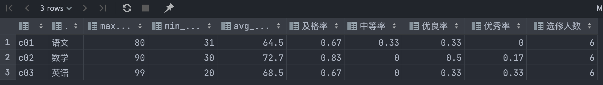

# 经典SQL练习题

# 1 表

| 名称  | 表名称       |
| --- | --------- |
| 老师  | t_teacher |
| 学生  | t_student |
| 课程  | t_course  |
| 成绩  | t_score   |

# 2 初始化

```
truncate table t_schoolmaster;
insert into t_schoolmaster(id, username, country_code, phone_no, password)
values ('master01', '王校长', '86', '13753532765', '$2a$04$IQye8lEkPEmS8lu4hwCzOeQb.Yw4Wzm9d7LNTGWHv5R3ELp6AtVSW');

create table t_teacher
(
    id             varchar(36) not null primary key,
    schoolmasterId varchar(36) not null,
    username       varchar(50) not null,
    country_code   varchar(4)  not null,
    phone_no       varchar(11) not null,
    password       varchar(65) not null,
    version        bigint    default 0,
    create_time    timestamp default CURRENT_TIMESTAMP,
    update_time    timestamp
);
comment on table t_teacher is '老师';

insert into t_teacher(id, schoolmasterId, username, country_code, phone_no, password)
values ('t01', 'master01', '张三', '86', '13753536151', '$2a$04$IQye8lEkPEmS8lu4hwCzOeQb.Yw4Wzm9d7LNTGWHv5R3ELp6AtVSW'),
       ('t02', 'master01', '李四', '86', '13753536152', '$2a$04$IQye8lEkPEmS8lu4hwCzOeQb.Yw4Wzm9d7LNTGWHv5R3ELp6AtVSW'),
       ('t03', 'master01', '王五', '86', '13753536153', '$2a$04$IQye8lEkPEmS8lu4hwCzOeQb.Yw4Wzm9d7LNTGWHv5R3ELp6AtVSW');

create table t_student
(
    id             varchar(36) not null primary key,
    schoolmasterId varchar(36) not null,
    username       varchar(50) not null,
    password       varchar(65) not null,
    birthday       date,
    gender         varchar(10),
    version        bigint    default 0,
    create_time    timestamp default CURRENT_TIMESTAMP,
    update_time    timestamp
);
comment on table t_student is '学生';
insert into t_student(id, schoolmasterId, username, password, birthday, gender)
values ('s01', 'master01', '赵雷', '$2a$04$IQye8lEkPEmS8lu4hwCzOeQb.Yw4Wzm9d7LNTGWHv5R3ELp6AtVSW', '1990-01-01', '男'),
       ('s02', 'master01', '钱电', '$2a$04$IQye8lEkPEmS8lu4hwCzOeQb.Yw4Wzm9d7LNTGWHv5R3ELp6AtVSW', '1990-12-21', '男'),
       ('s03', 'master01', '孙风', '$2a$04$IQye8lEkPEmS8lu4hwCzOeQb.Yw4Wzm9d7LNTGWHv5R3ELp6AtVSW', '1990-05-20', '男'),
       ('s04', 'master01', '李云', '$2a$04$IQye8lEkPEmS8lu4hwCzOeQb.Yw4Wzm9d7LNTGWHv5R3ELp6AtVSW', '1990-08-06', '男'),
       ('s05', 'master01', '周梅', '$2a$04$IQye8lEkPEmS8lu4hwCzOeQb.Yw4Wzm9d7LNTGWHv5R3ELp6AtVSW', '1991-12-01', '女'),
       ('s06', 'master01', '吴兰', '$2a$04$IQye8lEkPEmS8lu4hwCzOeQb.Yw4Wzm9d7LNTGWHv5R3ELp6AtVSW', '1992-03-01', '女'),
       ('s07', 'master01', '郑竹', '$2a$04$IQye8lEkPEmS8lu4hwCzOeQb.Yw4Wzm9d7LNTGWHv5R3ELp6AtVSW', '1989-07-01', '女'),
       ('s08', 'master01', '王菊', '$2a$04$IQye8lEkPEmS8lu4hwCzOeQb.Yw4Wzm9d7LNTGWHv5R3ELp6AtVSW', '1990-01-20', '女');

create table t_course
(
    id          varchar(36) not null primary key,
    course_name varchar(50) not null,
    teacher_id  varchar(36) not null,
    version     bigint    default 0,
    create_time timestamp default CURRENT_TIMESTAMP,
    update_time timestamp
);
comment on table t_course is '课程';
insert into t_course(id, course_name, teacher_id)
values ('c01', '语文', 't02'),
       ('c02', '数学', 't01'),
       ('c03', '英语', 't03');

create table t_score
(
    student_id  varchar(36)    not null,
    course_id   varchar(36)    not null,
    score       decimal(18, 1) not null,
    version     bigint    default 0,
    create_time timestamp default CURRENT_TIMESTAMP,
    update_time timestamp
);
comment on table t_score is '成绩';
insert into t_score(student_id, course_id, score)
values ('s01', 'c01', 80),
       ('s01', 'c02', 90),
       ('s01', 'c03', 99),
       ('s02', 'c01', 70),
       ('s02', 'c02', 60),
       ('s02', 'c03', 80),
       ('s03', 'c01', 80),
       ('s03', 'c02', 80),
       ('s03', 'c03', 80),
       ('s04', 'c01', 50),
       ('s04', 'c02', 30),
       ('s04', 'c03', 20),
       ('s05', 'c01', 76),
       ('s05', 'c02', 87),
       ('s06', 'c01', 31),
       ('s06', 'c03', 34),
       ('s07', 'c02', 89),
       ('s07', 'c03', 98);
```

# 3 练习题

1.查询”c01“课程比”c02“课程成绩高的学生的信息及课程分数

```sql
select a.username,b.score,c.score from t_student a
left join t_score b on a.id=b.student_id and b.course_id='c01'
left join t_score c on a.id=c.student_id and c.course_id='c02'
where b.score > c.score;
```

| username | score | score |
|:-------- |:----- |:----- |
| 钱电       | 70.0  | 60.0  |
| 李云       | 50.0  | 30.0  |

2.查询平均成绩大于等于 60 分的同学的学生编号和学生姓名和平均成绩

```sql
select b.student_id,c.username,b.avg_score
from (select a.student_id,round(avg(a.score),1) avg_score 
  from t_score a group by a.student_id having round(avg(a.score),1)>60) b
left join t_student c on b.student_id=c.id;
```

| student\_id | username | avg\_score |
|:----------- |:-------- |:---------- |
| s01         | 赵雷       | 89.7       |
| s02         | 钱电       | 70         |
| s03         | 孙风       | 80         |
| s05         | 周梅       | 81.5       |
| s07         | 郑竹       | 93.5       |

3.查询在 t_score 表存在成绩的学生信息

```sql
select a.username,a.birthday,a.gender 
from t_student a where exists(
  select 1 from t_score b where a.id=b.student_id);
```

| username | birthday   | gender |
|:-------- |:---------- |:------ |
| 赵雷       | 1990-01-01 | 男      |
| 钱电       | 1990-12-21 | 男      |
| 孙风       | 1990-05-20 | 男      |
| 李云       | 1990-08-06 | 男      |
| 周梅       | 1991-12-01 | 女      |
| 吴兰       | 1992-03-01 | 女      |
| 郑竹       | 1989-07-01 | 女      |

4.查询所有同学的学生编号、学生姓名、选课总数、所有课程的总成绩(没成绩的显示null )

```sql
select a.id,a.username,c.course_no,c.sum_score from t_student a
left join (
  select b.student_id,count(b.course_id) course_no,sum(b.score) sum_score 
  from t_score b group by b.student_id
) c on a.id=c.student_id;
```

| id  | username | course\_no | sum\_score |
|:--- |:-------- |:---------- |:---------- |
| s01 | 赵雷       | 3          | 269        |
| s05 | 周梅       | 2          | 163        |
| s02 | 钱电       | 3          | 210        |
| s04 | 李云       | 3          | 100        |
| s03 | 孙风       | 3          | 240        |
| s06 | 吴兰       | 2          | 65         |
| s07 | 郑竹       | 2          | 187        |
| s08 | 王菊       | NULL       | NULL       |

5.查有成绩的学生信息

```sql
select a.id,a.username from t_student a
where exists(select 1 from t_score b where a.id=b.student_id);
```

| id  | username |
|:--- |:-------- |
| s01 | 赵雷       |
| s02 | 钱电       |
| s03 | 孙风       |
| s04 | 李云       |
| s05 | 周梅       |
| s06 | 吴兰       |
| s07 | 郑竹       |

6.查询「李」姓老师的数量

```sql
select count(a.id) from t_teacher a where a.username like '李%';
```

7.查询学过「张三」老师授课的同学的信息

```sql
select a.id,a.username,a.birthday,a.gender from t_student a
where exists(
    select 1 from t_score d where d.student_id=a.id and exists(
        select 1 from t_course c where c.id=d.course_id and exists(
            select 1 from t_teacher b where b.username='张三' and b.id=c.teacher_id
        )
    )
);
```


8.查询没有学全所有课程的同学的信息

```sql
 select b.student_id,e.username,e.birthday,e.gender 
 from (select a.student_id,count(a.course_id) course_no 
       from t_score a group by a.student_id) b,
    (select count(c.id) course_no from t_course c) d,
    t_student e
where b.course_no<d.course_no and b.student_id=e.id;
```

| student\_id | username | birthday   | gender |
|:----------- |:-------- |:---------- |:------ |
| s05         | 周梅       | 1991-12-01 | 女      |
| s06         | 吴兰       | 1992-03-01 | 女      |
| s07         | 郑竹       | 1989-07-01 | 女      |

9.查询和”s01“号的同学学习的课程完全相同的其他同学的信息

```sql
select e.id,e.username,e.birthday,e.gender from (
  select b.student_id,count(b.course_id) course_no
    from t_score b where b.course_id in 
       (select a.course_id from t_score a where a.student_id='s01')
  group by b.student_id) c,
  t_student e
where c.student_id<>'s01' and c.course_no = 
  (select count(d.course_id) from t_score d where d.student_id='s01')
and c.student_id=e.id order by e.id;
```

| id  | username | birthday   | gender |
|:--- |:-------- |:---------- |:------ |
| s02 | 钱电       | 1990-12-21 | 男      |
| s03 | 孙风       | 1990-05-20 | 男      |
| s04 | 李云       | 1990-08-06 | 男      |

10.查询至少有一门课与学号为”s01“的同学所学相同的同学的信息

```sql
select a.id,a.username,a.birthday,a.gender from t_student a
where exists(select 1 from (
   select c.student_id from t_score c 
   where c.course_id in 
     (select d.course_id from t_score d where d.student_id='s01')
   ) b where a.id=b.student_id
) and a.id<>'s01'
order by a.id;
```

| id  | username | birthday   | gender |
|:--- |:-------- |:---------- |:------ |
| s02 | 钱电       | 1990-12-21 | 男      |
| s03 | 孙风       | 1990-05-20 | 男      |
| s04 | 李云       | 1990-08-06 | 男      |
| s05 | 周梅       | 1991-12-01 | 女      |
| s06 | 吴兰       | 1992-03-01 | 女      |
| s07 | 郑竹       | 1989-07-01 | 女      |

11.查询没学过”张三”老师讲授的任一门课程的学生姓名

```sql
select d.id,d.username,d.birthday,d.gender from t_student d
  where not exists(select 1 from (
    select distinct c.student_id from t_score c where c.course_id in (
      select a.id from t_course a 
      where exists(select 1 from t_teacher b 
        where b.username='张三' and b.id=a.teacher_id)
    )
  ) e where d.id=e.student_id)
order by d.id;
```

| id  | username | birthday   | gender |
|:--- |:-------- |:---------- |:------ |
| s06 | 吴兰       | 1992-03-01 | 女      |
| s08 | 王菊       | 1990-01-20 | 女      |

12.查询两门及其以上不及格课程的同学的学号，姓名及其平均成绩

```sql
select d.student_id,e.username,d.avg_score from (
  select b.student_id,round(avg(b.score),1) avg_score from t_score b
  where exists(select 1 from (
    select a.student_id, count(a.course_id) course_no
    from t_score a where a.score<60 group by a.student_id 
    having count(a.course_id)>=2)c where c.student_id=b.student_id)
  group by b.student_id) d
left join t_student e on d.student_id=e.id;
```

| student\_id | username | avg\_score |
|:----------- |:-------- |:---------- |
| s04         | 李云       | 33.3       |
| s06         | 吴兰       | 32.5       |

13.检索”c01“课程分数小于 60，按分数降序排列的学生信息

```sql
select a.student_id,b.username,b.birthday,b.gender,a.score from t_score a
left join t_student b on a.student_id=b.id
where a.course_id='c01' and a.score<60 order by a.score desc;
```

| student\_id | username | birthday   | gender | score |
|:----------- |:-------- |:---------- |:------ |:----- |
| s04         | 李云       | 1990-08-06 | 男      | 50.0  |
| s06         | 吴兰       | 1992-03-01 | 女      | 31.0  |

14.按平均成绩从高到低显示所有学生的所有课程的成绩以及平均成绩

```sql
select a.student_id,round(avg(a.score),1) avg_score,
  json_object_agg(a.course_id,a.score order by a.course_id) 
from t_score a group by a.student_id order by avg_score desc;

```

| student\_id | avg\_score | json\_object\_agg                            |
|:----------- |:---------- |:-------------------------------------------- |
| s07         | 93.5       | { "c02" : 89.0, "c03" : 98.0 }               |
| s01         | 89.7       | { "c01" : 80.0, "c02" : 90.0, "c03" : 99.0 } |
| s05         | 81.5       | { "c01" : 76.0, "c02" : 87.0 }               |
| s03         | 80         | { "c01" : 80.0, "c02" : 80.0, "c03" : 80.0 } |
| s02         | 70         | { "c01" : 70.0, "c02" : 60.0, "c03" : 80.0 } |
| s04         | 33.3       | { "c01" : 50.0, "c02" : 30.0, "c03" : 20.0 } |
| s06         | 32.5       | { "c01" : 31.0, "c03" : 34.0 }               |

15.查询各科成绩最高分、最低分和平均分，以如下形式显示：课程ID，课程name，最高分，最低分，平均分，及格率，中等率，优良率，优秀率(及格为>=60，中等为：70-80，优良为：80-90，优秀为：>=90）。要求输出课程号和选修人数，查询结果按人数降序排列，若人数相同，按课程号升序排列。（方便显示我改了字段名）

```sql
select b.course_id,c.course_name,b.max_score, b.min_score, 
  b.avg_score, b.及格率, b.中等率, b.优良率, b.优秀率, b.选修人数 from (
select a.course_id,max(a.score) max_score,min(a.score) min_score,
 round(avg(a.score),1) avg_score,
 round(avg(case when a.score>=60 then 1 else 0 end),2) 及格率,
 round(avg(case when a.score>=70 and a.score<80  then 1 else 0 end),2) 中等率,
 round(avg(case when a.score>=80 and a.score<90 then 1 else 0 end),2) 优良率,
 round(avg(case when a.score>=90 then 1 else 0 end),2) 优秀率,
 count(a.student_id) 选修人数
from t_score a
group by a.course_id) b left join t_course c on b.course_id=c.id
order by b.选修人数 desc,b.course_id;
```



16.按平均成绩进行排序，显示总排名和各科排名，score 重复时保留名次空缺

```sql

```


17.按平均成绩进行排序，显示总排名和各科排名，score 重复时合并名次

```sql

```


18.统计各科成绩各分数段人数：课程编号，课程名称，[100-85]，[85-70]，[70-60]，[60-0] 及所占百分比

```sql
select b.course_id,c.course_name,total_no_students,
       more_than_85,round((b.more_than_85/b.total_no_students::float)::numeric,2)*100||'%' more_than_85_percent,
       more_than_70,round((b.more_than_70/b.total_no_students::float)::numeric,2)*100||'%' more_than_70_percent,
       more_than_60,round((b.more_than_60/b.total_no_students::float)::numeric,2)*100||'%' more_than_60_percent,
       less_than_60,round((b.less_than_60/b.total_no_students::float)::numeric,2)*100||'%' less_than_60_percent
from (
select a.course_id,
       sum(case when a.score>=85 then 1 else 0 end) more_than_85,
       sum(case when a.score>=70 and a.score<85 then 1 else 0 end) more_than_70,
       sum(case when a.score>=60 and a.score<70 then 1 else 0 end) more_than_60,
       sum(case when a.score<60 then 1 else 0 end) less_than_60,
       count(a.student_id) total_no_students
from t_score a group by a.course_id) b
left join t_course c on b.course_id=c.id;
```

```json
[
  {
    "course_id": "c01",
    "course_name": "语文",
    "total_no_students": 6,
    "more_than_85": 0,
    "more_than_85_percent": "0.00%",
    "more_than_70": 4,
    "more_than_70_percent": "67.00%",
    "more_than_60": 0,
    "more_than_60_percent": "0.00%",
    "less_than_60": 2,
    "less_than_60_percent": "33.00%"
  },
  {
    "course_id": "c02",
    "course_name": "数学",
    "total_no_students": 6,
    "more_than_85": 3,
    "more_than_85_percent": "50.00%",
    "more_than_70": 1,
    "more_than_70_percent": "17.00%",
    "more_than_60": 1,
    "more_than_60_percent": "17.00%",
    "less_than_60": 1,
    "less_than_60_percent": "17.00%"
  },
  {
    "course_id": "c03",
    "course_name": "英语",
    "total_no_students": 6,
    "more_than_85": 2,
    "more_than_85_percent": "33.00%",
    "more_than_70": 2,
    "more_than_70_percent": "33.00%",
    "more_than_60": 0,
    "more_than_60_percent": "0.00%",
    "less_than_60": 2,
    "less_than_60_percent": "33.00%"
  }
]
```


19.查询各科成绩前三名的记录

```sql
select b.course_id,json_object_agg(b.student_id,b.score order by b.score desc,b.student_id) top_three
from (select  a.*,row_number() over (partition by a.course_id order by a.score desc) as rn from t_score a) b
where b.rn<=3 group by b.course_id;
```

| course\_id | top\_three                                   |
|:---------- |:-------------------------------------------- |
| c01        | { "s01" : 80.0, "s03" : 80.0, "s05" : 76.0 } |
| c02        | { "s01" : 90.0, "s07" : 89.0, "s05" : 87.0 } |
| c03        | { "s01" : 99.0, "s07" : 98.0, "s02" : 80.0 } |

20.查询出只选修两门课程的学生学号和姓名

```sql
select a.student_id,b.username,count(a.course_id) total_no_course from t_score a
left join t_student b on a.student_id=b.id
group by a.student_id,b.username having count(a.course_id)=2;
```

| student\_id | username | total\_no\_course |
|:----------- |:-------- |:----------------- |
| s06         | 吴兰       | 2                 |
| s07         | 郑竹       | 2                 |
| s05         | 周梅       | 2                 |

21.查询名字中含有「风」字的学生信息

```sql
select id,username,birthday,gender from t_student 
where username like '%风%';

```


22.查询 1990 年出生的学生名单

```sql
select id,username,birthday,gender 
from t_student where extract(year from birthday)=1990;

```


23.成绩不重复，查询选修「张三」老师所授课程的学生中，成绩最高的学生信息及其成绩

```sql
select d.course_id,e.student_id,f.username,f.birthday,
f.gender,e.score from (
  select a.course_id,max(a.score) max_score
  from t_score a where exists(
    select 1 from t_teacher b 
    inner join t_course c on b.id=c.teacher_id 
    where b.username='张三' and a.course_id=c.id)
  group by a.course_id) d
left join t_score e on d.course_id=e.course_id and d.max_score=e.score
left join t_student f on e.student_id=f.id;
```

| course\_id | student\_id | username | birthday   | gender | score |
|:---------- |:----------- |:-------- |:---------- |:------ |:----- |
| c02        | s01         | 赵雷       | 1990-01-01 | 男      | 90.0  |

24.成绩有重复的情况下，查询选修「张三」老师所授课程的学生中，成绩最高的学生信息及其成绩

```sql

```


25.查询各学生的年龄，只按年份来算

```sql
select id,username,birthday,
 date_part('year', age(current_date, birthday))::int age 
from t_student;

```

| id  | username | birthday   | age |
|:--- |:-------- |:---------- |:--- |
| s01 | 赵雷       | 1990-01-01 | 32  |
| s02 | 钱电       | 1990-12-21 | 31  |
| s03 | 孙风       | 1990-05-20 | 32  |
| s04 | 李云       | 1990-08-06 | 32  |
| s05 | 周梅       | 1991-12-01 | 30  |
| s06 | 吴兰       | 1992-03-01 | 30  |
| s07 | 郑竹       | 1989-07-01 | 33  |
| s08 | 王菊       | 1990-01-20 | 32  |

26.按照出生日期来算，当前月日 < 出生年月的月日则，年龄减一

```sql
select c.id,c.username,c.birthday,
  c.s_age_year+(case when c.s_age_month>=6 then 1 else 0 end) age
from (
  select b.id,b.username,b.birthday,
    date_part('year',b.s_age)::int s_age_year, 
    date_part('month',b.s_age)::int s_age_month
from (select a.id,a.username,a.birthday,
   age(current_date, a.birthday) s_age from t_student a) b) c;

```

| id  | username | birthday   | age |
|:--- |:-------- |:---------- |:--- |
| s01 | 赵雷       | 1990-01-01 | 33  |
| s02 | 钱电       | 1990-12-21 | 32  |
| s03 | 孙风       | 1990-05-20 | 32  |
| s04 | 李云       | 1990-08-06 | 32  |
| s05 | 周梅       | 1991-12-01 | 31  |
| s06 | 吴兰       | 1992-03-01 | 30  |
| s07 | 郑竹       | 1989-07-01 | 33  |
| s08 | 王菊       | 1990-01-20 | 33  |

27.查询本周过生日的学生

```sql
select b.id,b.username,b.birthday,b.start_date,b.end_date,
  (case when b.current_year between b.start_date and b.end_date 
   then 1 else 0 end) is_current_week
from (select a.id,a.username,a.birthday,
  (date_part('year',current_date)||'-'||to_char(a.birthday,'MM-DD'))::date current_year,
  to_char(date_trunc('week',current_date) - interval '1' day,'YYYY-MM-DD')::date start_date,
  to_char(date_trunc('week',current_date) + interval '5' day,'YYYY-MM-DD')::date end_date 
from t_student a) b;

```

| id  | username | birthday   | start\_date | end\_date  | is\_current\_week |
|:--- |:-------- |:---------- |:----------- |:---------- |:----------------- |
| s01 | 赵雷       | 1990-01-01 | 2022-08-28  | 2022-09-03 | 0                 |
| s02 | 钱电       | 1990-12-21 | 2022-08-28  | 2022-09-03 | 0                 |
| s03 | 孙风       | 1990-05-20 | 2022-08-28  | 2022-09-03 | 0                 |
| s04 | 李云       | 1990-08-06 | 2022-08-28  | 2022-09-03 | 0                 |
| s05 | 周梅       | 1991-12-01 | 2022-08-28  | 2022-09-03 | 0                 |
| s06 | 吴兰       | 1992-03-01 | 2022-08-28  | 2022-09-03 | 0                 |
| s07 | 郑竹       | 1989-07-01 | 2022-08-28  | 2022-09-03 | 0                 |
| s08 | 王菊       | 1990-01-20 | 2022-08-28  | 2022-09-03 | 0                 |

28.查询本月过生日的学生

```sql
select b.id,b.username,b.birthday,b.start_date,b.end_date,
       (case when b.current_year between b.start_date and b.end_date then 1 else 0 end) is_current_month
from (select a.id,a.username,a.birthday,(date_part('year',current_date)||'-'||to_char(a.birthday,'MM-DD'))::date current_year,to_char(date_trunc('month',current_date),'YYYY-MM-DD')::date start_date,to_char(date_trunc('month',current_date) + interval '1' month - interval '1' day,'YYYY-MM-DD')::date end_date from t_student a) b;

```

| id  | username | birthday   | start\_date | end\_date  | is\_current\_month |
|:--- |:-------- |:---------- |:----------- |:---------- |:------------------ |
| s01 | 赵雷       | 1990-01-01 | 2022-08-01  | 2022-08-31 | 0                  |
| s02 | 钱电       | 1990-12-21 | 2022-08-01  | 2022-08-31 | 0                  |
| s03 | 孙风       | 1990-05-20 | 2022-08-01  | 2022-08-31 | 0                  |
| s04 | 李云       | 1990-08-06 | 2022-08-01  | 2022-08-31 | 1                  |
| s05 | 周梅       | 1991-12-01 | 2022-08-01  | 2022-08-31 | 0                  |
| s06 | 吴兰       | 1992-03-01 | 2022-08-01  | 2022-08-31 | 0                  |
| s07 | 郑竹       | 1989-07-01 | 2022-08-01  | 2022-08-31 | 0                  |
| s08 | 王菊       | 1990-01-20 | 2022-08-01  | 2022-08-31 | 0                  |

29.查询下月过生日的学生

```sql
select b.id,b.username,b.birthday,b.start_date,b.end_date,
       (case when b.current_year between b.start_date and b.end_date then 1 else 0 end) is_current_month
from (select a.id,a.username,a.birthday,(date_part('year',current_date)||'-'||to_char(a.birthday,'MM-DD'))::date current_year,to_char(date_trunc('month',current_date)+ interval '1' month,'YYYY-MM-DD')::date start_date,to_char(date_trunc('month',current_date) + interval '2' month - interval '1' day,'YYYY-MM-DD')::date end_date from t_student a) b;

```

| id  | username | birthday   | start\_date | end\_date  | is\_current\_month |
|:--- |:-------- |:---------- |:----------- |:---------- |:------------------ |
| s01 | 赵雷       | 1990-01-01 | 2022-09-01  | 2022-09-30 | 0                  |
| s02 | 钱电       | 1990-12-21 | 2022-09-01  | 2022-09-30 | 0                  |
| s03 | 孙风       | 1990-05-20 | 2022-09-01  | 2022-09-30 | 0                  |
| s04 | 李云       | 1990-08-06 | 2022-09-01  | 2022-09-30 | 0                  |
| s05 | 周梅       | 1991-12-01 | 2022-09-01  | 2022-09-30 | 0                  |
| s06 | 吴兰       | 1992-03-01 | 2022-09-01  | 2022-09-30 | 0                  |
| s07 | 郑竹       | 1989-07-01 | 2022-09-01  | 2022-09-30 | 0                  |
| s08 | 王菊       | 1990-01-20 | 2022-09-01  | 2022-09-30 | 0                  |
