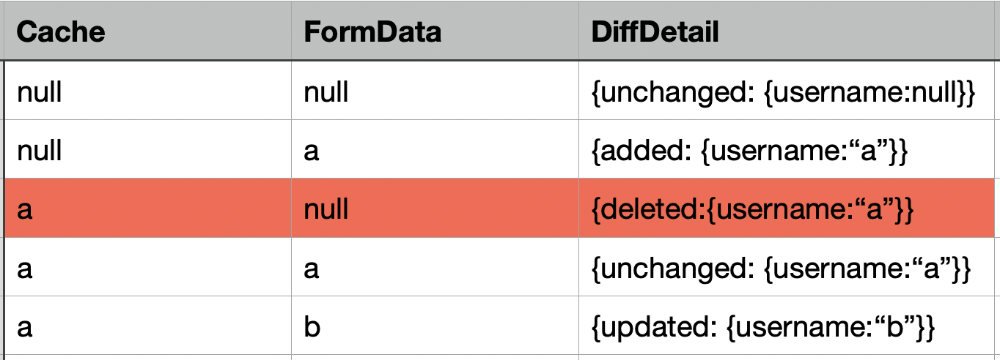

**1. 用户提交的数据是formData。那么，用来做对比的Cache是什么？**

|        | 用户上次提交的数据 LastSubmittedData | 页面初始化 initFormData | 从后端读取 LoadFromRemote |
| ------ | ------------------------------- | ---------------------- | ------------------------ |
| Create | ✓                               | ✓                      |                          |
| Read   | ✓                               | ✓                      |                          |
| Update |                                 |                        | ✓                        |
| Delete | ✓                               |                        |                          |

**2. 缓存formData，submit之"前"？还是"后"？**

答：submit之“前”

**3. 某业务场景，比如查询全部，允许用户重复提交，怎么做？**

答：默认抛异常，但，可修改配置<mark>`allowDuplicate:boolean`</mark>

**4. 查询全部，或，删除全部，接口没有参数，缓存什么？**

答：formData为空，不缓存

**5. (Update)更新操作，提交后台的数据中，若某字段为空，是忽略？还是更新为空？**

答：设，字段username，对比结果如下：

所以，username为空，有两种情况：unchanged、deleted

其中，

- unchanged的数据不需要传递到后台

- deleted的数据，即，更新为空

> Update，比较的是细节。Create/Read/Delete，只是比较是否相等
