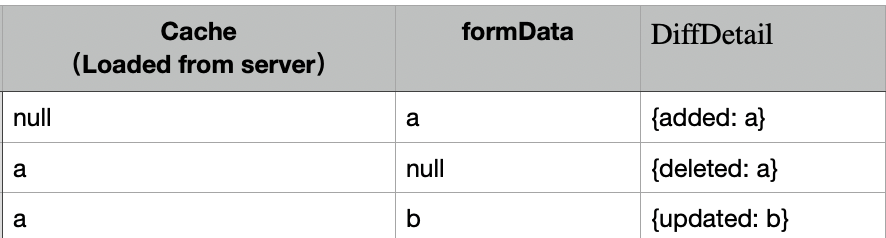

**1. 用户提交的数据是formData。那么，用来做对比的Cache是什么？**

答：Cache有三种来源：用户上次提交的数据(LastSubmittedData)、页面初始化时的默认值(InitData)、页面初始化时从后端读取的数据（LoadFromRemote）

|        | LastSubmittedData | initFormData | LoadFromRemote |
| ------ | ----------------- | ------------ | -------------- |
| Create | ✓                 | ✓            |                |
| Read   | ✓                 | ✓            |                |
| Update |                   |              | ✓              |
| Delete | ✓                 |              |                |

**2. 缓存formData，submit之"前"？还是"后"？**

答：若使用`Fire-And-Forget`模式，没有返回值。所以，是submit之前缓存。

**3. 某业务场景，允许用户重复提交，怎么做？**

答：默认抛异常，但，可修改配置<mark>`allowDuplicate:boolean`，默认`false`</mark>

**4. 查询全部，或，删除全部，接口没有参数，缓存什么？**

答：formData为空，不缓存

**5. (Update)更新操作，提交后台的数据中，若某字段为空，是忽略？还是更新为空？**

答：前端判断不了，交给后台判断。前端只需要忠实记录用户修改过的数据。

**1)** 设，某字段值有如下三种情况，分别对应三种对比结果：



**2)** 如上图，因为严格区分了数据的变化过程，所以，后端拿到数据后，会知道如何处理的。封装对比结果，如下：

```typescript
class DiffDetail<T> {
  added: Partial<T> | undefined
  deleted: Partial<T> | undefined
  updated: Partial<T> | undefined
  unchanged: Partial<T> | undefined

  public constructor(init?: Partial<DiffDetail<T>>) {
    Object.assign(this, init)
  }
}
```

**6. (Update)更新操作，前后端交互数据使用`DiffDetail<T>`？但，Java/kotlin不支持`Partial<T>`，怎么办？**

答：
