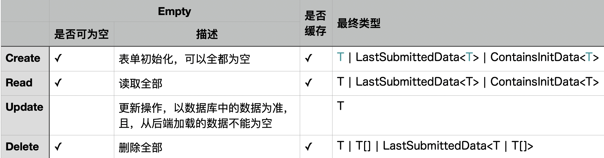

# 1 如何防止用户重复点击？

自定义`throttle`函数，3秒内，只能点击一次

- 3秒内，只能触发一次

- 与vue3结合，控制按钮的状态

## 1.1 源码

```typescript
import {
    ref,
    Ref
} from "vue"

function throttle<R, A extends any[]>(fn: (...args: A) => R | Promise<R>, delay: number = 3000): [(...args: A) => R | Promise<R> | undefined, Ref<boolean>]{
    const disabledBtn:Ref<boolean> = ref(false)

    return [(...args: A) => {
        if (disabledBtn.value) return undefined
        const _fn = fn(...args)
        disabledBtn.value = true
        setTimeout(() => {
            disabledBtn.value = false
        }, delay)
        return _fn
    }, disabledBtn]
}
export { throttle }
```

## 1.2 测试

```typescript
import {
    describe,
    expect
} from "vitest"
import { throttle } from "@/service/throttle"

describe("测试throttle",()=>{
    test("普通函数",()=>{
        const msg = "executed"
        const fn = () => msg
        const [throttledFn,disabledBtn] = throttle(fn)
        expect(throttledFn()).toBe(msg)
        expect(disabledBtn.value).toBe(true)

        expect(throttledFn()).toBeUndefined()
        expect(throttledFn()).toBeUndefined()
        expect(disabledBtn.value).toBe(true)

        setTimeout(()=>{
            expect(disabledBtn.value).toBe(false)
            expect(throttledFn()).toBe(msg)
            expect(disabledBtn.value).toBe(true)
        }, 3000)
    })
    test("Promise函数",async () => {
        const msg = "executed"
        const fn = () => new Promise((resolve, _) => {
            setTimeout(() => {
                resolve(msg)
            }, 1000)
        })
        const [throttledFn, disabledBtn] = throttle(fn)

        expect(await throttledFn()).toBe(msg)
        expect(disabledBtn.value).toBe(true)

        expect(await throttledFn()).toBeUndefined()
        expect(await throttledFn()).toBeUndefined()
        expect(disabledBtn.value).toBe(true)
        setTimeout(async () => {
            expect(disabledBtn.value).toBe(false)
            expect(await throttledFn()).toBe(msg)
            expect(disabledBtn.value).toBe(true)
        }, 4000)
    })
})
```

# 2 如何封装CacheData?



- `LastSubmittedData`，缓存上一次提交的数据

- `ContainsInitData`，缓存上一次提交的数据，且，设置初始值

**1.为什么Update缓存的数据不能为空？**

答：Update，对比（缓存）的数据来自数据库。

**2. 为什么只有Delete的类型有数组？**

答：Delete，提交的数据不是formData，而是id或其他业务字段。且，允许批量删除

**3. 为什么Delete的类型不能是`ContainsInitData`？**

答：按id删除，id是变量，怎么给默认值？
