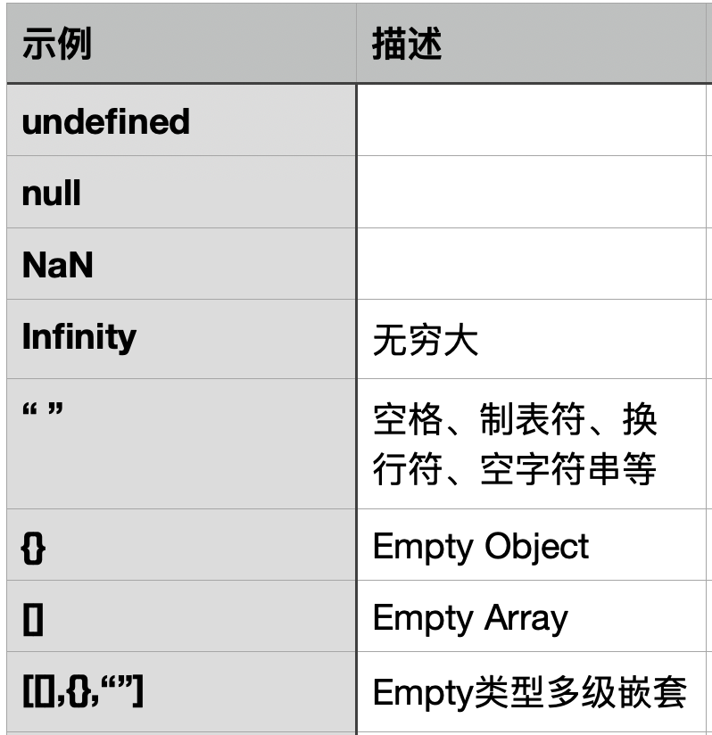

# 1 场景描述

`person`是Empty吗？

答：**是**

```typescript
const person = new Person({address: new Address({postcode: ""})})

class Person {
    username?: string
    address?: Address
}

class Address {
    postcode?: string
    addressName?: string
}
```

# 2 什么是Empty?


