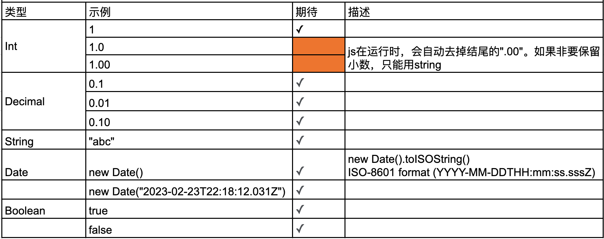
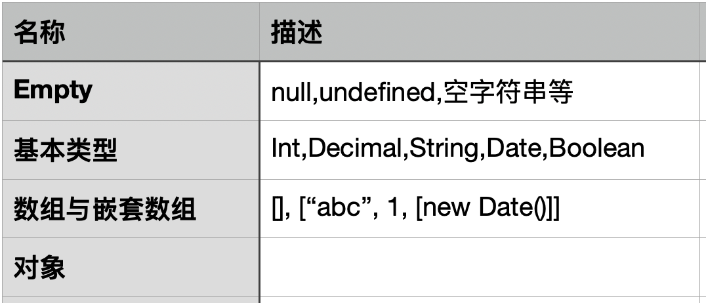

# 1 为什么要重新约定类型

> Empty好复杂

需要设计更严格的类型系统，才能比对前端提交的数据。

# 2 JSON

| 前端         | 交互   | 后端     |
| ---------- | ---- | ------ |
| typescript | json | kotlin |

每个环节对“类型”的定义都不相同，但，都要支持json。所以，类型系统必须以json为基础。

# 3 废弃的类型

Map、Set都不能转成json，所以，废弃

BigInt，解析费劲，废弃。可以用string替代。

Symbol，前后端交互用不上这个类型，废弃。

二进制、8进制、16进制都会自动转成10进制。前后端交互也用不上这些类型，废弃。

Enum转json会变成Int或String，所以，废弃。

# 4 基本类型

json支持的基本类型如下：


```typescript
enum BaseType {
  Empty = "Empty",
  Int = "Int",
  Decimal = "Decimal",
  String = "String",
  Date = "Date",
  Boolean = "Boolean",
  Array = "Array",
  Object = "Object",
}
```

# 5 类型系统



# 6 测试

## 6.1 Empty

## 6.2 基本类型

## 6.3 Array

## 6.4 Object

## 6.5 各种混
