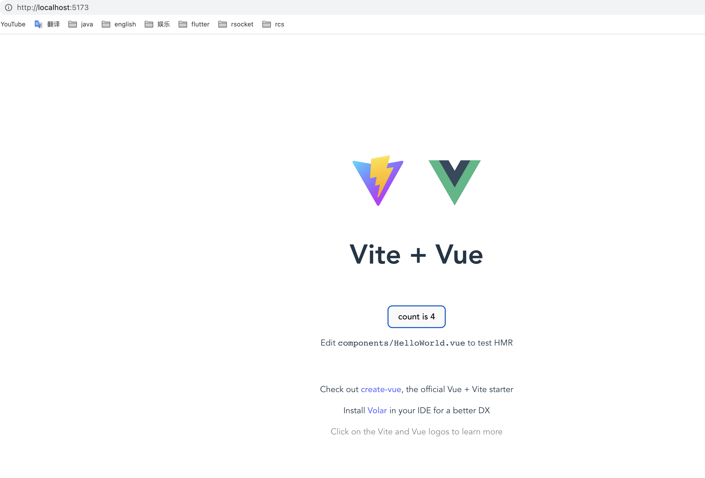
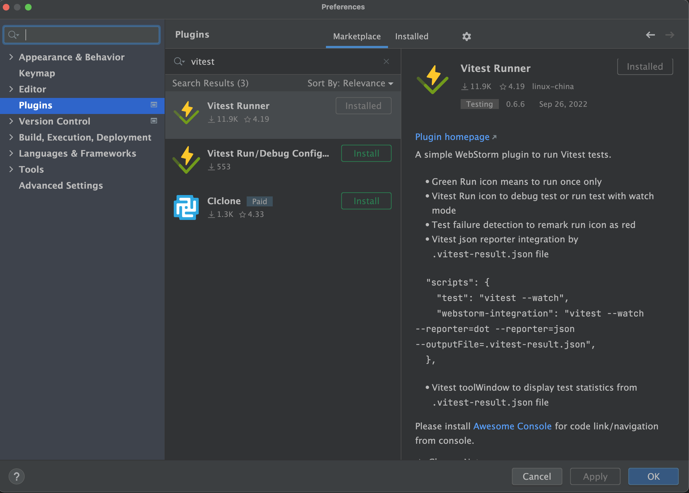

# 1 目的

循序渐进地学习vue3。

先构建一个vue3 + typescript + vitest的开发环境

# 2 版本管理

| 名称            | 描述                  | version         | 备注                                                                  |
| ------------- | ------------------- | --------------- | ------------------------------------------------------------------- |
| intellij idea | 开发工具                |                 | 前端项目已经很复杂了，vscode的插件安装/配置也多了，换成intellij idea，可以少很多麻烦                |
| nodejs        | 运行环境                | stable v18.12.0 |                                                                     |
| npm           | 包管理工具               | 8.19.2          | 使用npm（安装/升级）yarn                                                    |
| yarn          | 包管理工具               | 1.22.19         |                                                                     |
| eslint        | 代码格式校验              | 8.22.0          | 必须是这个版本，否则，构建报错`TypeError: this.libOptions.parse is not a function` |
| vitest        | 测试框架                | 0.24.5          |                                                                     |
| ts-node       | 可以直接运行typescript的工具 | 10.9.1          |                                                                     |
| vite          | 前端开发与构建工具           | 3.2.2           |                                                                     |

# 3 升级nodejs

```bash
# 1 查看开发环境
$ npm --version
8.4.1
$ ode --version
v17.5.0

# 2 升级
## 2.1 强制清理缓存
sudo npm cache clean -f
## 2.2 全局安装nodejs
sudo npm install -g n
## 2.3 启用stable版本
sudo n stable

# 3 查看是否更新成功
$ npm --version
8.19.2
$ node --version
v18.12.0
```

# 4 升级yarn

```bash
# 1 查看yarn版本
$ yarn -v
1.22.17

# 2 更新yarn
$ npm install --global yarn

changed 1 package, and audited 2 packages in 4s

found 0 vulnerabilities

# 3 再次确认
$ yarn -v
1.22.19

# 4 查看npm全局安装的包(多余的，卸载)
$ npm list -g --depth 0 
/usr/local/lib
├── corepack@0.14.2
├── n@9.0.0
├── npm@8.19.2
└── yarn@1.22.19
```

# 5 创建空项目

```bash
# 1 查看工作目录
$ pwd
/Users/yuri/workspace/idea/study/reactive-system/vue3-demo
```

## 5.1 yarn,vite,vue3,typescript

yarn,vite,vue3,typescript，各自的用途？如果有冲突，优先使用哪个？

- 使用yarn管理package

- 使用vite构建项目，管理源码、打包（开发、测试、生产，tree-shaking、懒加载和 chunk 分割）

- 使用vite提供的vue-ts模版

## 5.2 创建项目

https://cn.vitejs.dev/guide/#trying-vite-online

```bash
# 2 创建空项目
$ yarn create vite admin --template vue-ts

# 3 进入工作目录
$ cd admin

# 4 构建项目（加载依赖、编译、打包）
yarn

# 5 运行示例代码
yarn dev
```



## 5.3 使用intellij idea

使用intellij idea打开项目admin

### 5.3.1 合并tsconfig.node.json

把相关代码copy到`tsconfig.json`

> 配置文件太多了，能少一个是一个

### 5.3.2 加载依赖

```bash
yarn add -D @types/node @typescript-eslint/eslint-plugin \
 @typescript-eslint/parser @vitest/coverage-c8 @vue/test-utils \
eslint eslint-plugin-vue jsdom ts-node vitest sass
```

# 6 路径管理

- `@`，代表“src/”目录

- `~`，代表“test/”目录

## 6.1 vite.config.ts

```typescript
/// <reference types="vitest" />
// noinspection SpellCheckingInspection

import {defineConfig} from "vite"
import Vue from "@vitejs/plugin-vue"
import {resolve} from "path"

// https://vitejs.dev/config/
// noinspection JSUnusedGlobalSymbols
export default defineConfig({
    plugins: [Vue()],
    build: {
        target: "esnext",
        minify: false,
        rollupOptions: {
            output: {
                manualChunks: (id) => {
                    if (id.includes("node_modules")) {
                        return "vendor"
                    }
                },
            },
        },
    },
    resolve: {
        alias: {
            "@": resolve(__dirname, "src/"),
            "~": resolve(__dirname, "test/")
        }
    },
    test: {
        globals: true,
        environment: "jsdom",
        coverage: {
            reporter: ["text", "json", "html"],
        },
        include: ["test/**/*.spec.ts"],
    },
})
```

## 6.2 tsconfig.json

```json
{
  "compilerOptions": {
    "composite": true,
    "module": "ESNext",
    "moduleResolution": "Node",
    "allowSyntheticDefaultImports": true,
    "target": "ESNext",
    "useDefineForClassFields": true,
    "strict": true,
    "alwaysStrict": true,
    "importsNotUsedAsValues": "error",
    "sourceMap": true,
    "resolveJsonModule": true,
    "isolatedModules": true,
    "esModuleInterop": true,
    "jsx": "preserve",
    "types": ["vitest/globals"],
    "lib": ["ESNext", "DOM"],
    "skipLibCheck": true,
    "noEmit": true,
    "forceConsistentCasingInFileNames": true,
    "outDir": "dist",
    "baseUrl": ".",
    "paths": {
      "@/*": ["src/*"],
      "~/*": ["test/*"]
    }
  },
  "include": [
    "src/**/*.ts","src/**/*.d.ts","src/**/*.vue",
    "test/**/*.ts","test/**/*.d.ts"
  ],
  "exclude": ["node_modules", "dist"]
}
```

# 7 test/HelloWorld.spec.ts

```typescript
import HelloWorld from "@/components/HelloWorld.vue"
import App from "@/App.vue"
import { shallowMount, mount } from "@vue/test-utils"
import { describe } from "vitest"

const buildWrapper = (msg = "") => shallowMount(HelloWorld, {
    props: {
        msg
    }
})
describe("组件HelloWorld", () => {
    const emptyWrapper = buildWrapper()
    test("是否包含button", () => {
        const element = emptyWrapper.find("div > button")
        expect(element.exists()).toBeTruthy()
    })
    test("获取count的默认值", () => {
        expect((emptyWrapper.vm as any).count).toBe(0)
    })
    test("触发button 点击事件，观察点击前后count的值", async () => {
        expect((emptyWrapper.vm as any).count).toBe(0)

        const element = emptyWrapper.find("div > button")
        await element.trigger("click")
        expect((emptyWrapper.vm as any).count).toBe(1)
    })

    test("msg props: 有默认值", () => {
        const element = emptyWrapper.find("h1")
        expect(element.exists()).toBeTruthy()

        expect(element.text()).toBe("")
    })

    test("msg props: 给msg赋值", () => {
        const wrapper = buildWrapper("hello world")
        const element = wrapper.find("h1")

        expect(element.text()).toBe("hello world")
    })

    test("运行起来，测试真实的组件", () =>{
        const wrapper = mount(App)
        const element = wrapper.find("h1")
        expect(element.exists()).toBeTruthy()

        expect(element.text()).toBe("Vite + Vue")
    })
})
```

# 8 .eslintrc.json

```json
{
    "root": true,
    "env": {
        "browser": true,
        "es2022": true,
        "node": true
    },
    "extends": [
        "eslint:recommended",
        "plugin:@typescript-eslint/recommended",
        "plugin:vue/vue3-recommended"
    ],
    "parser": "vue-eslint-parser",
    "parserOptions": {
        "ecmaVersion": "latest",
        "sourceType": "module",
        "parser": {
            "ts": "@typescript-eslint/parser",
            "vue": "vue-eslint-parser",
            "template": "vue-eslint-parser"
        }
    },
    "plugins": ["@typescript-eslint", "vue"],
    "globals": {
        "defineProps": "readonly",
        "defineEmits": "readonly",
        "defineExpose": "readonly",
        "withDefaults": "readonly"
    },
    "rules": {
        "vue/no-mutating-props": "off",
        "vue/multi-word-component-names": "off",
        "vue/no-v-html": "off",
        "vue/first-attribute-linebreak": "off",
        "vue/html-quotes": ["error", "double"],
        "vue/html-indent": "off",
        "vue/singleline-html-element-content-newline": "off",
        "vue/max-attributes-per-line": "off",
        "vue/html-self-closing": "off",
        "@typescript-eslint/no-namespace": "off",
        "quotes": ["error", "double"],
        "semi": ["error", "never", {"beforeStatementContinuationChars": "never"}]
    }
}
```

# 9 package.json

```json
{
  "name": "admin",
  "private": true,
  "version": "0.0.0",
  "license": "MIT",
  "author": "yuri <javaliyuanyuan@163.com> (https://github.com/yuri-li)",
  "type": "module",
  "scripts": {
    "dev": "vite",
    "test": "vitest",
    "coverage": "vitest run --coverage",
    "build": "vue-tsc && vite build",
    "preview": "vite preview",
    "lint:script": "eslint --ext .ts,.vue --ignore-path .gitignore ."
  },
  "dependencies": {
    "vue": "^3.2.41"
  },
  "devDependencies": {
    "@types/node": "^18.11.9",
    "@typescript-eslint/eslint-plugin": "^5.42.0",
    "@typescript-eslint/parser": "^5.42.0",
    "@vitejs/plugin-vue": "^3.2.0",
    "@vitest/coverage-c8": "^0.24.5",
    "@vue/test-utils": "^2.2.1",
    "eslint": "8.22.0",
    "eslint-plugin-vue": "^9.7.0",
    "jsdom": "^20.0.2",
    "ts-node": "^10.9.1",
    "typescript": "^4.8.4",
    "vite": "^3.2.2",
    "vitest": "^0.24.5",
    "vue-tsc": "^1.0.9"
  }
}
```

# 10 测试

- 使用eslint检测代码

- 使用vitest执行`test/HelloWorld.spec.ts`


