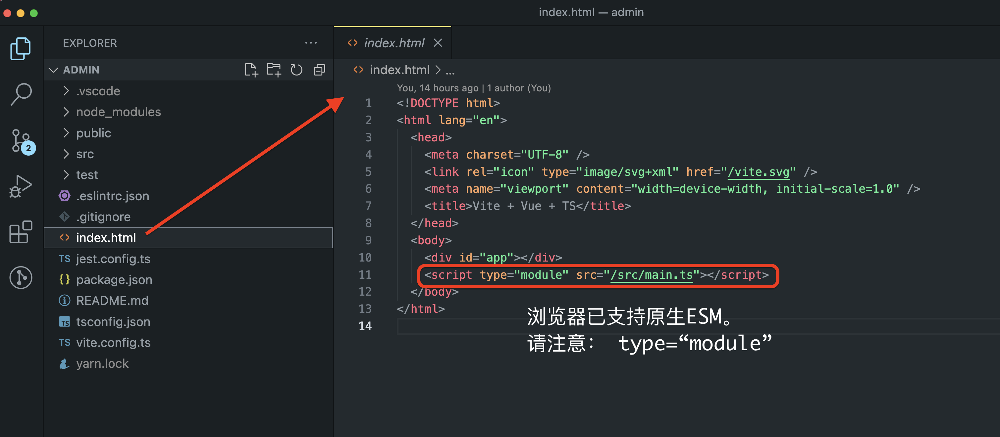

# 1 简介

前端模块化开发是“前端微服务”的基础。

- 项目拆分的标准：2周内，新人可以独立负责一个子项目

- 功能拆分的标准：2天内，新人可以独立调试该功能

2015年，在JavaScript官方组织发布ESM标准之前，市面上流行的工具/框架：webpack, babel, commonJs, AMD, UMD, CMD等。

从现在开始，只需要学习ESM。

> 1. 历史遗留的参考项目怎么办？
> 
> 做加法。先学习如何使用ESM，再把老项目中的代码，一点点挪过来
> 
> 2. 模块到底是什么？其他语言怎么做的，比如Java语言？
> 
> |      | java                   | js                                                                                       |
> | ---- | ---------------------- | ---------------------------------------------------------------------------------------- |
> | 简单描述 | 每个Java文件               | 每个js文件                                                                                   |
> | 职责   | 每个Java文件是一个对象，有明确的“边界” | :flushed::flushed::flushed: ，js不都是混到一起的吗？ 答：以前是，但，如果想使用模块化开发，也要跟Java学习：确定每个js文件的职责范围 |
> | 依赖   | 对象之间互相依赖，形成依赖链路        | js文件之间互相依赖。 :question: 确定是文件吗？不是对象、函数、全局变量？ 答：是的，就是js文件。js要考虑兼容性，历史包袱太重了，不会改动太多  |
> 
> 3. 这么简单的功能，Java设计的时候就有吧，为什么js最近几年才开始推进？
> 
> js是脚本语言，跟Java等后端语言应用场景不一样。
> 大家要用，但是，没有！所以，开始自己造了。
> js官方把成熟的架构引入，就成了现在的Es Module

# 2 如何工作

ESM，ES Module。其中，

- ES是JavaScript官方的名称，Ecma Script

- Module，模块系统

1. `/src/main.ts`是vue3的入口文件

2. 浏览器异步加载`ES Module`文件。即，等到页面渲染完成后，再执行`ES Module`中的脚本

3. 多个`ESM`，按（代码书写）顺序依次执行

# 3 ESM详细的工作流程

-----

查找import的文件、下载、分配内存空间、运行等，太复杂了，略。

只需要记住两点：

- 浏览器只能识别html/css/js。源码中的`.vue, .ts, .tsx, ...`文件，都需要编译成浏览器可以识别的文件格式

- js是按顺序执行的。如果顺序混乱，可能对象/变量还没有初始化，就会被调用。浏览器需要按照`import`组成的依赖链路，找到代码正确的加载顺序。

> 思考：浏览器只能识别js文件，那么，代码中export/import的变量/对象/函数是什么？

# 4 语法

export/import
