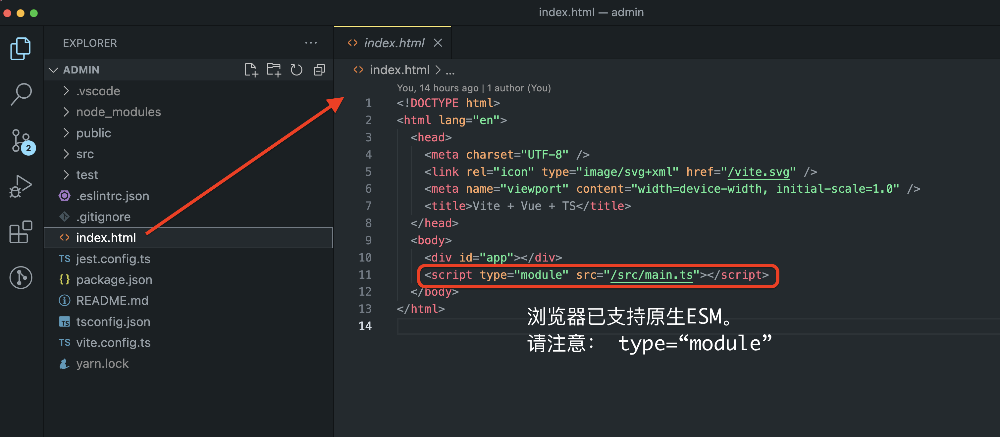
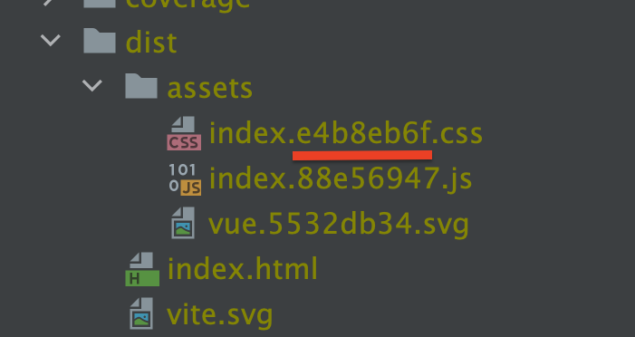

# 1 构建什么

- 与Java一样的后端服务（NodeJs）

- 跑在浏览器中的服务（JS dom）

- 在后端动态渲染成html/css，再交给浏览器展示（SSR）

前端工程的结构已经跟后端项目差不多了。虽然js只是脚本语言，但是，为了方便工程开发，与后端工程一样，需要搭建开发人员与运行环境之间的桥梁。

# 2 具体做什么

- 查找、下载、编译、压缩等，将源码模块串联成可以在浏览器中运行的文件

- 对代码进行 tree-shaking、懒加载和 chunk 分割（提高浏览器加载文件的速度）

- 预构建。vite使用golang开发的esbuild执行预构建任务

- 经常修改的是`前端组件的model,与后端交互的model, .vue文件等`，每次构建只需要做局部更新。即，“HMR”（Hot Module replacement 动态模块热替换）

- vite支持原生ESM，与webpack,Rollup,Parcel等工具相比，实际上是让浏览器接管了打包程序的部分工作。不需要将所有文件都打包到一起，可以根据动态路由，寻找对应的Module。按需加载

总之，更少的配置，更快的速度

# 3 开发环境和生产环境

开发环境：

- 默认本地部署

- 使用 TypeScript, SCSS 等需要编译的语言，提高开发效率

- 代码不会压缩，并有 Source Mapping 源码映射，方便 BUG 调试

- 热重载（ Hot Module Replacement ， 简称 HMR ）。修改代码后，构建工具会监听修改，自动刷新浏览器

生产环境：

- 去除未使用的代码或依赖

- 合并多个文件

- 压缩体积

- 混淆源码，降低源码被直接曝光的风险

- 代码会编译为浏览器兼容的版本

- 部署测试通过的版本

# 4 index.html

vite约定，“index.html”是项目的入口文件。



## 4.1 所见即所得

我们写的代码，需要做一些处理：

- typescript，编译成js

- scss，编译成css

修改源码、测试、刷新浏览器（加载最新的文件）等操作太频繁了，vite需要隐藏编译的细节，让我们感觉直接读取的typescript/scss源码。

>  也包括`vite.config.ts`（vite自己的配置文件）

## 4.2 用户体验

太多文件引用的方式了：`<script>`,`<link>`,``,`<video>`,`new URL('./a.png', import.meta.url)`,`@import`

- 链接很容易损坏

- 浏览器可能需要下载很多资源，为了提高效率
  
  - 按需加载
  
  - 尽可能地合并、压缩文件
  
  - 缓存

## 4.3 vite的解决方案

上述问题vite已经处理了。我们只需要安心写typescript/scss的代码。

但，必须使用"index.html"作为项目的入口文件。

```typescript
export default defineConfig({
  build: {
    rollupOptions: {
      input: {
        main: path.resolve(__dirname, "index.html"),
      }
    }
  }
})
```

# 5 public目录

打包时，public目录下的文件会原封不动的拷贝到 dist 目录下

# 6 dependencies与devDependencies

- 以eslint为例，生产环境，是跑在浏览器中的代码，需要识别你的源码是否规范吗？

答：不需要

所以，eslint只是开发环境才需要的依赖。

- 怎么判断某个依赖的类型？

答：尽量放在`devDependencies`中，然后尝试构建、部署。如果生产环境可以正常运行，则设置正确。

# 7 缓存

## 7.1 浏览器的缓存

若文件名称没有变，浏览器就不会重新获取。所以，修改文件内容后，通常要清缓存，才会生效。

怎么解决呢？

vite打包生成的js/css/svg等文件，名称会添加随机字符串。只要文件内容发生变化，文件名称就会跟着变化



## 7.2 分包

将"node_modules"下的文件单独打包。

因为依赖文件几乎不变，所以，文件名也不会变。让浏览器使用缓存。

> vite使用Rollup做打包的工作，所以，配置参数需要查看Rollup的文档。
> 
> 1. 修改配置文件后，执行build命令，观察dist目录下的文件是否变化
> 
> 2. 修改`src/`目录下的文件，观察dist目录下的文件
> 
> 3. 修改`test/`目录下的文件，观察dist...

```typescript
/// <reference types="vitest" />
// noinspection SpellCheckingInspection

import { defineConfig,splitVendorChunkPlugin } from "vite"
import Vue from "@vitejs/plugin-vue"
import { resolve } from "path"
import VueMacros from "unplugin-vue-macros/vite"

// https://vitejs.dev/config/
// noinspection JSUnusedGlobalSymbols
export default defineConfig({
    plugins: [
        VueMacros({
            plugins: {
                vue: Vue({
                    reactivityTransform: true
                }),
            },
        }),
        splitVendorChunkPlugin(),
    ],
    build: {
        target: "esnext",
    },
    resolve: {
        alias: {
            "@": resolve(__dirname, "src/"),
            "~": resolve(__dirname, "test/")
        }
    },
    test: {
        globals: true,
        environment: "jsdom",
        coverage: {
            reporter: ["text", "json", "html"],
        },
        include: ["test/**/*.spec.ts"],
    },
})
```

# 8 项目特点

- 几乎空白的index.html

- 一个Javascript入口文件`main.ts`，引用其他js文件

- 大部分html的渲染功能交给js实现

- 尽量使用`import`引用文件

# 9 工程化开发的优势

> 先列举一些，想起来了，再填写

## 9.1 开发

1. 模块化、包、作用域隔离，避免变量或函数名称重复，减少了代码的冲突

2. 按需导出和导入，避免了直接在上千行代码中调试

3. 自动化的代码检测流程，有问题的代码在开发过程中就可以被发现

4. 编译打包
   
   - 可以让使用开发人员选择更适合自己的技术，比如 Vue3、 scss、typescript等
   - 自动转译代码为浏览器识别的版本。使用新技术的同时，不需要考虑浏览器兼容性

5. 引入了 Tree Shaking 机制，清理没有用到的代码，减少项目构建后的体积

## 9.2 团队

- 统一的项目结构

- 统一的代码风格

- 可复用的模块和组件

- 完善的测试（单元测试、功能测试、UI测试、性能测试），代码更健壮
