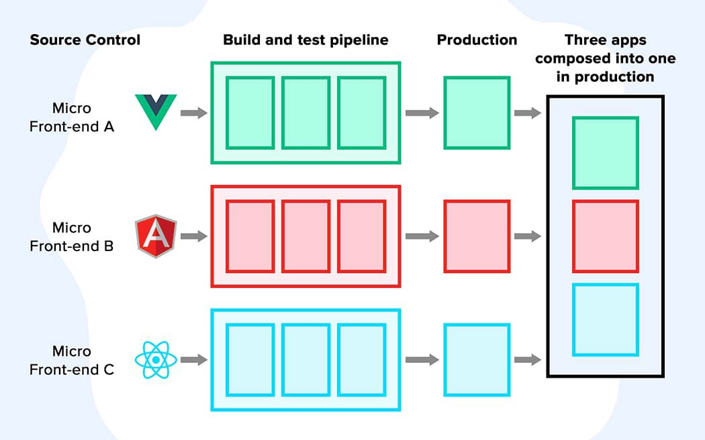

# 1 简介

由一个主应用管理各个子应用的加载/卸载。

微前端不是指具体的库、框架、工具，而是一种理想与架构模式：

**子应用可自主选择技术栈、独立构建、开发、部署、运行**

# 2 架构选择

**参考架构**  [qiankun](https://qiankun.umijs.org/zh/guide), [micro-app](https://zeroing.jd.com/docs.html#/) ,[module-federation](https://webpack.docschina.org/concepts/module-federation/)

选择micro-app

# 3 micro-app

https://github.com/MinJieLiu/micro-app-demo
