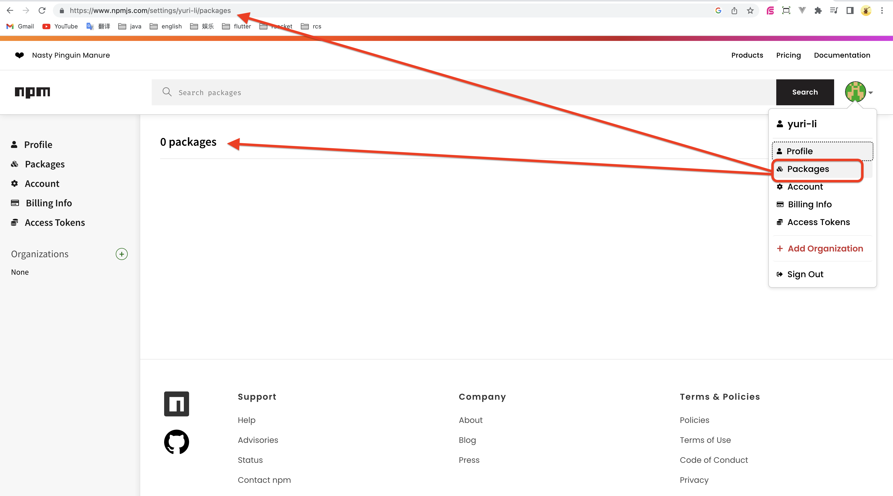
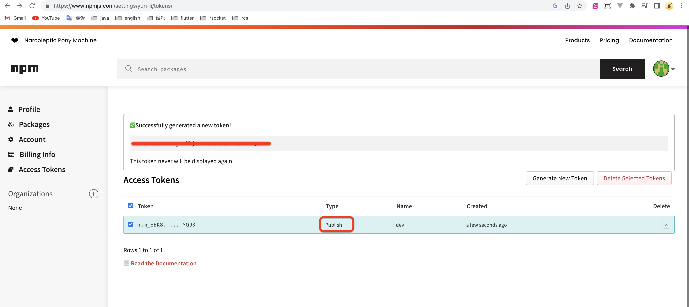
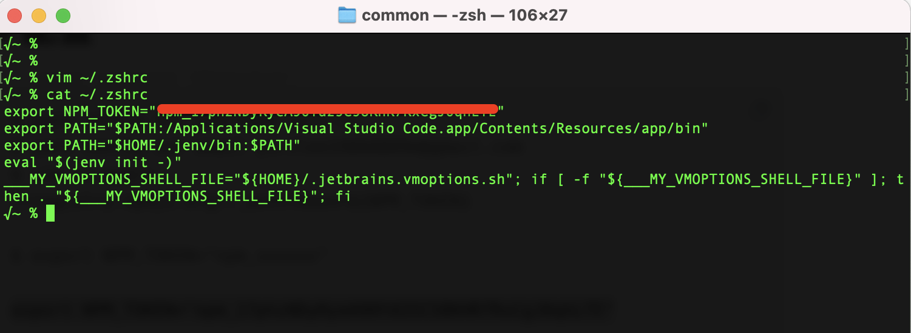
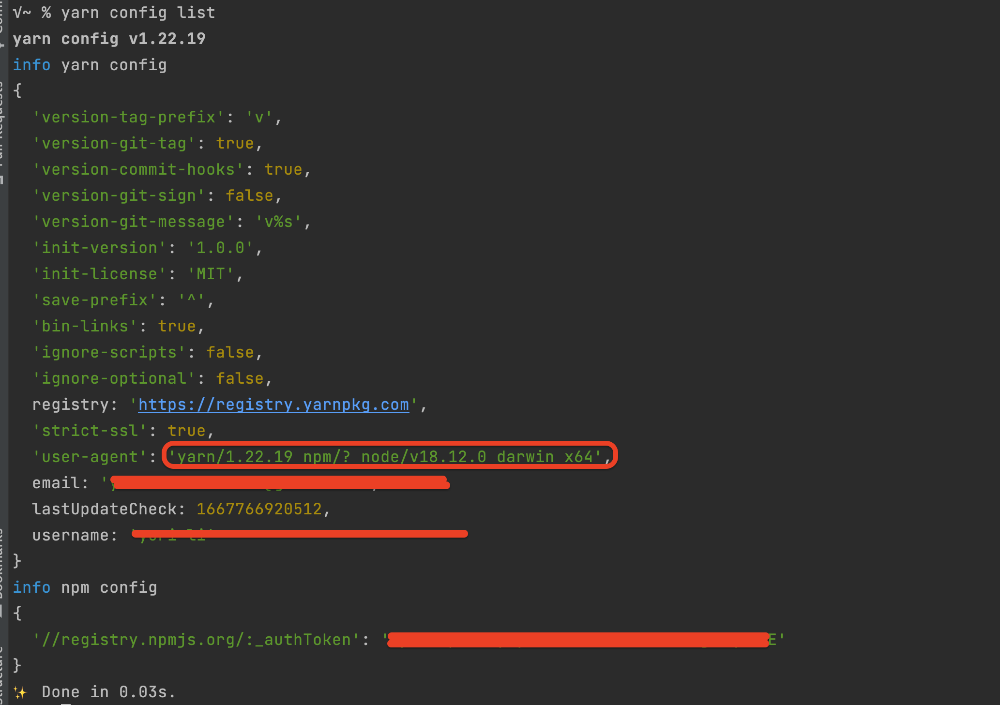

# 1 简介

`package.json`配置的`dependencies/devDependencies`，都是大家开源的。怎么把自己做好的功能，发布到npm repository，让别人使用？

# 2 步骤

```
# 1 注册、登录 https://www.npmjs.com/
```



```
# 2 进入账户，创建Access Token。类型必须是：Automation 或 Publish。
#   否则，没有上传的权限

# 3 复制Access Token（也可以使用username/password上传，但，繁琐）
```



```
# 4 打开项目，进入项目根目录。三种配置Access Token的方式：
## 4.1 打开`~/.npmrc`，直接修改`NPM_TOKEN`
//registry.npmjs.org/:_authToken=${NPM_TOKEN}
## 4.2 临时配置环境变量`NPM_TOKEN`（关闭terminal，失效）
$ export NPM_TOKEN="npm_xxxxxx"
## 4.3 修改环境变量`.zshrc`
$ vim ~/.zshrc
export NPM_TOKEN="npm_xxxxxx"
xxxxxx
$ source ~/.zshrc
```





```
# 5 检查`package.json -> name`。如果name在npm repository中已经存在，则，不能发布
# 6 发布
$ yarn publish
```

# 3 使用

```
$ yarn add [-D] project-name
```
