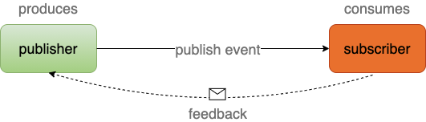

# 1 场景

分别使用**MVVM(model，view， view model)，Redux(action ，state，view)** 两种模型，分析业务，画出流程图。

观察流程图的区别，体会编程思想对开发的影响，对代码结构的影响。

# 2 原理

## 2.1 Publisher/Subscriber

流程中的每个节点（前端与后端的组件/服务/函数/接口等）都有明确的边界。

publiser只需要将任务派发出去，即可释放资源

> subscriber接到任务后，怎么处理？
> 答：请看下一小节的`Event Loop`

## 2.2 Event Loop

最重要的角色是`Event Loop`，相当于`管家`

- `管家`，按照本子上的记录，找`工人`干活

- `工人`做完了，主动找`管家`汇报

|      | 描述   | 概念                | 角色         | 软件/代码/框架          |
| ---- | ---- | ----------------- | ---------- | ----------------- |
| 发布任务 | 1个管家 | Event Loop        | publisher  | thread            |
| 执行   | 很多工人 | worker coroutines | subscriber | kotlin coroutines |

## 2.3 从哪里开始？

完整的架构，涉及的环节太多

- 没听说http协议是响应式的。是的，得换成RSocket协议

- 前后端交互的数据不止是json

- 后端的controller/service/dao也不会无缘无故地就变成响应式的代码

- 数据库/缓存有“Event Loop”机制吗？

有一个环节是“阻塞”的，响应式编程的意义就少一分。

那么从哪里开始学起？

答：kotlin coroutines。学完语法后，可以使用coroutiens的思想，重新推导一遍设计模式的例子。当然，有些例子用不到coroutines，不用强凹造型，换个例子，继续。

# 3 性能提升

从整体链路的角度，观察性能提升了多少？

## 3.1 示例"**查询订单**"

`app/网页`发起查询订单的请求后，`controller/service/dao`依次工作。假设，每个节点执行自己的任务需要1秒，顺序执行的效果如下：

| 节点         | 执行耗时（秒） | 等待（秒）          | 响应时间（秒） | 备注                |
| ---------- | ------- | -------------- | ------- | ----------------- |
| app/网页     | 1       | <mark>3</mark> | 4       | **死等的3秒，就是“阻塞”**。 |
| controller | 1       | <mark>2</mark> | 3       |                   |
| service    | 1       | <mark>1</mark> | 2       |                   |
| dao        | 1       | 0              | 1       |                   |

## 3.2 响应式编程解决什么问题？

等待的时间没有消耗资源

## 3.3 为什么不消耗资源？

示例“查询订单”有4个节点，不好解释。简化链路，只考虑service调用dao：

| 步骤/关键字 | 描述                                                       | 备注                            |
| ------ | -------------------------------------------------------- | ----------------------------- |
| 挂起     | service `subscribe` dao： service被**挂起**； dao异步执行 | 记录当前service的状态，释放service占用的资源 |
| 唤醒     | dao执行结束后，service被**唤醒**                                  | 恢复service的状态，继续执行service的后续代码 |
| 调度     | 挂起与唤醒，都由架构**调度**                                         |                               |

service将请求发送给dao后，就释放了资源；dao执行结束后，再恢复service的状态，继续执行service的后续代码。所以，“等待”的时间段内，没有消耗资源

有没有跟我一样想死磕流程的？难道挂起/唤醒，不需要消耗资源吗？

答：肯定要消耗资源。但，跟“死等”相比，可以忽略不计。比如，你请朋友帮忙做事，两种方式拿到结果：

1. 你心里一直惦记着，每隔一段时间，催一下

2. 你什么也不管了，等朋友做完了，主动通知你

真实的人，不靠谱，所以，你选择1，没有错！
响应式编程，则选择2。请用心体会，如果看到这里你还没有感触，就很可怕了。很多事情，你觉得是常识，就压根儿不会往另外一个方向思考，于是，永远失去了“创造”的能力。

## 3.4 性能对比

响应式编程，执行效果，如下：

| 节点         | 执行耗时（秒） | 响应时间（秒） |
| ---------- | ------- | ------- |
| app/网页     | 1       | 4       |
| controller | 1       | 3       |
| service    | 1       | 2       |
| dao        | 1       | 1       |

1. 响应时间没有变化呀

答：是的。单个“查询订单”的请求，整个链路的响应时间没有变化

2. 区别是什么？

答：app/网页，只**占用**了1秒的资源。所以，同样的资源，app/网页，可以做4倍的事情

所以，示例场景“查询订单”，整个链路的性能提升了 <mark>4 * 3 * 2* 1 = 24 </mark> 倍。

-----

同样的（网络/硬件）资源：

- 修改前。4秒内，整个链路最多处理1个请求

- 修改后。4秒内，整个链路最多处理24个请求

# 4 优缺点

 

## 4.1 代价多大？

现在通用的模式，我称为“推拉模式”。“阻塞”的不止是性能，还有“思路”。

响应式编程，已经有落地的项目了，但，还不圆润。

懂了，代价可以忽略不计。不懂，代价无法想象

## 4.2 为什么组织管理困难？

目标：创新？模仿？

方法：测试？汇报？

信心：多好？多久？

行动：先做，错了再说？稳定输出，不错就好？

一旦开始选择，意味着，得换人！

## 4.3 为什么运维困难？

“开发”还不圆润，运维不会，正常。
