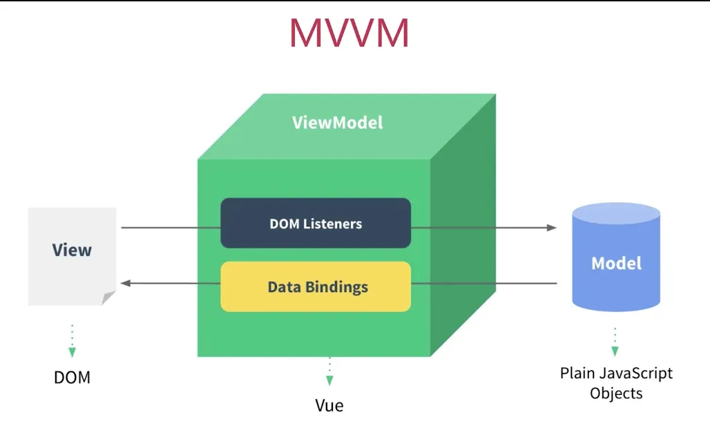
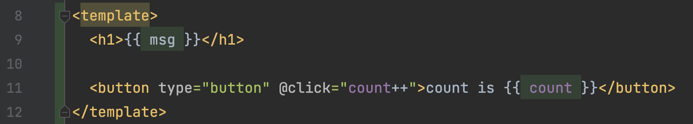
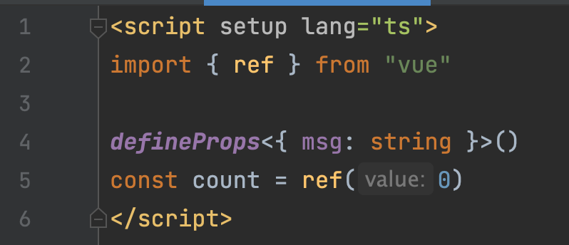
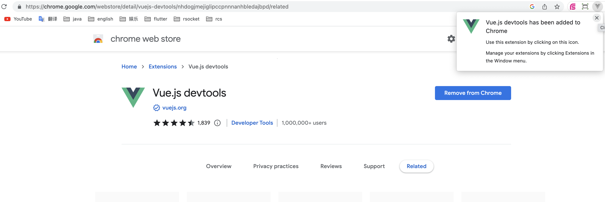
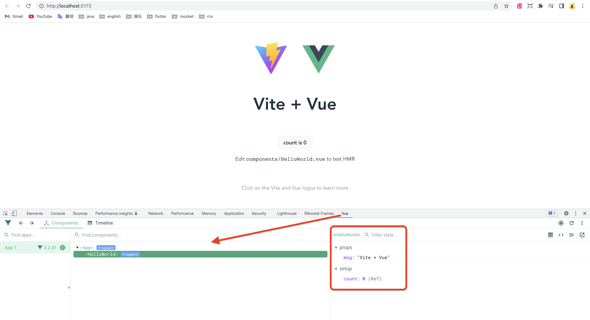
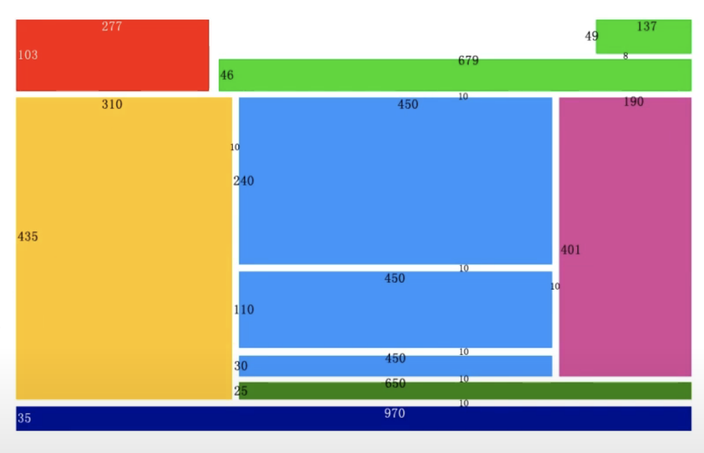
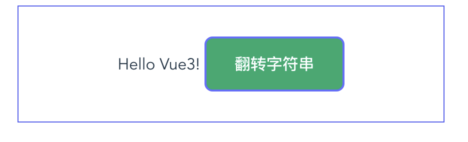
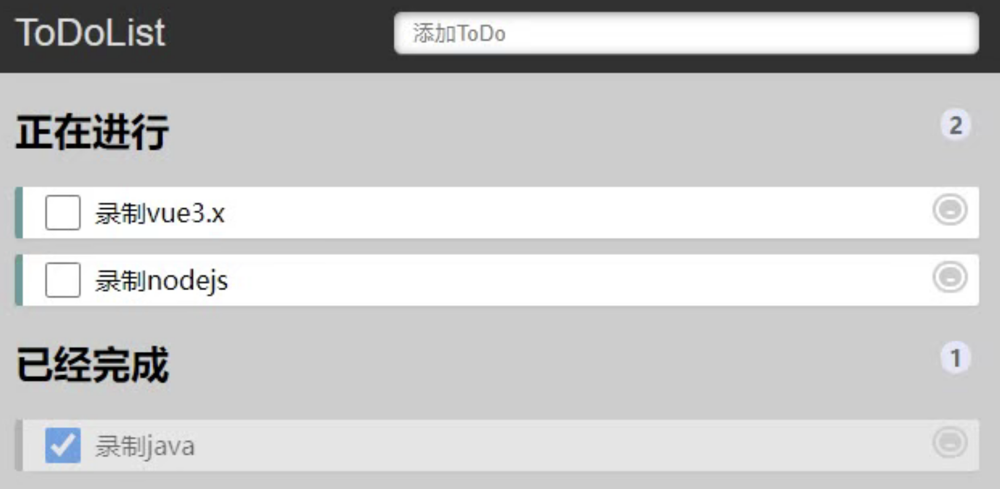
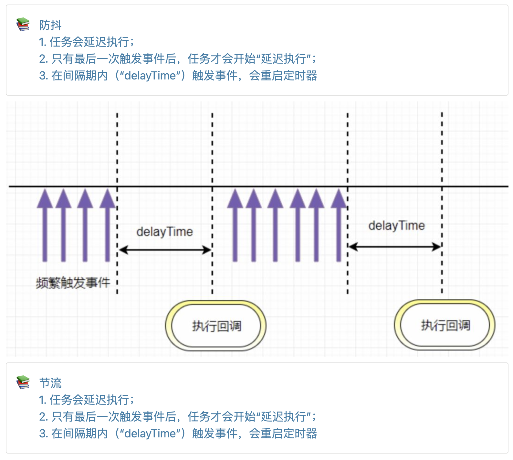

# 1 前置知识

## 1.1 前端基础

html5, css(scss), 响应式布局(Flex布局), typescript

## 1.2 NodeJs和浏览器的区别

Node.js （简称 Node ），不是浏览器，它没有 Window 、没有 Document 、没有 DOM 、没有 Web API ，没有 UI 界面…

Node是基于 Chrome V8 引擎构建的 JS 运行环境。前端开发人员不需要学习新的语言，基于Node，可以开发“**前端+后端**”。

JS是脚本语言，解释型的脚本语言。基于Node提供的运行时环境，JS有了开发、编译、运行的概念，跟后端语言差不多了。前端工程正在拥抱CI/CD。

> 思考：前端技术不断造轮子，是变复杂了，还是简单了？

## 1.3 MVVM框架



| 类型         | 描述                                                                                     | 代码片段                                      |
| ---------- | -------------------------------------------------------------------------------------- | ----------------------------------------- |
| Model      | 封装访问后端接口的request + response                                                            |                                           |
| View       | 视图(html + css)                                                                         |  |
| View Model | 视图模型。双向绑定：<br/>1. 数据绑定，即，将后端传递的数据（model），转换成页面（view）<br/>2. DOM监听。当页面交互的数据变化后，传递给model |  |

## 1.4 SPA

Single Page web Application，单页应用，只有一个 HTML 文件`index.html`。第一次访问时，会构建完整的网页，之后，只是内部组件跳转 + 局部刷新。

| SPA页面跳转的两种方式                                                                               | from                  | to                    |
| ------------------------------------------------------------------------------------------ | --------------------- | --------------------- |
| 调用[pushState](https://developer.mozilla.org/zh-CN/docs/Web/API/History/pushState) 方法更新 URL | `https://a.com/foo`   | `https://a.com/bar`   |
| 修改 URL 的 Hash 值                                                                            | `https://a.com/#/foo` | `https://a.com/#/bar` |

# 2 组件化开发

## 2.1 什么是组件化开发

> 组件化开发的思想可以借鉴后端的开发模式`领域模型驱动开发`

算是互联网的又一个黑话，原来的名字是（**package + class**）。

组件是前端封装的最小单元，即`.vue`文件

- **开发**。借助前端工程化的构建工具，开发者可以编写 `.vue` 单组件文件。

- **封装**
  
  - 将多个页面的代码根据其功能模块进行划分
  
  - 每个组件实现1个功能模块
  
  - 每个组件还可以继续细分

- **复用**。组合简单组件，实现复杂功能

- **测试**。每个组件经过充分测试后，足够可靠
  
  - 每个简单组件，“边界”是确定的
  
  - 组合之后的组件，“边界”也是确定的，容易测试

- **打包**。通过构建工具编译再合并，最终生成浏览器能访问的 HTML / CSS / JS 文件

这样的开发过程，用户体验没有影响，但开发体验大大提升。

## 2.2 vue3定义组件的方式

| 概念       | 描述         | 备注                  |
| -------- | ---------- | ------------------- |
| 组件名称     |            | 文件名"HelloWorld.vue" |
| data     | View Model |                     |
| template | View       | html                |

> 思考：
> 
> 1. 为什么组件不包含`MVVM模型`的与后端交互的`Model`？
> 
> 答：`Model`是独立的模块/思想。从两种视角分析：
> 
> - 前端视角。后端的接口有各种规范：Restful API、websocket、Mono/Flux、GraphQL等。需要针对不同的规范，使用typescript定制Model
> 
> - 后端视角。`Model`只是普通的typescript代码，没有复杂的依赖。甚至于，可以看做单纯的Json
> 2. 组件包含css的代码吗？
> 
> 答：包含。通常是SCSS/SASS/LESS等预编译的语言，也是独立的知识点，属于“美工”的范畴，与“开发”关系不大。

## 2.3 如何使用组件

```typescript
<script setup lang="ts">
import HelloWorld from "@/components/HelloWorld.vue"
</script>

<template>
  <HelloWorld />
</template>
```

## 2.4 组件通信

- 父子

- 爷孙

- 兄弟

- 全局

## 2.5 vue3调试工具





# 3 路由

vue-router

# 4 状态管理

- localStorage
- sessionStorage
- pinia

# 5 练习

## 5.1 flex布局

### 5.1.1 基础

```
# 1. 1个div在body中，水平居中
# 2. 1个div在body中，垂直居中
# 3. 1个div在body中，固定水平居中。即，屏幕水平滚动时，一直水平居中显示
# 4. 1个div在body中，固定垂直居中。即，屏幕上下滚动时，一直垂直居中显示
# 5. 2个div：1个沾满全屏，1个水平居中
# 6. 2个div，水平居中平铺，左右间距`20px`
# 7. 2个div，垂直居中平铺，上下间距`20px`
# 8. 当调整屏幕大小时，切换6/7的效果
```

### 5.1.2 复杂页面



### 5.1.3 css-loading-button


## 5.2 模板

### 5.2.1 翻转字符串



### 5.2.2 九九乘法表


## 5.3 表单

### 5.3.1 登录页

https://codepen.io/afgprogrammer/pen/mYQQJV?editors=1100

### 5.3.2 表单


### 5.3.3 三级地址级联

```json
[
  {
    "id": "110000",
    "text": "北京市",
    "order": 0,
    "children": [
      {
        "id": "110101",
        "text": "东城区",
        "order": 1
      },
      {
        "id": "110102",
        "text": "西城区",
        "order": 2
      }
    ]
  },
  {
    "id": "310000",
    "text": "上海市",
    "order": 778,
    "children": [
      {
        "id": "310101",
        "text": "黄浦区",
        "order": 779
      },
      {
        "id": "310104",
        "text": "徐汇区",
        "order": 780
      }
    ]
  },
  {
    "id": "140000",
    "text": "山西省",
    "order": 213,
    "children": [
      {
        "id": "140100",
        "text": "太原市",
        "order": 214,
        "children": [
          {
            "id": "140105",
            "text": "小店区",
            "order": 215
          },
          {
            "id": "140106",
            "text": "迎泽区",
            "order": 216
          }
        ]
      },
      {
        "id": "140200",
        "text": "大同市",
        "order": 225,
        "children": [
          {
            "id": "140212",
            "text": "新荣区",
            "order": 226
          },
          {
            "id": "140213",
            "text": "平城区",
            "order": 227
          }
        ]
      }
    ]
  }
]
```

### 5.3.4 自定义格式级联

> 会员，SAT早教课，24节，2880元

```json
{
  "member": [
    {
      "courseName": "SAT早教",
      "price": {
        "24": 2880,
        "48": 5280,
        "96": 9600
      }
    },
    {
      "courseName": "能力衔接",
      "price": {
        "48": 5280,
        "96": 9600
      }
    }
  ],
  "nonMember": [
    {
      "courseName": "早教随心上",
      "price": {
        "96": 3880
      }
    },
    {
      "courseName": "SAT早教",
      "price": {
        "24": 4800,
        "48": 8400,
        "96": 13440
      }
    },
    {
      "courseName": "能力衔接",
      "price": {
        "48": 8400,
        "96": 13440
      }
    }
  ]
}
```

## 5.4 TodoList



```
TodoList
   ├─ TodoAdd
   └─ TodoItem
      ├─ Doing
      └─ Done
```

## 5.5 监听数据变化

### 5.5.1 只上传Form表单中修改后的数据

**隐藏条件：必须上传id**

### 5.5.2 比较两个数组是否相等

```typescript
const a = [1,2,3]
const b = [...a]
```

## 5.6 防抖和节流



## 5.7 无限滚动的table

- 默认填满首屏
  - 获取窗口高度，记为`height`
  - 获取每一行数据的高度，记为`rowHeight`
  - 计算需要加载多少条数据，记为：`requestN = Math.floor(height/rowHeight)`
- 当用户向下滚动时，自动加载数据（向上滚动时，不加载数据）
  - 获取用户滚动的位置，记为`y`
  - 获取已加载数据总条数，记为`doneSize`
  - 当`y > doneSize * rowHeight`时，自动加载`requestN`条数据
- 当用户调整窗口大小后，有更多空间来展现结果，则自动加载数据
