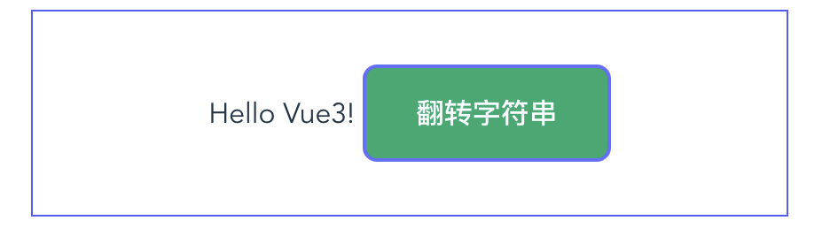
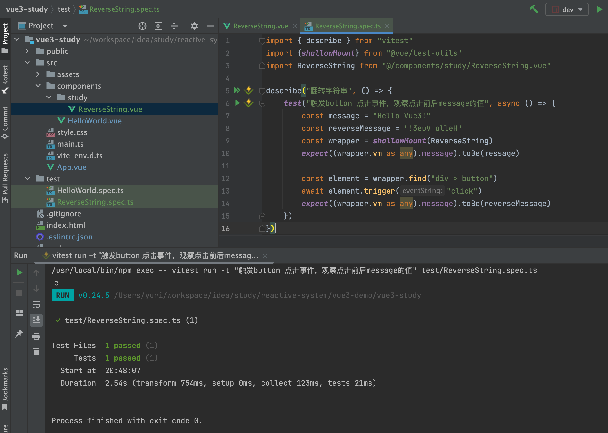
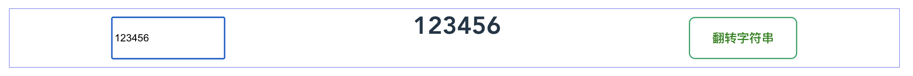
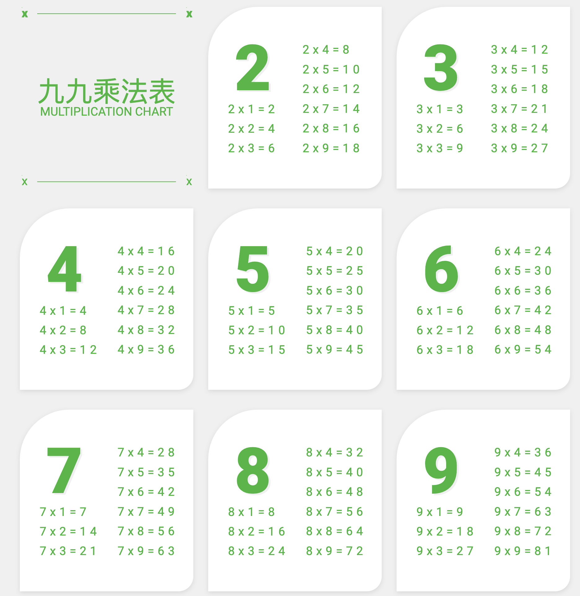

# 1 翻转字符串

初始值："Hello Vue3!" 。点击按钮，翻转字符串。



## 1.1 components/study/ReverseString.vue

```typescript
<template>
  <div>
    {{ message }}
    <button class="btn success" @click="reverseString">翻转字符串</button>
  </div>
</template>

<script setup lang="ts">
import {ref} from "vue"

const message = ref("Hello Vue3!")

function reverseString() {
  message.value = message.value.split("").reverse().join("")
}
</script>

<style scoped>
div {
  border: #535bf2 1px solid;
  text-align: center;
  padding: 30px;
}
</style>
```

## 1.2 测试

```typescript
import { describe } from "vitest"
import {shallowMount} from "@vue/test-utils"
import ReverseString from "@/components/study/ReverseString.vue"

describe("翻转字符串", () => {
    test("触发button 点击事件，观察点击前后message的值", async () => {
        const message = "Hello Vue3!"
        const reverseMessage = "!3euV olleH"
        const wrapper = shallowMount(ReverseString)
        expect((wrapper.vm as any).message).toBe(message)

        const element = wrapper.find("div > button")
        await element.trigger("click")
        expect((wrapper.vm as any).message).toBe(reverseMessage)
    })
})
```



# 2 获取input的输入



```typescript
<input v-model="message" placeholder="请输入" />
```

# 3 九九乘法表



## 3.1 Index.vue

```typescript
<template>
  <ul class="wrap">
    <li class="l-card-title">
      <h1>九九乘法表</h1>
    </li>
    <Item v-for="idx in range" :key="idx" :idx="idx" />
  </ul>
</template>

<script setup lang="ts">
import Item from "@/components/study/multiplicationTable/Item.vue"
import _ from "lodash"

const range = _.range(2, 10)
</script>

<style lang="scss" scoped>
.wrap {
  max-width: 1110px;
  width: 100%;
  margin: 32px auto;
  display: grid;
  grid-template-columns: repeat(3, 350px);
  grid-template-rows: repeat(3, 366px);
  gap: 40px 30px;
  font-family: "Roboto", "微软正黑体", serif;
}

//颜色变量
$color-pri: #2EB738;

//九九乘法表标题栏
.l-card-title {
  text-align: center;
  color: $color-pri;
  position: relative;
  top: 0;
  bottom: 0;
  margin: auto;

  h1 {
    font-size: 56px;

    &::before, &::after {
      font-size: 24px;
      font-weight: 700;
      position: absolute;
      top: -142px;
      width: 1px;
      height: 1px;
      background-color: $color-pri;
    }
  }
}
</style>
```

## 3.2 Item.vue

```typescript
<template>
  <li class="l-card">
    <ul class="l-card__wrap">
      <li class="l-card__title">{{idx}}</li>
      <li v-for="item in 9" :key="item">
        {{idx}} x {{item}} = {{parseInt(idx) * parseInt(item)}}
      </li>
    </ul>
  </li>
</template>

<script setup lang="ts">
const props = defineProps<{ idx: string }>()
console.log(props.idx)
</script>

<style lang="scss" scoped>
$color-pri: #2EB738;
.l-card {
  width: 100%;
  height: 366px;
  background-color: #FFF;
  border-radius: 100px 0 30px 0;
  box-shadow: 0 3px 10px #D8D8D8;

  .l-card__wrap {
    width: 100%;
    height: 60%;
    display: flex;
    padding: 64px 40px;
    flex-direction: column;
    flex-wrap: wrap;
    align-items: flex-start;
    li {
      margin-right: 35px;
      font-size: 24px;
      line-height: 32px;
      font-weight: 300;
      color: $color-pri;
      letter-spacing: .3em;
      display: inline-block;
    }

    .l-card__title {
      height: auto;
      padding-left: .1em;
      margin-top: 0;
      margin-right: 25px;
      font-size: 128px;
      line-height: 120px;
      font-weight: 900;
      text-shadow: 4px 3px 0 #F0F0F0;
    }
  }
}
</style>
```
