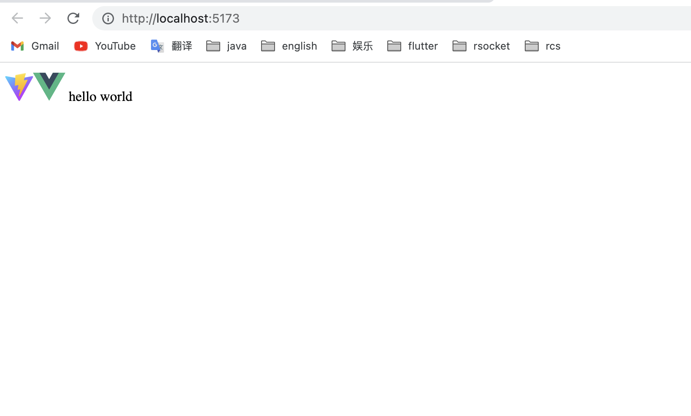
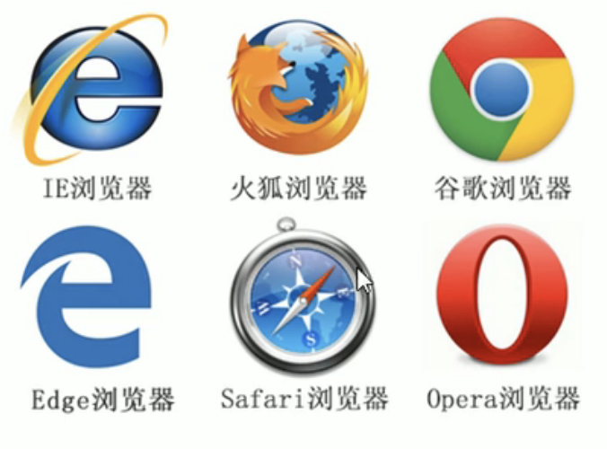
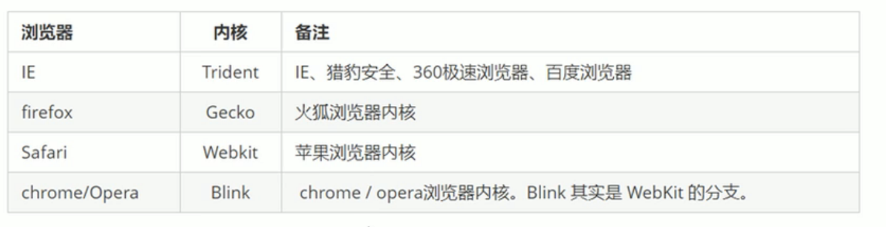

# 1 构建开发环境

```
# 1 复制项目模板 vue3-basic
https://github.com/yuri-li/reactive-system/tree/main/vue3-demo/template/

# 2 重命名为"scss-study"
# 3 清理环境
## 3.1修改package.json -> name 为 "scss-study"
## 3.2 清空"style.scss"
## 3.3 删除"components/HelloWorld.vue"
## 3.4 清理"App.vue"
# 4 加载依赖
$ yarn

# 5 运行开发环境
$ yarn dev
```



# 2 Html基础

## 2.1 基础

```
什么是网页？
常用的浏览器？
web标准的三大组成部分？
```

```
1. 什么是网页？
网页是浏览器可以识别的文本格式，文件后缀名".html"
2. 常用的浏览器及内核？
```





```
3. web标准的三大组成部分
html,css,javascript
```

## 2.2 常用标签

```
# 1 <!DOCTYPE html>
 告诉浏览器，要使用html5的语法解析网页

# 2 <html lang="en">
- en, 英文
- zh-CN，中文
告诉浏览器是中文网站还是英文网站。如果lang="zh-CN"，且，网页里面都是英文，
浏览器会自动提示“是否翻译成中文”

# 3 <meta charset="UTF-8" />
 使用的字符集

# 4 
```
