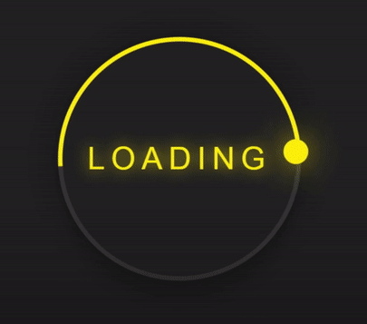
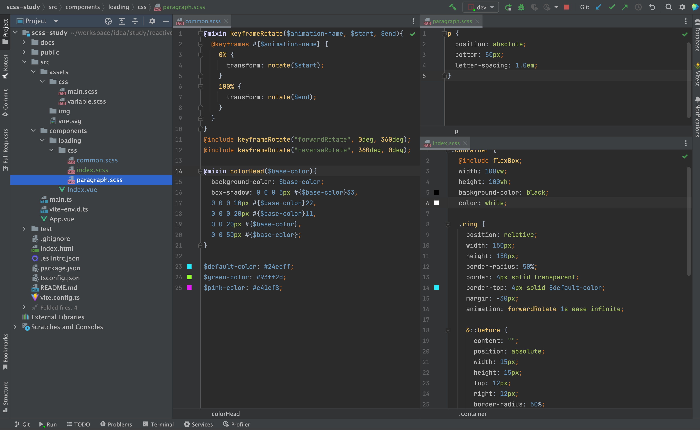
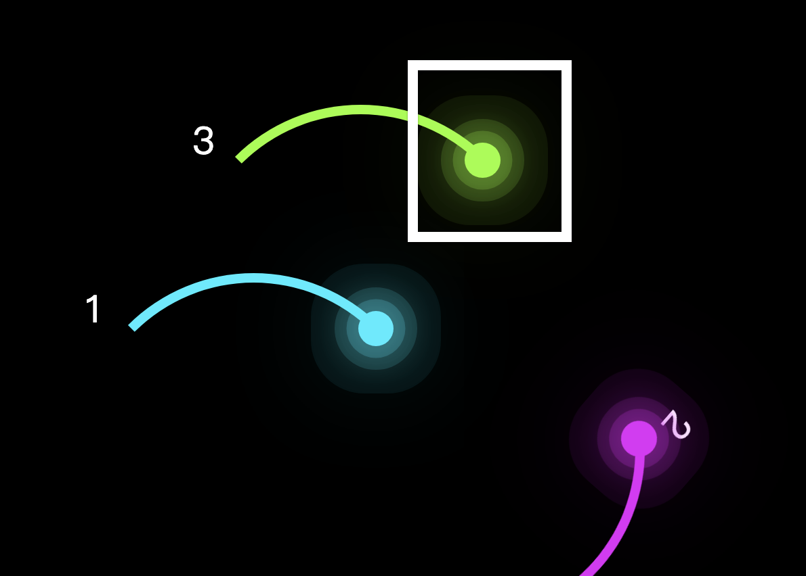

# 1 loading



```
1. 清除默认样式
2. 让"div#app"居中
3. 初始化Loading.vue
div > ring * 3
4. 设置三个ring的位置、颜色
5. 设置ring -> border-top
6. 设置ring -> ::before 的位置
7. 动态效果
```

# 1 全局设置

## 1.1 清除默认样式

```scss
/* src/assets/css/main.scss */
* {
margin: 0;
padding: 0;
box-sizing: border-box;
}
```

## 1.2 定义全局变量

```scss
/* src/assets/css/common.scss */
@mixin flexContainer {
display: flex;
justify-content: center;
align-items: center;
}
```

## 1.3 App.vue

页面框架

```
<template>
  <Loading />
</template>

<script setup lang="ts">
import Loading from "@/components/pages/Loading.vue"
</script>

<style lang="scss">
body {
  @include flexBox;
}

#app {
  @include flexBox;
  height: 100vh;
}
</style>
```

# 2 Loading.vue

```
<template>
  <div class="container">
    <div class="ring"></div>
    <div class="ring"></div>
    <div class="ring"></div>
    <p>Loading...</p>
  </div>
</template>

<style lang="scss" scoped>
$default-color: #24ecff;
$green-color: #93ff2d;
$pink-color: #e41cf8;

@mixin rotateKeyframes($animation-name, $start, $end) {
  @keyframes #{$animation-name} {
    0% {
      transform: rotate($start);
    }
    100% {
      transform: rotate($end);
    }
  }
}

@include rotateKeyframes("forwardRotate", 0deg, 360deg);
@include rotateKeyframes("reverseRotate", 360deg, 0deg);

@mixin colorBox($base-color){
  background-color: $base-color;
  box-shadow: 0 0 0 5px #{$base-color}33,
  0 0 0 10px #{$base-color}22,
  0 0 0 20px #{$base-color}11,
  0 0 20px #{$base-color},
  0 0 50px #{$base-color};
}
@mixin colorTop($base-color) {
  animation: reverseRotate 1s ease infinite;
  border-top: 4px solid transparent;
  border-left: 4px solid $base-color;
  &::before {
    top: initial;
    bottom: 12px;
    left: 12px;
    @include colorBox($base-color);
  }
}

.container {
  @include flexBox;
  position: relative;
  width: 100vw;
  height: 100vh;
  background-color: black;
  color: white;

  p {
    position: absolute;
    bottom: 50px;
    font-family: "Courier New", serif;
    font-size: 1.5em;
    letter-spacing: 1.0em;
  }

  .ring {
    position: relative;
    width: 150px;
    height: 150px;
    border-radius: 50%;
    border: 4px solid transparent;
    border-top: 4px solid $default-color;
    margin: -30px;
    animation: forwardRotate 2s ease-in-out infinite;

    &::before {
      content: "";
      position: absolute;
      width: 15px;
      height: 15px;
      top: 12px;
      right: 12px;
      border-radius: 50%;
      @include colorBox($default-color);
    }
    &:nth-child(2) {
      position: absolute;
      top: 126.66px;
      @include colorTop($green-color);
    }

    &:nth-child(3) {
      @include colorTop($pink-color);
    }
  }
}
</style>
```

# 3 重构

## 3.1 目录结构



> 思考： css文件拆分地这么碎，是否可以一次性引入目录下的所有css文件？

## 3.2 给每个ring添加头部的小圈圈



```scss
&::before {
  content: "";
  position: absolute;
  width: 15px;
  height: 15px;
  top: 12px;
  right: 12px;
  border-radius: 50%;
  background-color: white;
}
```

## 3.3 给光圈添加晕染效果

```scss
@mixin colorHead($base-color){
  background-color: $base-color;
  box-shadow: 0 0 0 5px #{$base-color}33,
  0 0 0 10px #{$base-color}22,
  0 0 0 20px #{$base-color}11,
  0 0 20px #{$base-color},
  0 0 50px #{$base-color};
}
```
