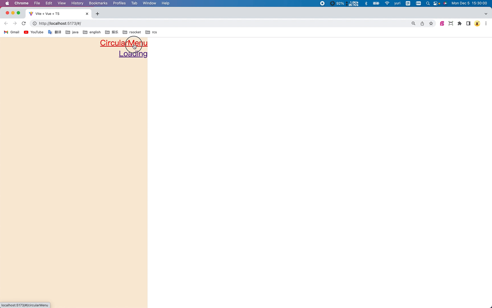

# 1 Animated Circular Menu


# 2 开发计划

- 路由，[介绍 | Vue Router](https://router.vuejs.org/zh/introduction.html)

- icons，[iconify-prerendered](https://github.com/cawa-93/iconify-prerendered)

- coding

# 3 思考

> 1. 路由的代码太繁琐了，是否可以根据“约定”，自动生成？
> 
> 2. 如果可以自动生成，那么，有哪些约定？
> 
> 3. 组件化开发的思想，会让css/js的代码拆分地很细
> 
> |             | 优点                   | 缺点                             |
> | ----------- | -------------------- | ------------------------------ |
> | 每个文件都做很少的功能 | 问题足够小，有能力彻底解决        | 文件太多了，管理难                      |
> | 简单的组件       | 容易测试<br/>复用/组合时，心里有底 | 每个人封装的思路不同，风格各异。急需比较规范的约定或思维模式 |
> | 共用（公用）的组件   | 方便使用                 | 是否相互隔离？是否被污染？                  |
> 
> 4. 生成路由的代码，如何复用？
> 5. 如何构建ts-lib的模板项目？使用vite + typescript怎么构建项目？
> 6. 怎么将ts开发的工具上传到npm repository，让别人使用？
> 7. 怎么构建私有的npm repository?
> 8. 怎么管理多个npm repository?

# 4 重构



## 4.1 index.html

为index.html中的元素：body, div#app，添加默认样式

参考：[flexbox布局-在线调试](https://flexbox.help/)

### 4.1.1 public/index.css

```css
body {
  margin: 0;
  padding: 0;
  box-sizing: border-box;
  display: flex;
  justify-content: center;
  align-items: center;
}
#app {
  display: flex;
  flex-direction: row;
  flex-wrap: wrap;
  width: 100vw;
  min-height: 100vh;
  margin: 0;
  padding: 0;
}
```

### 4.1.2 index.html

> 注：
> 
> 1. public目录下的文件，会被直接copy到dist目录
> 
> 2. 浏览器中运行的代码，都是dist中，编译之后的文件

```
<link rel="stylesheet" type="text/css" href="/index.css">
```

## 4.2 引入路由和icons

```bash
yarn add -D generate-routes-yuri vue-router@4 \
@iconify-prerendered/vue-bi
```

## 4.3 App.vue

左右两列布局，左侧：router-link; 右侧：router-view

```
<template>
  <div class="menu">
    <router-link to="/circularMenu">CircularMenu</router-link>
    <router-link to="/loading">Loading</router-link>
  </div>
  <div class="main">
    <router-view></router-view>
  </div>
</template>
<style lang="scss" scoped>
.menu{
  display: flex;
  flex-direction: column;
  align-items: flex-end;
  flex-wrap: wrap;
  width: 30%;
  height: 100vh;
  background-color: antiquewhite;
}
.main{
  display: flex;
  width: 70%;
  height: 100vh;
}
</style>
```

## 4.4 icons

`src/components/circularMenu/Index.vue`

```
<template>
  <IconHouseHeart />
  <IconYoutube />
  <IconTwitter />
</template>
<script lang="ts" setup>
import { IconHouseHeart, IconYoutube, IconTwitter } from "@iconify-prerendered/vue-bi"
</script>
```

# 5 源码

```

```
