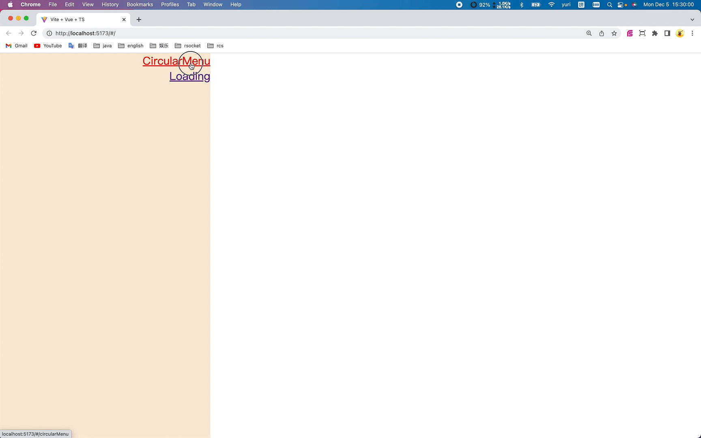

# 1 Animated Circular Menu

container>menu>share+ul>li*8


# 2 开发计划

- 路由，[介绍 | Vue Router](https://router.vuejs.org/zh/introduction.html)

- icons，[iconify-prerendered](https://github.com/cawa-93/iconify-prerendered)

- coding

# 3 思考

> 1. 路由的代码太繁琐了，是否可以根据“约定”，自动生成？
> 
> 2. 如果可以自动生成，那么，有哪些约定？
> 
> 3. 组件化开发的思想，会让css/js的代码拆分地很细
> 
> |             | 优点                   | 缺点                             |
> | ----------- | -------------------- | ------------------------------ |
> | 每个文件都做很少的功能 | 问题足够小，有能力彻底解决        | 文件太多了，管理难                      |
> | 简单的组件       | 容易测试<br/>复用/组合时，心里有底 | 每个人封装的思路不同，风格各异。急需比较规范的约定或思维模式 |
> | 共用（公用）的组件   | 方便使用                 | 是否相互隔离？是否被污染？                  |
> 
> 4. 生成路由的代码，如何复用？
> 5. 如何构建ts-lib的模板项目？使用vite + typescript怎么构建项目？
> 6. 怎么将ts开发的工具上传到npm repository，让别人使用？
> 7. 怎么构建私有的npm repository?
> 8. 怎么管理多个npm repository?

# 4 重构



## 4.1 index.html

为index.html中的元素：body, div#app，添加默认样式

参考：[flexbox布局-在线调试](https://flexbox.help/)

### 4.1.1 public/index.css

```css
body {
  margin: 0;
  padding: 0;
  box-sizing: border-box;
  display: flex;
  justify-content: center;
  align-items: center;
}
#app {
  display: flex;
  flex-direction: row;
  flex-wrap: wrap;
  width: 100vw;
  min-height: 100vh;
  margin: 0;
  padding: 0;
}
```

### 4.1.2 index.html

> 注：
> 
> 1. public目录下的文件，会被直接copy到dist目录
> 
> 2. 浏览器中运行的代码，都是dist中，编译之后的文件

```
<link rel="stylesheet" type="text/css" href="/index.css">
```

## 4.2 引入路由和icons

```bash
yarn add -D generate-routes-yuri vue-router@4 \
@iconify-prerendered/vue-bi
```

## 4.3 App.vue

左右两列布局，左侧：router-link; 右侧：router-view

```
<template>
  <div class="menu">
    <router-link to="/circularMenu">CircularMenu</router-link>
    <router-link to="/loading">Loading</router-link>
  </div>
  <div class="main">
    <router-view></router-view>
  </div>
</template>
<style lang="scss" scoped>
.menu{
  display: flex;
  flex-direction: column;
  align-items: flex-end;
  flex-wrap: wrap;
  width: 30%;
  height: 100vh;
  background-color: antiquewhite;
}
.main{
  display: flex;
  width: 70%;
  height: 100vh;
}
</style>
```

## 4.4 icons

`src/components/circularMenu/Index.vue`

```
<template>
  <IconHouseHeart />
  <IconYoutube />
  <IconTwitter />
</template>
<script lang="ts" setup>
import { IconHouseHeart, IconYoutube, IconTwitter } from "@iconify-prerendered/vue-bi"
</script>
```

# 5 css 基础

## 5.1 开发工具

[Emmet](https://docs.emmet.io/cheat-sheet/)

## 5.2 角度单位

| 单位   | 全称          | 描述      |
| ---- | ----------- | ------- |
| deg  | 度数(degree)  | $360^o$ |
| rad  | 弧度(radians) | 2兀      |
| turn | 圈           | 1圈      |

## 5.3 transform-origin

围绕哪个点旋转？

# 6 源码

## 6.1 Index.vue

```
<template>
  <div class="container">
    <div class="menu" :class="{active: isActive}">
      <div class="share" @click="isActive = !isActive">
        <IconShareFill />
      </div>
      <ul>
        <li><IconFacebook /></li>
        <li><IconWhatsapp /></li>
        <li><IconTwitter /></li>
        <li><IconDribbble /></li>
        <li><IconLinkedin /></li>
        <li><IconInstagram /></li>
        <li><IconPinterest /></li>
        <li><IconYoutube /></li>
      </ul>
    </div>
  </div>
</template>
<script lang="ts" setup>
import { $ref } from "vue/macros"
import {
  IconDribbble, IconFacebook, IconInstagram, IconLinkedin, IconPinterest, IconShareFill, IconTwitter, IconWhatsapp, IconYoutube,
} from "@iconify-prerendered/vue-bi"

let isActive = $ref(false)
defineOptions({
  name: "CircularMenu",
})
</script>
<style lang="scss" scoped>
@import "@/components/circularMenu/css/common.scss";
@import "@/components/circularMenu/css/index.scss";
@import "@/components/circularMenu/css/share.scss";
@import "@/components/circularMenu/css/li.scss";
@import "@/components/circularMenu/css/active.scss";
</style>
```

## 6.2 common.scss

```scss
$background-color: #9ad751 #2196f3;
$icon-color: #1877f2 #25d366 #1da1f2 #ea4c89 #0a66c2 #c32aa3 #bd081c #ff0000;
$menu-side-length: 280px;
$element-side-length: 60px;
$ul-top: ($menu-side-length - $element-side-length)/2;

@mixin square($side-length) {
  width: $side-length;
  height: $side-length;
}

@mixin round($side-length) {
  @include square($side-length);
  border-radius: 50%;
}
```

## 6.3 index.scss

```scss
.container {
  @include flexBox;
  width: 100vw;
  background: linear-gradient(45deg, nth($background-color, 1), nth($background-color, 2));
}

.menu {
  @include flexBox;
  position: relative;
  @include square($menu-side-length);

  ul {
    position: absolute;
    left: 0;
    top: $ul-top;
    list-style: none;
  }
}
```

## 6.4 share.scss

```scss
.share {
  @include flexBox;
  @include round($element-side-length);
  cursor: pointer;
  font-size: 2em;
  background: #fff;
  box-shadow: 0 3px 4px rgba(0, 0, 0, 0.15);
  transition: 1.25s;
}
```

## 6.5 li.scss

```scss
li {
  @include flexBox;
  position: absolute;
  top: 0;
  list-style: none;
  cursor: pointer;
  @include round($element-side-length);
  font-size: 1.75em;
  background: #fff;
  box-shadow: 0 3px 4px rgba(0, 0, 0, 0.15);
  transition: 0.05s;
  transform-origin: $menu-side-length / 2;
  scale: 0;
  @for $i from 1 through 8 {
    &:nth-child(#{$i}) {
      transform: rotate(360deg / 8 * $i);
      transition-delay: 0.05s * $i;
      color: nth($icon-color, $i);

      &:hover {
        font-size: 2.5em;
        box-shadow: 0 0 0 2px nth($icon-color, $i),
        0 0 0 6px #ffffff;
      }
    }
  }
}
```

## 6.6 active.scss

```scss
.menu.active {
  .share {
    transform: rotate(360deg);
    box-shadow: 0 6px 8px rgba(0, 0, 0, 0.15),
    0 0 0 2px #333,
    0 0 0 8px #fff;
  }

  li {
    scale: 1;
  }

  @for $i from 1 through 8 {
    li:nth-child(#{$i}) {
      svg {
        transition: 2s;
        transform: rotate(360deg / -8 * $i);
      }
    }
  }

}
```
