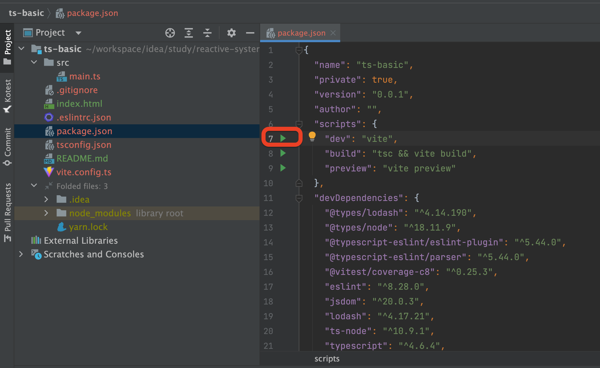
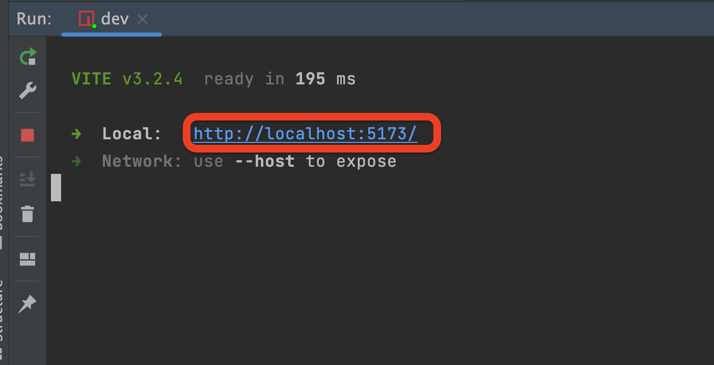
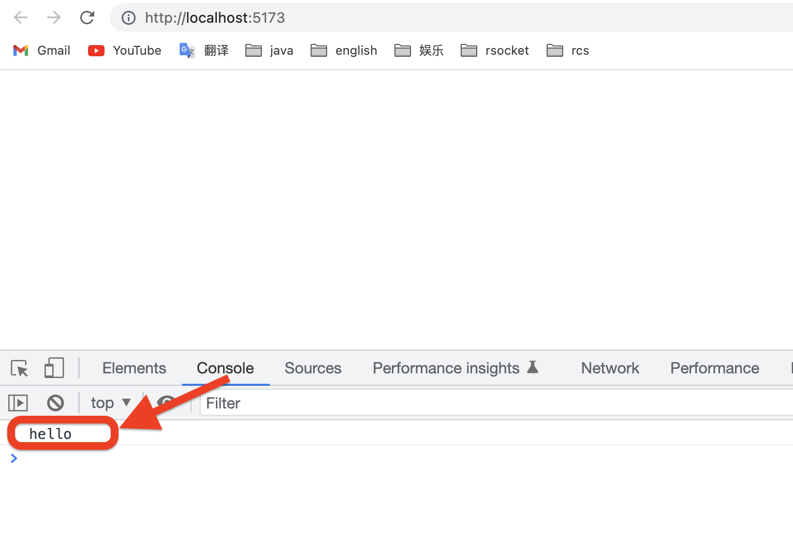
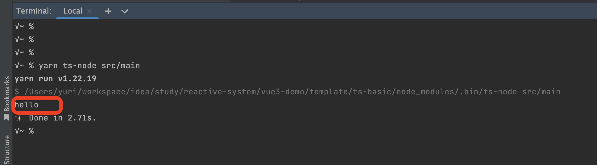

# 1 模版项目用途

- typescript的学习环境

- tyepscript写的工具，开放给第三方使用

- 没有css，html

# 2 构建过程

## 2.1 使用vite构建项目

```
$ yarn create vite ts-basic --template vanilla-ts
```

## 2.2 添加必要的依赖

| 依赖                                                                | 是否必须 | 描述         |
| ----------------------------------------------------------------- | ---- | ---------- |
| typescript ts-node @types/node                                    |      | typescript |
| vite                                                              |      | vite       |
| vitest @vitest/coverage-c8 jsdom                                  |      | 测试         |
| lodash @types/lodash                                              | 否    |            |
| eslint @typescript-eslint/eslint-plugin @typescript-eslint/parser |      |            |

## 2.3 配置文件

### 2.3.1 .eslintrc.json

```json
{
  "root": true,
  "env": {
    "es2022": true,
    "node": true
  },
  "extends": ["eslint:recommended", "plugin:@typescript-eslint/recommended"],
  "parserOptions": {
    "ecmaVersion": "latest",
    "sourceType": "module",
    "parser": {
      "ts": "@typescript-eslint/parser"
    }
  },
  "plugins": ["@typescript-eslint"],
  "rules": {
    "@typescript-eslint/no-namespace": "off",
    "@typescript-eslint/no-empty-function": "off",
    "quotes": ["error", "double"],
    "semi": ["error", "never", {
        "beforeStatementContinuationChars": "never"
    }]
  }
}
```

### 2.3.2 tsconfig.json

```
{
  "compilerOptions": {
    "composite": true,
    "module": "ESNext",
    "moduleResolution": "Node",
    "allowSyntheticDefaultImports": true,
    "target": "ESNext",
    "useDefineForClassFields": true,
    "strict": true,
    "alwaysStrict": true,
    "importsNotUsedAsValues": "error",
    "sourceMap": true,
    "resolveJsonModule": true,
    "isolatedModules": true,
    "esModuleInterop": true,
    "jsx": "preserve",
    "types": ["vitest/globals"],
    "lib": ["ESNext", "DOM"],
    "skipLibCheck": true,
    "noEmit": true,
    "forceConsistentCasingInFileNames": true,
    "outDir": "dist",
    "baseUrl": ".",
    "paths": {
      "@/*": ["src/*"],
      "~/*": ["test/*"]
    }
  },
  "include": [
    "src/**/*.ts","src/**/*.d.ts",
    "test/**/*.ts","test/**/*.d.ts"
  ],
  "exclude": ["node_modules", "dist"]
}
```

### 2.3.3 vite.config.ts

```typescript
/// <reference types="vitest" />
// noinspection SpellCheckingInspection

import { defineConfig, splitVendorChunkPlugin } from "vite"
import { resolve } from "path"

// https://vitejs.dev/config/
// noinspection JSUnusedGlobalSymbols
export default defineConfig({
    plugins: [
        splitVendorChunkPlugin(),
    ],
    build: {
        target: "esnext",
        // minify: false,
        sourcemap: true,
    },
    resolve: {
        alias: {
            "@": resolve(__dirname, "src/"),
            "~": resolve(__dirname, "test/")
        }
    },
    test: {
        globals: true,
        environment: "jsdom",
        coverage: {
            reporter: ["text", "json", "html"],
        },
        include: ["test/**/*.spec.ts"],
    },
})
```

## 2.4 项目入口文件

vite构建的项目，入口文件是"index.html"

> 可以将入口文件指向“src/main.ts”，但，一些很简单的测试不方便，比如：
> 
> `console.log("Hello World")`
> 
> 对于初学者，直接在浏览器里观察输出，比使用命令行执行ts文件，更直观。
> 
> 所以，还是使用默认配置

## 2.5 示例代码 src/main.ts

```
// @ts-ignore
console.log("hello")
```

# 3 运行

## 3.1 在浏览器中







## 3.2 在控制台

```bash
$ yarn ts-node src/main
```



# 4 如何使用模板项目

```
# 1 copy 整个项目
# 2 修改目录名称为你的项目名称
# 3 修改package.json（项目名称，作者，版本号等）
# 4 根据需要添加依赖
# 5 构建环境
$ yarn
# 6 运行
$ yarn dev
```
