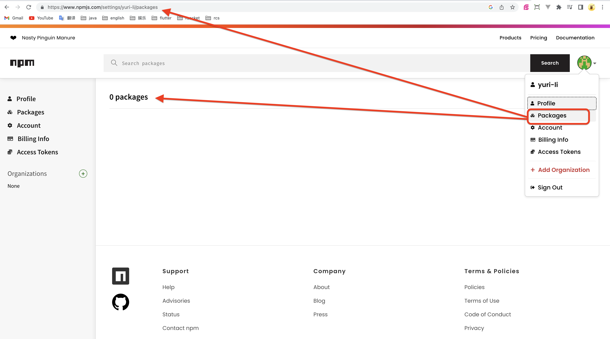
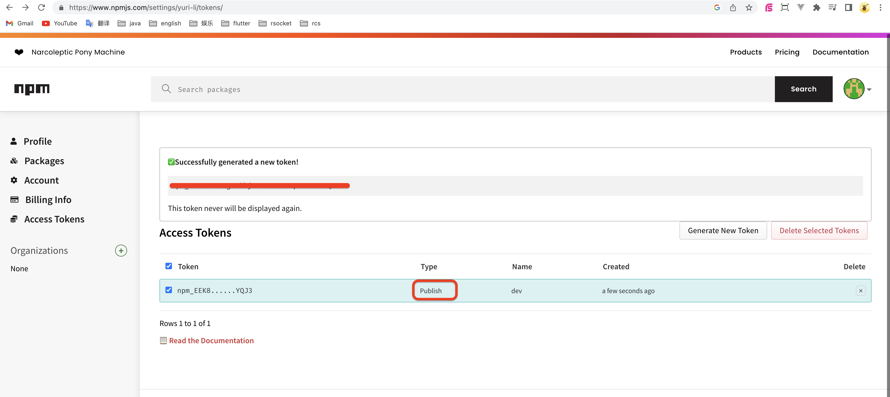
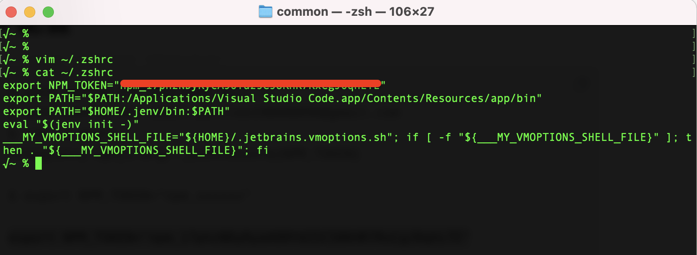
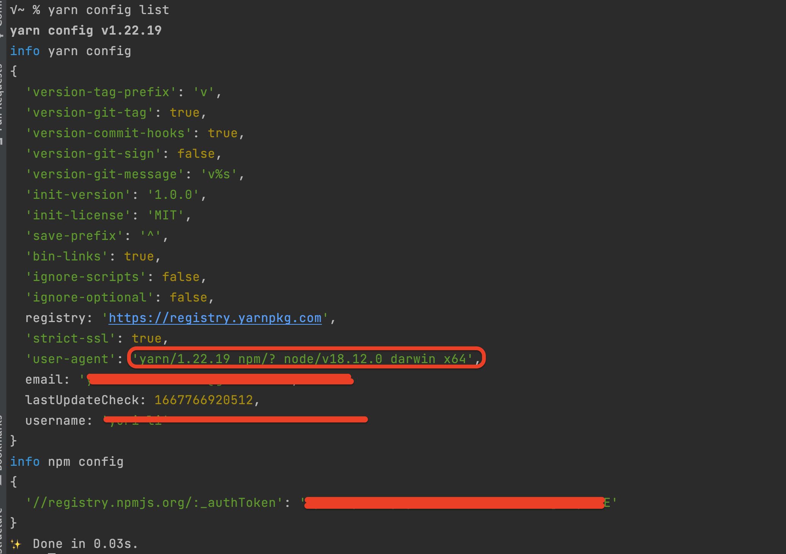

# 1 简介

怎么把自己做好的功能，发布到npm repository（让别人使用）？

# 2 步骤

```
# 1 注册、登录 https://www.npmjs.com/
```



```
# 2 进入账户，创建Access Token。类型必须是：Automation 或 Publish。
#   否则，没有上传的权限

# 3 复制Access Token（也可以使用username/password上传，但，繁琐）
```



```
# 4 修改环境变量`.zshrc`，添加变量`NPM_TOKEN`
$ vim ~/.zshrc
export NPM_TOKEN="npm_xxxxxx"
xxxxxx

# 5 让环境变量生效
$ source ~/.zshrc

# 6 设置npm全局变量（上传时，会自动读取这个值）
$ npm config set //registry.npmjs.org/:_authToken $NPM_TOKEN
```





```
# 5 检查`package.json -> name`。如果name在npm repository中已经存在，则，不能发布
# 6 发布
$ yarn publish
```

# 3 使用

```
$ yarn add [-D] project-name
```
