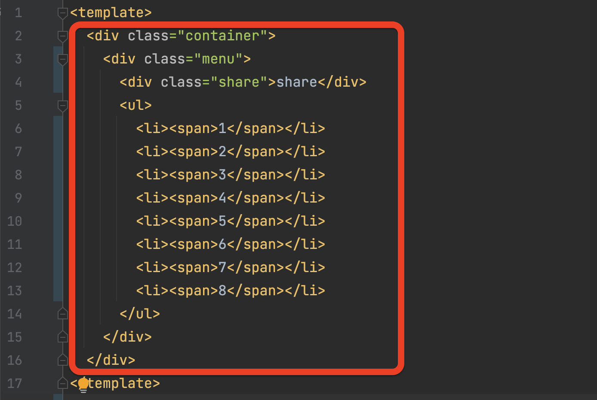
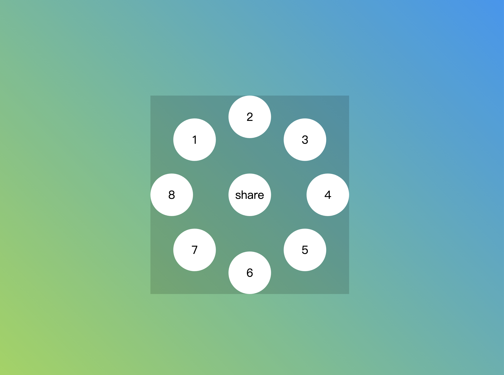

# 1 使用emmet生成html

## 1.1 emmet在线示例

[Emmet](https://docs.emmet.io/cheat-sheet/)

## 1.2 输入

```
div.container>div.menu>div.share{share}+ul>li*8>span{$}
```

## 1.3 生成



# 2 css基础

## 2.1 角度单位

| 单位   | 全称          | 描述      |
| ---- | ----------- | ------- |
| deg  | 度数(degree)  | $360^o$ |
| rad  | 弧度(radians) | 2兀      |
| turn | 圈           | 1圈      |

## 2.2 transform-origin

围绕哪个点旋转？

## 2.3 缩放与旋转

```
scale:0; // 0:缩放为0倍，即隐藏；1: 正常大小
transition: 0.05s * $i 0.05s * $i; //duration delay
transform: rotate(360deg / 8 * $i); //依次旋转
```

# 3 布局

```scss
$background-color: #9ad751 #2196f3;
$icon-color: #1877f2 #25d366 #1da1f2 #ea4c89 #0a66c2 #c32aa3 #bd081c #ff0000;
$menu-side-length: 280px;
$element-side-length: 60px;
$ul-top: ($menu-side-length - $element-side-length)/2;
```

- container

- menu

- social(icons, 比如 share, li>1, li>2...)



# 4 动画

## 4.1 hover

```
.share, li {
  transition-duration: 0.05s;
  &:hover {
    font-size: 2em;
    box-shadow: 0 6px 8px rgba(0, 0, 0, 0.15),
    0 0 0 2px #333,
    0 0 0 8px #fff;
  }
}
```

## 4.2 active

### 4.2.1 ts

```
<script setup lang="ts">
import { ref } from "vue"
defineOptions({
  name: "CircularMenu",
})
const isActive = ref(false)
</script>
```

### 4.2.2 css

```scss
.menu.active {
  li {
    scale: 1;
  }
}
```

# 5 icons

```
$icon-color: #1877f2 #25d366 #1da1f2 #ea4c89 #0a66c2 #c32aa3 #bd081c #ff0000;
```

```
import {
  IconDribbble, IconFacebook, IconInstagram, IconLinkedin, IconPinterest, IconShareFill, IconTwitter, IconWhatsapp, IconYoutube,
} from "@iconify-prerendered/vue-bi"
```

```
<li><IconFacebook /></li>
<li><IconWhatsapp /></li>
<li><IconTwitter /></li>
<li><IconDribbble /></li>
<li><IconLinkedin /></li>
<li><IconInstagram /></li>
<li><IconPinterest /></li>
<li><IconYoutube /></li>
```
