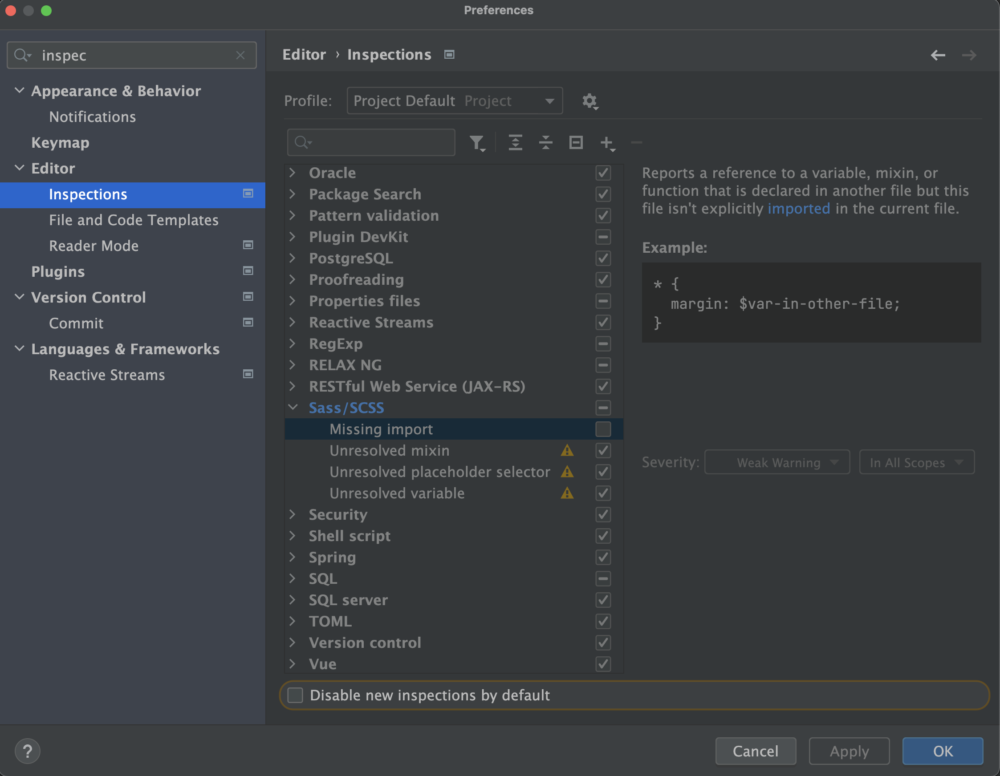

# Vue 3 + TypeScript + Vite

# 1 配置目标

- 不再使用js配置（不会出现js后缀的配置代码）
- 遵守ES Module规范（不会出现commonjs的配置代码）

# 2 版本管理

| 名称            | 描述                  | version         | 备注                                                                  |
| ------------- | ------------------- | --------------- | ------------------------------------------------------------------- |
| intellij idea | 开发工具                |                 | 前端项目已经很复杂了，vscode的插件安装/配置也多了，换成intellij idea，可以少很多麻烦                |
| nodejs        | 运行环境                | stable v18.12.0 |                                                                     |
| npm           | 包管理工具               | 8.19.2          | 使用npm（安装/升级）yarn                                                    |
| yarn          | 包管理工具               | 1.22.19         |                                                                     |
| eslint        | 代码格式校验              | 8.22.0          | 必须是这个版本，否则，构建报错`TypeError: this.libOptions.parse is not a function` |
| vitest        | 测试框架                | 0.24.5          |                                                                     |
| ts-node       | 可以直接运行typescript的工具 | 10.9.1          |                                                                     |
| vite          | 前端开发与构建工具           | 3.2.2           |                                                                     |

# 3 路径管理

- `@`，代表“src/”目录

- `~`，代表“test/”目录

# 4 scss

## 4.1 清除默认样式

### 4.1.1 main.scss

```scss
/* src/assets/css/main.scss */
* {
  margin: 0;
  padding: 0;
  box-sizing: border-box;
}

```

### 4.1.2 App.vue

```
/* src/App.vue */

<style lang="scss">
@import "@/assets/css/main.scss";

</style>
```

## 4.2 全局变量

### 4.2.1 variable.scss

```scss
/* src/assets/css/variable.scss */
@mixin flexContainer {
  display: flex;
  justify-content: center;
  align-items: center;
}
```

### 4.2.2 vite.config.ts

```
css: {
  preprocessorOptions: {
    scss: {
      additionalData: "@import \"@/assets/css/variable.scss\";"
    }
  }
},
```

## 4.3 使用配置

### 4.3.1 App.vue

`index.html -> main.ts -> App.vue --> style(no scoped)`

即，App.vue的css设置是全局的。所以，所有页面都会用到"@/assets/css/main.scss"

### 4.3.2 `*.vue`

```scss
<style lang="scss" scoped>
.container {
  ...
  @include flexContainer;
  ...
}
</style>
```

## 4.4 intellij idea配置



# 5 测试

- 使用eslint检测代码
- 使用vitest执行`test/HelloWorld.spec.ts`
- 使用vitest检查测试覆盖率

# 6 发布到npm repository

package.json配置的dependencies/devDependencies，都是大家开源的。怎么把自己做好的功能，发布到npm repository，让别人使用？

```
# 1 注册、登录 https://www.npmjs.com/

# 2 进入账户，创建Access Token。类型必须是：Automation 或 Publish。
#   否则，没有上传的权限

# 3 复制Access Token。打开项目，进入项目根目录。三种配置Access Token的方式：
## 3.1 打开`~/.npmrc`，直接修改`NPM_TOKEN`
//registry.npmjs.org/:_authToken=${NPM_TOKEN}
## 3.2 临时配置环境变量`NPM_TOKEN`（关闭terminal，失效）
$ export NPM_TOKEN="npm_xxxxxx"
## 3.3 修改环境变量`.zshrc`
$ vim ~/.zshrc
export NPM_TOKEN="npm_xxxxxx"
xxxxxx
$ source ~/.zshrc

# 4 检查`package.json -> name`。如果name在npm repository中已经存在，则，不能发布
# 5 发布
$ yarn publish
```

# 7 使用自己的模板创建项目

```
# 1 复制到本地（不要使用degit，多学了，也没啥用）
$ git clone repo-name folder-name

# 2 进入项目根目录。删除`.git`文件夹
# 3 打开package.json，修改name、author等
  "name": "admin",
  "private": true,
  "version": "0.0.1",
  "license": "MIT",
  "author": "yuri <javaliyuanyuan@163.com> (https://github.com/yuri-li)",


# 4 构建项目
$ yarn
# 5 运行
$ yarn dev
```